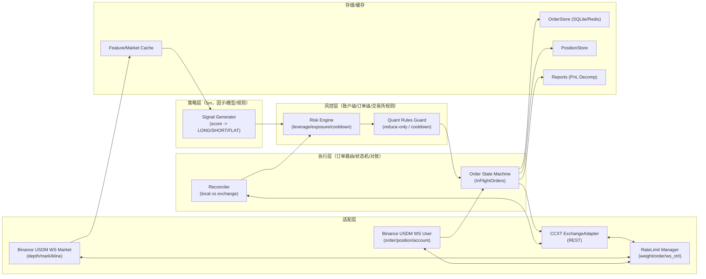

# 开源 Crypto 交易系统深度调研报告

## 执行摘要

面向“散户、entity["company","Binance","crypto exchange"] 永续、5m、多空”的目标，最值得“直接嫁接”的开源资产主要集中在三类：交易所适配层（entity["organization","CCXT","crypto exchange api library"]）、盘口/订单簿与订单跟踪（entity["organization","Hummingbot","open source trading bot"]）、以及成熟的回测/运营化形态（entity["organization","Jesse","python crypto trading framework"]、entity["organization","Freqtrade","open source crypto trading bot"]、entity["organization","VeighNa Evo (vnpy_evo)","vn.py crypto platform"]）。entity["organization","NautilusTrader","event-driven trading platform"] 的事件驱动与 backtest/live parity 设计很强，但集成复杂度高且为 LGPL，需要更谨慎的“参考式吸收”。  
对你而言，“能落地且最省风险”的路线是：用 CCXT 做 REST 统一适配（下单/查询/拉 K 线）、用 Binance 永续官方 WS 做盘口与用户数据流（订单/仓位/成交回报），再嫁接一套“限速+订单状态机+资金费率记账”的基础设施，用于让 5m 高频策略在成本、风控、对账上可控。  
此外，Binance 永续对 API/WS 限速、量化交易规则（触发后 reduce-only/临时禁开仓）有明确约束，必须在工程层实现限速与保护，否则策略再好也会被风控/限流打断。citeturn20view0turn20view1turn20view2

## 方法与评估维度

本报告优先引用：官方 GitHub 仓库、官方文档、README、LICENSE 文件与官方交易所文档。对每个项目采用同一组维度评估，并给出“可直接嫁接/仅供参考”的边界与原因。

评估维度（按用户要求显式列出）：

- 许可（MIT/Apache/GPL/LGPL）：是否允许直接拷贝/修改/闭源集成；是否存在强/弱 copyleft 传播风险。citeturn19search0turn19search1turn19search2turn19search3turn17view1  
- 模块成熟度（1-5）：社区活跃、发布节奏、功能覆盖（以官方仓库/文档信号为主）。citeturn5view0turn6view0turn7view0turn9view0turn3view1turn10view0  
- 可复用性（1-5）：模块是否可独立抽取；抽取后对你现有系统侵入性多大。citeturn5view1turn6view1turn10view0turn14view2  
- 对高频/盘口支持（1-5）：是否有 order book tracker / WS 设计、增量更新、快照纠偏等。citeturn6view1turn6view2turn20view0turn5view1  
- 对永续合约支持（1-5）：是否有 perpetual/futures 概念、资金费率、杠杆、多空与清算相关字段。citeturn6view1turn17view0turn4view1turn10view0turn13view0  
- 工程复杂度/集成成本（低/中/高）：引入成本、运行依赖、重构范围。citeturn9view0turn6view0turn3view1  
- 安全/风控注意点：API key 管理、限速、交易所规则触发、对账与熔断。citeturn17view0turn4view0turn20view1turn20view2turn6view1  

## 项目对比表与适配性结论

### 对比表格

> 说明：适配度评分（1-5）是“对散户 Binance 永续 5m 多空”的综合建议值；并不等同于项目质量高低。

| 项目 | 许可证 | 核心模块（官方定位） | 可复用点（面向你的场景） | 成熟度(1-5) | 可复用性(1-5) | 高频/盘口(1-5) | 永续(1-5) | 集成成本 | 适配度(1-5) | 备注 |
|---|---|---|---|---:|---:|---:|---:|---|---:|---|
| entity["organization","CCXT","crypto exchange api library"] | MIT citeturn5view0turn5view2 | 统一交易所类集合；统一 API（fetch/create/cancel 等）citeturn5view1turn5view0 | **ExchangeAdapter（REST）**、市场/符号映射、统一错误处理入口 citeturn5view1 | 5 | 5 | 2 | 4 | 低 | 5 | WS 在 CCXT Pro（非开源/商业）citeturn5view1 |
| entity["organization","Hummingbot","open source trading bot"] | Apache-2.0 citeturn6view0 | 高频 bot 框架；连接器体系；订单簿与订单跟踪 citeturn6view0turn6view1 | **OrderBookTracker/快照纠偏**、UserStream/订单回报、InFlightOrders/ClientOrderTracker 设计 citeturn6view1turn6view2 | 4 | 4 | 5 | 4 | 高 | 4 | 适合“摘”连接器/订单簿模块；全量引入较重 citeturn6view3turn6view1 |
| entity["organization","Jesse","python crypto trading framework"] | MIT citeturn7view0turn7view1 | 研究/回测/优化/实盘一体；强调无 look-ahead citeturn7view0turn8view0turn7view2 | 策略结构与多标的/多周期“无偷看”范式、基准/批量对比、优化流程参考 citeturn8view0turn7view2 | 4 | 4 | 2 | 4 | 中 | 4 | 更偏 candle/策略研发；对盘口级不强（但对 5m 足够）citeturn7view2turn8view0 |
| entity["organization","NautilusTrader","event-driven trading platform"] | LGPL-3.0 citeturn9view0turn9view1 | 事件驱动引擎；强调 backtest/live parity；高性能/生产级 citeturn9view0 | 事件总线、类型系统、回测与实盘一致性（**更适合参考设计**）citeturn9view0turn9view2 | 4 | 3 | 4 | 4 | 高 | 3 | LGPL 允许一定方式“链接使用”，但直接拷贝整合需谨慎；另有 CLA citeturn9view0turn19search2 |
| entity["organization","VeighNa Evo (vnpy_evo)","vn.py crypto platform"] + entity["organization","vnpy_binance","vn.py binance gateway"] | MIT citeturn10view0turn13view0 | 事件引擎、网关体系、RPC、图表；Binance 网关 citeturn10view0turn13view0 | **事件引擎/网关插件化**、RPC 分布式部署思路；但 Binance 永续支持有模式限制 citeturn10view0turn13view0 | 3 | 4 | 3 | 3 | 中 | 3 | vnpy_binance 衍生品仅 cross + one-way（与你可能的对冲/逐仓需求冲突）citeturn13view0 |
| entity["organization","Freqtrade","open source crypto trading bot"] | GPL-3.0 citeturn3view1turn17view1 | bot 产品化：回测/优化/风控/控制台；可做 futures/short/leverage citeturn3view1turn14view2turn17view0turn4view0 | **强烈建议“参考而非拷贝”**：成本/杠杆/资金费率文档很有价值 citeturn17view0turn14view2turn4view0 | 5 | 2 | 2 | 4 | 低(独立使用)/高(代码嫁接) | 3 | GPLv3 对衍生作品分发要求高；适合做“对照实现”与运维形态参考 citeturn17view1turn19search3 |

### 许可风险要点解读

- MIT：极宽松，保留版权与许可声明即可；适合直接“复制/修改/嫁接”。citeturn19search1turn5view0turn7view0turn10view0turn13view0  
- Apache-2.0：宽松且包含专利授权条款（对工程团队更友好）；同样适合嫁接，但要保留 NOTICE/许可信息。citeturn19search0turn6view0  
- LGPL-3.0：弱 copyleft，通常允许以“库链接/分离”方式使用，但对“组合作品/重新链接”等有要求；做商业/闭源分发前要走一遍合规评估（本报告非法律意见）。citeturn19search2turn9view0  
- GPL-3.0：强 copyleft，分发衍生作品通常要求提供对应源代码与相同自由；如果你不准备把整个项目 GPL 化，避免拷贝 GPL 代码，改为“参考设计/独立运行/接口对接”。citeturn17view1turn19search3turn19search20  

## 可嫁接模块建议与优先级清单

下面给出至少 6 个“可直接嫁接”的模块建议（以你的目标为中心），并为每个模块提供：职责、I/O schema、主要函数签名、错误处理/限速策略、Docker/部署注意事项。模块设计大量借鉴了 Hummingbot 的连接器分层（OrderBookTracker、UserStream、InFlightOrders）citeturn6view1turn6view2、CCXT 的统一 API citeturn5view1、以及 Binance 官方对 WS/限速/量化规则的约束 citeturn20view0turn20view1turn20view2。

### 可嫁接优先级

| 优先级 | 模块 | 直接价值 | 主要来源灵感 |
|---:|---|---|---|
| P0 | ExchangeAdapter（REST 统一适配） | 统一下单/查仓位/拉 K 线/错误归一化 | CCXT 统一 API citeturn5view1turn5view0 |
| P0 | Binance 永续 WS：Market + User Data | 实时订单/仓位/成交回报 & 行情；降低 REST 延迟 | Binance USDS-M WS 建议与限制 citeturn20view0 |
| P0 | Rate-Limit Manager（权重/订单/WS 控制消息） | 防封禁、防触发风控，提升稳态运行 | Binance Futures 限速 citeturn20view1turn20view0 |
| P0 | Order State Machine（InFlightOrders） | 解决“下单成功但本地未知”“部分成交”“重连后状态恢复” | Hummingbot ClientOrderTracker/InFlightOrders citeturn6view1turn2search5 |
| P1 | Backtest PnL Decomposition（含费用/滑点） | 让 5m 高频研究不被“假收益”误导 | Freqtrade：费用计入、执行逻辑 citeturn14view2turn3view1 |
| P1 | Funding Rate Handler（永续资金费率记账） | 永续真实净收益关键项；回测/实盘一致性 | Freqtrade：funding fees 与 futures 模式说明 citeturn17view0 |
| P2 | Quant Rules / Reduce-Only Guard | 处理 Binance 量化规则触发后的降级与冷却 | Binance Quant Rules（reduce-only/禁开仓）citeturn20view2turn4view0 |
| P2 | Reconciler（对账与熔断） | long/short 多空、跨重连一致性；防“幽灵仓位” | Binance 建议用 WS 获取订单/仓位 citeturn20view0 |

### 模块一：ExchangeAdapter（CCXT）

**职责**  
统一 REST 能力：加载合约信息、拉 5m K 线、下单/撤单、查询订单/仓位/余额，把不同交易所/不同市场（现货/永续）差异屏蔽在 adapter 内。CCXT 的统一方法集合与“Exchange 类体系”正是为此设计。citeturn5view1turn5view0

**输入/输出 schema（示例）**  
- 输入：`OrderRequest`（symbol、side、type、qty、price、reduce_only、client_order_id、time_in_force…）  
- 输出：`OrderAck`（exchange_order_id、status、提交时间、raw）  
- 错误：归一化 `ExchangeError`（RateLimit、InsufficientMargin、InvalidOrder、TemporaryBan…）

**主要函数签名**  
- `load_markets()`  
- `fetch_ohlcv(symbol, timeframe="5m", since_ms=None, limit=1000)`  
- `create_order(req: OrderRequest) -> OrderAck`  
- `cancel_order(symbol, exchange_order_id)`  
- `fetch_open_orders(symbol)` / `fetch_positions()` / `fetch_balance()`

**错误处理与限速策略**  
- CCXT 调用统一入口捕获异常，映射到你的错误码；429/418/“-4400 量化限制”等触发降级。  
- 重试只用于幂等读请求；写请求（下单/撤单）必须用 `clientOrderId` 幂等。  

**Docker/部署注意事项**  
- API key 只挂交易权限、禁止提现；建议绑定 IP（Freqtrade 文档也强调限制 API key 使用来源）。citeturn3view0  
- 容器内时间同步（NTP）必须可靠，否则签名/过期时间会频繁失败。  

### 模块二：Binance 永续 WS（Market + User Data）

**职责**  
维护实时行情（至少 mark price/kline/depth）、以及用户流（订单状态、仓位、成交回报）。Binance 官方明示：极端行情 REST 可能有延迟，建议用 WS user data 获取订单状态/仓位。citeturn20view0  
同时要遵守：连接 24 小时断开、ping/pong、每秒控制消息上限、单连接最大 streams 等限制。citeturn20view0

**输入/输出 schema（示例）**  
- 输出事件：`MarketEvent`（ts、symbol、type=DEPTH/KLINE/MARK、payload）  
- 输出事件：`UserEvent`（ORDER_UPDATE、ACCOUNT_UPDATE、TRADE_UPDATE…）

**主要函数签名**  
- `subscribe(streams: list[str])`  
- `run_forever(on_event: Callable)`  
- `health()`（延迟、重连次数、last_event_ts）

**错误处理与限速策略**  
- WS 控制消息限速（USDS-M 为 10 条/秒“incoming messages”限制；超过会断连/封 IP）。citeturn20view0  
- 断线重连 + 订阅恢复；对订单簿要做快照纠偏（Hummingbot 文档强调 diff/snapshot 与 nonce 检查、周期快照作为兜底）。citeturn6view1  

**Docker/部署注意事项**  
- 建议把 WS 与策略执行拆成进程/服务：WS 负责持续流与缓存，策略读取共享队列/Redis/本地 IPC，避免策略阻塞导致丢包。

### 模块三：Rate-Limit Manager（权重/订单/WS 控制消息）

**职责**  
把 Binance Futures “IP/账户/10 秒订单上限”等规则编码成可执行限速器，避免触发限流/禁用。Binance Futures FAQ 给出默认限速：IP 2,400/min，账户/子账户订单 1,200/min，并且 USDⓈ-M 还有 10 秒级别订单限制。citeturn20view1  
另外 Binance 量化规则会在违规时触发 reduce-only/禁开仓冷却。citeturn20view2

**输入/输出 schema**  
- 输入：`RateLimitRequest(kind="REST_WEIGHT"|"ORDER"|"WS_CTRL", cost=int)`  
- 输出：`await acquire()` 或抛出 `RateLimitExceeded(retry_after_ms)`

**主要函数签名**  
- `acquire(kind, cost=1)`  
- `penalize(kind, retry_after_ms)`（收到 429/ban/quant rules 触发时）  
- `stats()`（当前桶余量、违规次数）

**错误处理与限速策略**  
- token-bucket + 抖动（jitter）退避；写请求单独桶（更严格）。  
- 针对 quant rules（-4400）进入“cooldown + 只允许 reduce-only”的降级模式。citeturn20view2  

**Docker/部署注意事项**  
- 以“单账号单 bot”为默认假设，避免多个进程共享同一 API key 抢额度；Freqtrade 文档也明确：杠杆模式下无法在同一账户跑两个 bot（因为清算水平计算假设单一使用者）。citeturn17view0  

### 模块四：Order State Machine（InFlightOrders / 对账友好）

**职责**  
维护订单生命周期（提交→ACK→部分成交→成交/撤单/拒绝），解决“重连/网络抖动/重复回报/部分成交/撤单失败”等问题。Hummingbot 连接器架构将 `ClientOrderTracker` 与 `InFlightOrders` 作为核心组件，专门做这件事。citeturn6view1turn2search5

**输入/输出 schema**  
- 输入：`OrderRequest`、`UserEvent(OrderUpdate/TradeUpdate)`  
- 输出：`OrderUpdateNormalized`、`Fill`、`PositionDelta`

**主要函数签名**  
- `submit(order_req) -> client_order_id`  
- `on_exchange_ack(client_order_id, exchange_order_id)`  
- `on_order_update(event)`  
- `snapshot()` / `restore()`（持久化恢复）

**错误处理与限速策略**  
- 幂等：必须全链路使用 `clientOrderId`；写请求重试只在“确认未送达”且严格幂等的情况下做。  
- 若 Binance 进入 reduce-only/禁开仓状态，状态机应把新开仓请求拒绝为 `PolicyDenied`，并提示冷却剩余时间。citeturn20view2  

**Docker/部署注意事项**  
- 订单状态机需要持久化（SQLite/Redis）以便容器重启可恢复；否则重启后“本地不知道有仓位/订单”风险极高。

### 模块五：Backtest PnL Decomposition（费用/滑点拆分）

**职责**  
对 5m 高频策略，决定成败的往往不是信号，而是费用/滑点/资金费率是否吞噬边际收益。Freqtrade 文档明确：利润计算包含手续费，且回测/优化与实盘执行逻辑存在差异，需要专门对齐与分析。citeturn14view2turn2search13

**输入/输出 schema**  
- 输入：成交序列（fills）、K 线序列（或撮合价格模型）、费率表  
- 输出：`PnLReport`：gross_pnl、fees、slippage、funding、net_pnl、turnover、avg_hold_time、max_dd

**主要函数签名**  
- `apply_fill(fill)`  
- `mark_to_market(price)`  
- `finalize() -> PnLReport`  
- `decompose() -> dict`（输出可视化友好结构）

**错误处理与限速策略**  
- 回测严格防未来函数；资金费率按结算周期计入；滑点模型可配置（固定/基于波动/盘口代理）。  

**Docker/部署注意事项**  
- 回测与实盘的配置分离（不同密钥、不同数据源）；回测容器不应拥有任何真实交易 key。

### 模块六：Funding Rate Handler（永续资金费率）

**职责**  
永续的资金费率会显著改变多空净收益。Freqtrade 的杠杆/期货文档对 perpetual futures 与 funding fees 的存在、以及“某些交易所 funding 数据不完整导致回测区间受限/需要设置默认 funding”都有明确说明。citeturn17view0  

**输入/输出 schema**  
- 输入：`Position`（size、entry_price、side、notional）、`FundingRateSeries`（ts→rate）  
- 输出：`FundingPnLSeries`、累计 funding_pnl

**主要函数签名**  
- `fetch_funding_rates(symbol, start_ms, end_ms) -> list[FundingRate]`  
- `apply_funding(position, funding_rate, ts) -> FundingDelta`  
- `estimate_missing_rates(default_rate=0.0)`（明确标记“回测不准确”）

**错误处理与限速策略**  
- funding 拉取可能受限（历史窗口/缺失），需要“缺失标注 + 报告输出”，避免 silently 产生虚假收益。citeturn17view0turn18search2  

**Docker/部署注意事项**  
- funding 数据缓存（parquet/SQLite），避免频繁拉取触发限速；与策略进程共享只读缓存。

## 建议的模块化接口设计与集成流程图

本节给出可直接交给 Codex/工程师落地的“接口设计（文件路径、职责、主要函数签名）”，并配套示例 skeleton 代码片段。

### 集成流程关系图（Mermaid）



该流程图的关键设计点，分别对应开源项目的“可吸收资产”：  
- CCXT：统一 REST 类与统一方法集合 → ExchangeAdapter。citeturn5view1turn5view0  
- Hummingbot：OrderBookTracker / UserStreamTracker / InFlightOrders 分层 → WS 与订单状态机设计。citeturn6view1turn6view2  
- Binance 官方：WS must-have 规则（24h 重连、ping/pong、10 msg/s 控制消息上限、1024 streams、强烈建议用 user data stream 获取订单/仓位）→ WS 客户端与限速器约束。citeturn20view0  
- Freqtrade：futures/leverage/funding/费用计入与风险提示 → 回测记账与风控边界。citeturn17view0turn14view2turn3view1  

### 模块化接口设计（文件路径与签名）

> 下面是你可以直接落到仓库里的建议结构（与具体框架无关，便于嫁接进你现有系统）。

- `core/adapters/exchange/base.py`：定义统一接口与数据结构（OrderRequest、OrderAck、Position…）
- `core/adapters/exchange/ccxt_adapter.py`：CCXT 实现（REST）
- `core/marketdata/ws/base.py`：WS 基类（重连、心跳、订阅限速）
- `core/marketdata/ws/binance_usdm.py`：USDⓈ-M 永续 WS（market + user）
- `core/infra/rate_limit.py`：多桶限速器（REST weight / ORDER / WS 控制消息）
- `core/execution/order_state_machine.py`：订单状态机（InFlightOrders、幂等、持久化）
- `core/futures/funding.py`：资金费率拉取/缓存/计算
- `core/backtest/accounting.py`：PnL 分解（fees/slippage/funding）

## 交付物与示例 Skeleton 代码

本节按用户要求给出三类交付物内容：  
- `docs/open_source_reference.md`（对比表与链接）  
- `docs/architecture_adapters.md`（模块接口设计）  
- 若干 Python skeleton 文件（每个优先模块 1-2 个文件示例）

### docs/open_source_reference.md

```md
# 开源 Crypto 交易系统参考清单（面向 Binance 永续 5m 多空）

## 核心结论
- 直接嫁接优先：CCXT（MIT）做 REST ExchangeAdapter；Hummingbot（Apache-2.0）“借鉴/摘取”订单簿与订单跟踪设计；Jesse（MIT）吸收研究/回测/多周期无偷看范式；vnpy_evo/vnpy_binance（MIT）可参考事件引擎与网关架构。
- 仅供参考（不建议拷贝代码）：Freqtrade（GPL-3.0）适合学产品化与风控/资金费率文档；NautilusTrader（LGPL-3.0）适合学事件驱动与 backtest/live parity 设计。

## 项目清单与链接
- CCXT（MIT）：https://github.com/ccxt/ccxt
  - Wiki Manual：https://github.com/ccxt/ccxt/wiki/manual
- Hummingbot（Apache-2.0）：https://github.com/hummingbot/hummingbot
  - Connector Architecture：https://hummingbot.org/connectors/connectors/architecture/
- Jesse（MIT）：https://github.com/jesse-ai/jesse
  - Project Template：https://github.com/jesse-ai/project-template
- NautilusTrader（LGPL-3.0）：https://github.com/nautechsystems/nautilus_trader
- VeighNa Evo / vnpy_evo（MIT）：https://github.com/veighna-global/vnpy_evo
  - vnpy_binance（MIT）：https://github.com/veighna-global/vnpy_binance
- Freqtrade（GPL-3.0）：https://github.com/freqtrade/freqtrade
  - Exchange Notes（含 Binance Futures）：https://www.freqtrade.io/en/stable/exchanges/
  - Leverage（含 funding/清算风险）：https://raw.githubusercontent.com/freqtrade/freqtrade/develop/docs/leverage.md

## 许可提醒（非法律意见）
- MIT / Apache-2.0 通常可直接拷贝修改并闭源分发（需保留许可与声明）。
- LGPL / GPL 对分发衍生作品有额外义务；如不确定，采用“仅参考设计、不复制代码”的方式最稳。
```

### docs/architecture_adapters.md

```md
# 模块化适配层设计（Binance 永续 5m 多空）

## 目标
- 实盘：低延迟获取订单/仓位（WS user stream），统一下单/撤单/查询（CCXT REST）。
- 研究：回测记账必须包含 fees / slippage / funding，并支持 PnL 分解。
- 风控：内置 rate-limit、quant rules 冷却、reduce-only 降级、对账与熔断。

## 模块边界
- adapters/exchange：REST 交易与查询统一入口（CCXT）。
- marketdata/ws：WS 数据流（market + user），只负责流与缓存，不做决策。
- infra/rate_limit：统一多桶限速器，支持 penalize/重试窗口。
- execution/order_state_machine：订单生命周期、幂等、持久化恢复。
- futures/funding：资金费率拉取、缺失标注、记账。
- backtest/accounting：PnL 分解与导出。

## 事件与数据结构（建议）
- MarketEvent：DEPTH/KLINE/MARK
- UserEvent：ORDER_UPDATE/ACCOUNT_UPDATE/TRADE_UPDATE
- NormalizedOrder：统一订单状态（NEW/ACK/PARTIAL/FILLED/CANCELED/REJECTED）
- Position：包含 side、qty、entry、notional、leverage、liq_price(若有)

## 关键工程策略
- 所有写请求必须 clientOrderId 幂等。
- WS 控制消息限速（Binance USDS-M 为 10 msg/s），超限要断开并指数退避。
- 订单簿需要 snapshot + diff + nonce 校验；异常时周期快照纠偏。
- quant rules 触发后进入 cooldown，仅允许 reduce-only 下单。
```

### Python Skeleton 文件示例

> 说明：以下为“可执行的最小骨架”，便于你直接交给 Codex 生成完整实现；代码不复制任何 GPL/LGPL 项目内容，属于“参考式实现”。

#### P0 模块：ExchangeAdapter（CCXT）

```python
# file: core/adapters/exchange/base.py
from __future__ import annotations

from dataclasses import dataclass
from enum import Enum
from typing import Any, Optional, Protocol, runtime_checkable, List, Dict


class Side(str, Enum):
    BUY = "buy"
    SELL = "sell"


class OrderType(str, Enum):
    MARKET = "market"
    LIMIT = "limit"
    STOP = "stop"          # placeholder: exchange-specific
    STOP_MARKET = "stop_market"
    TAKE_PROFIT = "take_profit"
    TAKE_PROFIT_MARKET = "take_profit_market"


class TimeInForce(str, Enum):
    GTC = "GTC"
    IOC = "IOC"
    FOK = "FOK"
    GTX = "GTX"  # post-only on some exchanges


@dataclass(frozen=True)
class OrderRequest:
    symbol: str
    side: Side
    type: OrderType
    qty: float
    price: Optional[float] = None
    reduce_only: bool = False
    tif: Optional[TimeInForce] = None
    client_order_id: Optional[str] = None
    params: Optional[Dict[str, Any]] = None  # exchange-specific extras


@dataclass(frozen=True)
class OrderAck:
    symbol: str
    client_order_id: Optional[str]
    exchange_order_id: str
    status: str
    ts_ms: int
    raw: Dict[str, Any]


@dataclass(frozen=True)
class Position:
    symbol: str
    side: str               # "long" | "short" | "flat"
    qty: float
    entry_price: float
    leverage: float
    unrealized_pnl: float = 0.0
    liquidation_price: Optional[float] = None
    raw: Optional[Dict[str, Any]] = None


class ExchangeError(Exception):
    """Base class for normalized exchange errors."""


class RateLimitError(ExchangeError):
    def __init__(self, retry_after_ms: Optional[int] = None, msg: str = "rate-limited"):
        super().__init__(msg)
        self.retry_after_ms = retry_after_ms


class PolicyDenied(ExchangeError):
    """E.g. reduce-only mode, cooldown, risk control trigger."""


@runtime_checkable
class ExchangeAdapter(Protocol):
    """Unified REST adapter (CCXT-backed or custom)."""

    async def load_markets(self) -> Dict[str, Any]: ...

    async def fetch_ohlcv(
        self, symbol: str, timeframe: str = "5m",
        since_ms: Optional[int] = None, limit: int = 1500
    ) -> List[list]: ...

    async def create_order(self, req: OrderRequest) -> OrderAck: ...

    async def cancel_order(self, symbol: str, exchange_order_id: str) -> bool: ...

    async def fetch_open_orders(self, symbol: Optional[str] = None) -> List[Dict[str, Any]]: ...

    async def fetch_positions(self) -> List[Position]: ...
```

```python
# file: core/adapters/exchange/ccxt_adapter.py
from __future__ import annotations

import time
from typing import Any, Dict, List, Optional

from .base import (
    ExchangeAdapter, OrderRequest, OrderAck, Position,
    RateLimitError, ExchangeError
)

# NOTE: This is a skeleton. Implementation should use `ccxt.async_support` in production.
# CCXT provides unified methods like fetchOHLCV/createOrder/cancelOrder/fetchBalance etc.

class CcxtAdapter(ExchangeAdapter):
    def __init__(self, exchange: Any):
        self._ex = exchange  # ccxt exchange instance (async)
        self._markets_loaded = False

    async def load_markets(self) -> Dict[str, Any]:
        try:
            markets = await self._ex.load_markets()
            self._markets_loaded = True
            return markets
        except Exception as e:
            raise ExchangeError(f"load_markets failed: {e}") from e

    async def fetch_ohlcv(
        self, symbol: str, timeframe: str = "5m",
        since_ms: Optional[int] = None, limit: int = 1500
    ) -> List[list]:
        try:
            if not self._markets_loaded:
                await self.load_markets()
            return await self._ex.fetch_ohlcv(symbol, timeframe=timeframe, since=since_ms, limit=limit)
        except Exception as e:
            # TODO: map specific ccxt exceptions to RateLimitError, etc.
            raise ExchangeError(f"fetch_ohlcv failed: {e}") from e

    async def create_order(self, req: OrderRequest) -> OrderAck:
        try:
            params = dict(req.params or {})
            if req.client_order_id:
                # TODO: set correct param key for Binance Futures (newClientOrderId) if needed
                params["clientOrderId"] = req.client_order_id
            if req.reduce_only:
                params["reduceOnly"] = True

            raw = await self._ex.create_order(
                symbol=req.symbol,
                type=req.type.value,
                side=req.side.value,
                amount=req.qty,
                price=req.price,
                params=params,
            )
            return OrderAck(
                symbol=req.symbol,
                client_order_id=req.client_order_id,
                exchange_order_id=str(raw.get("id")),
                status=str(raw.get("status", "unknown")),
                ts_ms=int(time.time() * 1000),
                raw=raw,
            )
        except Exception as e:
            # TODO: detect rate-limit and raise RateLimitError(retry_after_ms)
            raise ExchangeError(f"create_order failed: {e}") from e

    async def cancel_order(self, symbol: str, exchange_order_id: str) -> bool:
        try:
            await self._ex.cancel_order(exchange_order_id, symbol)
            return True
        except Exception as e:
            raise ExchangeError(f"cancel_order failed: {e}") from e

    async def fetch_open_orders(self, symbol: Optional[str] = None):
        try:
            return await self._ex.fetch_open_orders(symbol) if symbol else await self._ex.fetch_open_orders()
        except Exception as e:
            raise ExchangeError(f"fetch_open_orders failed: {e}") from e

    async def fetch_positions(self) -> List[Position]:
        try:
            raw_positions = await self._ex.fetch_positions()
            out: List[Position] = []
            for p in raw_positions:
                out.append(Position(
                    symbol=p.get("symbol"),
                    side=str(p.get("side", "flat")),
                    qty=float(p.get("contracts") or p.get("positionAmt") or 0.0),
                    entry_price=float(p.get("entryPrice") or 0.0),
                    leverage=float(p.get("leverage") or 1.0),
                    unrealized_pnl=float(p.get("unrealizedPnl") or 0.0),
                    liquidation_price=p.get("liquidationPrice"),
                    raw=p,
                ))
            return out
        except Exception as e:
            raise ExchangeError(f"fetch_positions failed: {e}") from e
```

#### P0 模块：Binance USDS-M WS（Market + User）

```python
# file: core/marketdata/ws/base.py
from __future__ import annotations

import asyncio
from dataclasses import dataclass
from typing import Any, Callable, Optional

@dataclass(frozen=True)
class WsEvent:
    stream: str
    ts_ms: int
    payload: dict

class WsClientBase:
    """
    Base websocket client with:
    - reconnect + backoff
    - ping/pong management
    - subscription throttling (WS control messages)
    """

    def __init__(self, url: str, ctrl_msg_per_sec: int = 10):
        self.url = url
        self.ctrl_msg_per_sec = ctrl_msg_per_sec
        self._stop = asyncio.Event()
        self._on_event: Optional[Callable[[WsEvent], Any]] = None

    def set_handler(self, on_event: Callable[[WsEvent], Any]) -> None:
        self._on_event = on_event

    async def subscribe(self, streams: list[str]) -> None:
        # TODO: implement and throttle outgoing control messages
        raise NotImplementedError

    async def run_forever(self) -> None:
        # TODO: connect, read loop, handle reconnect
        raise NotImplementedError

    async def stop(self) -> None:
        self._stop.set()
```

```python
# file: core/marketdata/ws/binance_usdm.py
from __future__ import annotations

import time
from typing import Any, Dict, List, Optional

from .base import WsClientBase, WsEvent

class BinanceUsdmMarketWs(WsClientBase):
    """
    Skeleton for Binance USDⓈ-M Futures market streams.
    Must follow official constraints:
    - connection valid for 24h
    - server sends ping frames periodically; client must respond pong
    - max 10 incoming control messages per second
    - max 1024 streams per connection
    """

    def __init__(self, base_url: str = "wss://fstream.binance.com/stream", ctrl_msg_per_sec: int = 10):
        super().__init__(base_url, ctrl_msg_per_sec=ctrl_msg_per_sec)
        self._subs: List[str] = []

    async def subscribe(self, streams: list[str]) -> None:
        # Binance expects lower-case stream names
        self._subs = [s.lower() for s in streams]
        # TODO: send {"method":"SUBSCRIBE","params":[...],"id":...} with throttling
        return

    async def run_forever(self) -> None:
        # TODO: use `websockets` or `aiohttp` WS client, read messages, parse into WsEvent
        # Each message typically contains {"stream": "...", "data": {...}}
        while True:
            await self._fake_emit()
            await asyncio.sleep(1)

    async def _fake_emit(self) -> None:
        if self._on_event:
            evt = WsEvent(stream="!fake", ts_ms=int(time.time() * 1000), payload={"note": "TODO"})
            self._on_event(evt)

class BinanceUsdmUserWs(WsClientBase):
    """
    User data stream (listenKey) skeleton.
    TODO:
    - fetch listenKey via REST (CCXT or direct)
    - keepalive listenKey
    - parse ORDER_TRADE_UPDATE / ACCOUNT_UPDATE etc
    """
    pass
```

#### P0 模块：Rate-Limit Manager

```python
# file: core/infra/rate_limit.py
from __future__ import annotations

import asyncio
import time
from dataclasses import dataclass
from typing import Dict, Optional

@dataclass
class Bucket:
    capacity: float
    refill_per_sec: float
    tokens: float
    ts_last: float

class RateLimitManager:
    """
    Multi-bucket limiter:
    - REST_WEIGHT (per IP/min)
    - ORDER (per account/min + per 10s)
    - WS_CTRL (subscribe/unsubscribe/ping/pong control messages)
    """

    def __init__(self):
        now = time.time()
        self._buckets: Dict[str, Bucket] = {
            "REST_WEIGHT": Bucket(capacity=2400, refill_per_sec=2400/60.0, tokens=2400, ts_last=now),
            "ORDER_MIN": Bucket(capacity=1200, refill_per_sec=1200/60.0, tokens=1200, ts_last=now),
            "ORDER_10S": Bucket(capacity=300, refill_per_sec=300/10.0, tokens=300, ts_last=now),
            "WS_CTRL": Bucket(capacity=10, refill_per_sec=10.0, tokens=10, ts_last=now),
        }
        self._lock = asyncio.Lock()

    def _refill(self, b: Bucket) -> None:
        now = time.time()
        dt = max(0.0, now - b.ts_last)
        b.tokens = min(b.capacity, b.tokens + dt * b.refill_per_sec)
        b.ts_last = now

    async def acquire(self, kind: str, cost: float = 1.0, timeout_s: float = 5.0) -> None:
        deadline = time.time() + timeout_s
        while True:
            async with self._lock:
                b = self._buckets[kind]
                self._refill(b)
                if b.tokens >= cost:
                    b.tokens -= cost
                    return
            if time.time() > deadline:
                raise TimeoutError(f"rate_limit acquire timeout: {kind}")
            await asyncio.sleep(0.01)

    async def penalize(self, kind: str, cooldown_s: float) -> None:
        # crude penalty: set tokens to 0 and wait for refill naturally
        async with self._lock:
            b = self._buckets[kind]
            b.tokens = 0.0
        await asyncio.sleep(cooldown_s)

    def stats(self) -> Dict[str, float]:
        out = {}
        for k, b in self._buckets.items():
            out[k] = b.tokens
        return out
```

#### P0 模块：Order State Machine（InFlightOrders）

```python
# file: core/execution/order_state_machine.py
from __future__ import annotations

import time
from dataclasses import dataclass, field
from enum import Enum
from typing import Dict, Optional, Any, List

class OrderState(str, Enum):
    NEW = "new"
    SUBMITTED = "submitted"
    ACKED = "acked"
    PARTIALLY_FILLED = "partially_filled"
    FILLED = "filled"
    CANCELED = "canceled"
    REJECTED = "rejected"
    EXPIRED = "expired"

@dataclass
class InFlightOrder:
    symbol: str
    client_order_id: str
    exchange_order_id: Optional[str] = None
    state: OrderState = OrderState.NEW
    qty: float = 0.0
    filled: float = 0.0
    avg_price: float = 0.0
    reduce_only: bool = False
    ts_create_ms: int = field(default_factory=lambda: int(time.time() * 1000))
    raw: Dict[str, Any] = field(default_factory=dict)

class OrderStateMachine:
    """
    Tracks orders end-to-end.
    - idempotency via client_order_id
    - transitions driven by exchange/user-stream events
    - persistence hooks (snapshot/restore)
    """

    def __init__(self):
        self._orders: Dict[str, InFlightOrder] = {}

    def submit(self, symbol: str, client_order_id: str, qty: float, reduce_only: bool) -> InFlightOrder:
        if client_order_id in self._orders:
            return self._orders[client_order_id]
        o = InFlightOrder(symbol=symbol, client_order_id=client_order_id, qty=qty, reduce_only=reduce_only)
        o.state = OrderState.SUBMITTED
        self._orders[client_order_id] = o
        return o

    def on_ack(self, client_order_id: str, exchange_order_id: str, raw: Dict[str, Any]) -> None:
        o = self._orders[client_order_id]
        o.exchange_order_id = exchange_order_id
        o.state = OrderState.ACKED
        o.raw.update(raw)

    def on_fill(self, client_order_id: str, fill_qty: float, fill_price: float, raw: Dict[str, Any]) -> None:
        o = self._orders[client_order_id]
        new_filled = o.filled + fill_qty
        if new_filled > 0:
            o.avg_price = (o.avg_price * o.filled + fill_price * fill_qty) / new_filled
        o.filled = new_filled
        o.raw.update(raw)
        o.state = OrderState.FILLED if o.filled >= o.qty else OrderState.PARTIALLY_FILLED

    def on_cancel(self, client_order_id: str, raw: Dict[str, Any]) -> None:
        o = self._orders[client_order_id]
        o.raw.update(raw)
        if o.state not in (OrderState.FILLED,):
            o.state = OrderState.CANCELED

    def snapshot(self) -> List[Dict[str, Any]]:
        return [o.__dict__ for o in self._orders.values()]

    def restore(self, data: List[Dict[str, Any]]) -> None:
        self._orders.clear()
        for d in data:
            o = InFlightOrder(**d)
            self._orders[o.client_order_id] = o
```

#### P1 模块：Funding + PnL 分解（永续关键）

```python
# file: core/futures/funding.py
from __future__ import annotations

from dataclasses import dataclass
from typing import List, Optional

@dataclass(frozen=True)
class FundingRate:
    symbol: str
    ts_ms: int
    rate: float   # e.g. 0.0001

@dataclass
class FundingLeg:
    symbol: str
    ts_ms: int
    notional: float
    rate: float
    funding_pnl: float

class FundingEngine:
    """
    Funding accounting for perpetual futures.
    - fetch rates (from exchange or cached store)
    - apply to positions at settlement timestamps
    """

    def __init__(self, default_rate_if_missing: float = 0.0):
        self.default_rate_if_missing = default_rate_if_missing

    def apply(self, symbol: str, ts_ms: int, notional: float, side: str, rate: Optional[float]) -> FundingLeg:
        r = self.default_rate_if_missing if rate is None else rate
        # Convention: long pays if rate > 0, short receives (and vice versa).
        sign = -1.0 if side == "long" else 1.0
        pnl = sign * notional * r
        return FundingLeg(symbol=symbol, ts_ms=ts_ms, notional=notional, rate=r, funding_pnl=pnl)
```

```python
# file: core/backtest/accounting.py
from __future__ import annotations

from dataclasses import dataclass, field
from typing import List, Dict

@dataclass
class PnLDecomp:
    gross_pnl: float = 0.0
    fees: float = 0.0
    slippage: float = 0.0
    funding: float = 0.0
    net_pnl: float = 0.0

@dataclass
class BacktestAccounting:
    """
    Minimal accounting skeleton.
    Extend with:
    - maker/taker fees
    - dynamic slippage
    - funding at settlement times
    - liquidation fee modeling if needed
    """

    fee_rate: float = 0.0004
    slippage_bps: float = 1.0
    decomp: PnLDecomp = field(default_factory=PnLDecomp)

    def apply_trade(self, qty: float, entry: float, exit: float) -> None:
        gross = qty * (exit - entry)
        fee = self.fee_rate * qty * (abs(entry) + abs(exit)) * 0.5
        slip = (self.slippage_bps / 1e4) * qty * (abs(entry) + abs(exit)) * 0.5

        self.decomp.gross_pnl += gross
        self.decomp.fees += fee
        self.decomp.slippage += slip
        self._recalc()

    def apply_funding(self, funding_pnl: float) -> None:
        self.decomp.funding += funding_pnl
        self._recalc()

    def _recalc(self) -> None:
        self.decomp.net_pnl = self.decomp.gross_pnl - self.decomp.fees - self.decomp.slippage + self.decomp.funding

    def report(self) -> Dict[str, float]:
        return self.decomp.__dict__.copy()
```

## 推荐的下一步行动清单

将“调研结论”转成可执行工程任务时，建议按以下顺序推进（每一步都能独立验收）：

- 先落地 P0：实现 CCXT ExchangeAdapter + Binance USDS-M WS（market + user）+ RateLimitManager + OrderStateMachine，并用最小策略（比如阈值突破）做一次小资金 dry-run（或影子运行只记录，不下单）。这一步用到 CCXT 的统一 API 与 Hummingbot 的订单跟踪分层思想，同时必须遵守 Binance WS/限速约束。citeturn5view1turn6view1turn20view0turn20view1  
- 加入“量化规则防护与降级”：检测 Binance quant rules 触发后进入 cooldown 且仅允许 reduce-only，避免被动扩大风险（官方量化规则描述了禁开仓与 reduce-only 场景）。citeturn20view2  
- 再落地 P1：把资金费率与费用/滑点拆分写进回测记账，复用 Freqtrade 文档里的风险点（futures/funding/清算缓冲、cross 影响回测不完全等）作为“必测清单”，但不拷贝 GPL 代码。citeturn17view0turn14view2  
- 选一个开源框架做“形态对照”：用 Freqtrade 或 Jesse 跑同样的 5m 策略作为 sanity check（信号时序、持仓变化、费用口径），用来验证你自己的执行与记账一致性。citeturn14view2turn8view0turn2search13  
- 最后才扩展“真高频要素”：如果你决定从 5m 下探到 1m/更高换手，优先把盘口订阅、订单簿快照/增量对齐、重连恢复做扎实（Hummingbot 的 OrderBookTracker/diff+snapshot 机制是最佳参考）。citeturn6view1turn6view2