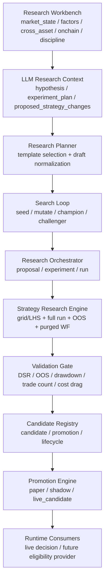
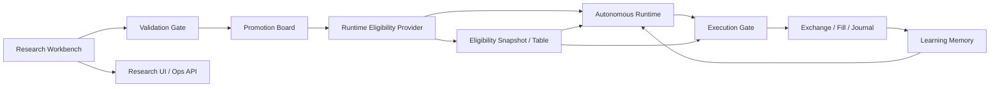

# AI 自治交易代理研究-准入-运行时治理一体化改进方案

更新时间：2026-04-07

## 1. 文档定位

这份文档是当前 AI 自治交易代理系统的总改造蓝图，用于统一回答以下问题：

1. 当前系统里的“研究”到底是怎么做的。
2. 为什么这套系统现在无法稳定盈利，且回撤巨大。
3. 为什么“只继续加模型、加策略、加币种”不会解决核心问题。
4. 后续应该按什么架构、什么顺序、什么验收标准去改造。

这不是一份单纯的讨论文档，而是一份可执行的实施方案。后续开发、测试、联调、上线、复盘，都应该以这份文档为主线。

## 2. 执行摘要

当前系统并不是“完全没有研究能力”，而是已经具备了一条相对完整的研究链：

1. 研究工作台汇总市场状态、因子、横截面、链上和纪律模块。
2. LLM 可生成结构化 hypothesis、experiment plan 和 strategy draft。
3. planner 会挑选可回测模板，并把 draft 转成可执行研究对象。
4. research engine 会跑参数搜索、全样本回测、OOS 验证、purged walk-forward 稳定性检查。
5. validation gate 会给出 reject、shadow、paper、live_candidate 的建议。
6. promotion engine 会把候选注册到 paper 或 live_candidate 生命周期。

问题不在“有没有研究流程”，而在“研究、准入、运行时、执行、学习之间的边界和纪律还不够硬”。

当前系统无法稳定盈利、回撤巨大的根本原因，不是单点 bug，而是多因素叠加：

1. 研究端仍可能把低样本、弱 edge、负净收益结果推进到较高状态。
2. 运行端过去对服务不稳定、连续亏损、同向重入的抑制不够硬。
3. 执行端对自治代理存在旁路，缺少独立二次审查。
4. 学习记忆没有完全升级为硬治理层。
5. 成本归因和净 PnL 口径仍不够可信。
6. 组合层风控与回撤熔断能力不足。
7. 研究域与运行时域仍存在“研究注册表格式耦合”。

本次改造的核心不是“让代理更聪明地下单”，而是：

1. 先让系统不把错误放大成回撤。
2. 再让研究结果以稳定契约的形式进入运行时。
3. 再让运行时在纪律边界内逐步放开自治权限。

一句话概括：

先治理错误，再放大收益；
先明确边界，再扩张自治。

### 2.1 2026-04-07 当前已完成收口项

以下关键闭环已经落地到代码，并且不依赖“AI 研究页面本身参与运行时决策”：

1. 自治代理 `fresh entry` 已被冷静期、服务不稳定、连亏保护、风险熔断共同硬阻断。
2. `execution_engine` 已统一记录 `gross_pnl_usd`、`net_pnl_usd`、`cost_usd`，净收益口径统一为成本后结果。
3. `risk_manager` 已输出自治纪律契约，包括 `discipline`、`max_drawdown`、`rolling_3d`、`rolling_7d`。
4. 自治纪律阈值已从硬编码切换为可配置字段，并新增独立 overlay 持久化，服务重启后仍保留。
5. `Runtime Eligibility Provider` 已落地为独立 snapshot/provider，运行时控制面只消费稳定契约摘要。
6. 自治代理专用 API 已暴露 `risk-status`、`risk-config`、`scorecard`，并附带 eligibility 的 `generated_at`、`refresh_age_sec`、`reason_codes`、`data_source`。
7. 前端自治代理面板已能直接看到纪律阈值、回撤状态、净收益记分牌、eligibility 刷新年龄与原因码。

这意味着当前控制面只是“观测与治理入口”，而不是把自治代理重新耦合回研究页面。

## 3. 当前系统是怎么做“研究”的

这一节用于统一概念。当前系统里的“研究”并不是单一模块，而是一条从研究工作台到候选准入的链路。

### 3.1 当前研究链路总览

当前实际链路可以概括为：

### 3.2 当前研究工作台做什么

研究工作台不是直接下单模块，而是研究控制面。

它负责：

1. 汇总研究相关输入。
2. 形成市场环境与候选方向建议。
3. 给研究 planner 提供上下文。
4. 承载人工审核和后续研究操作入口。

当前研究工作台核心输入模块包括：

1. `market_state`
2. `factors`
3. `cross_asset`
4. `onchain`
5. `discipline`

这些模块由 `web/api/research.py` 统一组织，先产出研究 overview，再给 recommendation 层生成下一步建议。

### 3.3 当前 LLM 研究上下文是怎么生成的

当前系统有一条单独的“研究上下文生成”能力：

1. 输入 `market_summary`
2. 输入 `goals`
3. 输出结构化 JSON

输出内容包括：

1. `hypothesis`
2. `experiment_plan`
3. `metrics_to_check`
4. `expected_failure_modes`
5. `proposed_strategy_changes`
6. `uncertainty`
7. `evidence_refs`

重要的是：

1. 这一步的目标是生成研究计划，不是生成交易指令。
2. 它可以提供 2-4 个可执行 draft。
3. 至少一个 draft 应能转换成 strategy program。

### 3.4 当前 planner 做什么

planner 并不是直接用 LLM 文本去下单，而是把研究上下文正规化。

planner 当前会做这些事：

1. 读取 `market_context`
2. 根据方向、波动、新闻、链上、微观结构等信号对策略分类加权
3. 选择 catalog 中“可回测”的模板策略
4. 把 LLM draft 规范成 `StrategyDraft`
5. 解析 `program`
6. 计算 `research_mode`
7. 给出 `search_budget`
8. 触发轻量 search loop

这意味着当前系统已经在做“研究对象工程化”，不是只靠 prompt 临场拍脑袋。

### 3.5 当前 search loop 做什么

search loop 的定位不是无限制自进化，而是把 research draft 变成一批可追踪的候选。

当前逻辑大致是：

1. 生成 seed draft
2. 基于模板参数做有限 mutation
3. 根据可执行性、novelty、模板重复度、退出逻辑、参数面等打 heuristic score
4. 做 accept / reject
5. 标记 champion 与 challenger
6. 记录 rejection reason，例如 `duplicate_signature`、`budget_trimmed`

它的价值在于：

1. 让研究候选可追踪
2. 让 search 结果有 lineage
3. 让 champion/challenger 关系可被运行时消费

### 3.6 当前 research engine 做什么

当前 research engine 并不是只跑一个简单 backtest。

它会做：

1. 数据加载
2. 多 timeframe 重采样
3. 事件与 funding enrichment
4. 参数优化
5. 全样本运行
6. OOS 验证
7. purged walk-forward 稳定性验证
8. quality flag 计算
9. 成本拖累估计
10. best result 和 best per strategy 汇总

当前输出中已经包含：

1. `total_return`
2. `gross_total_return`
3. `cost_drag_return_pct`
4. `sharpe_ratio`
5. `max_drawdown`
6. `total_trades`
7. `win_rate`
8. `is_sharpe`
9. `oos_sharpe`
10. `wf_stability`
11. `wf_consistency`
12. `quality_flag`
13. `best_params`
14. `equity_curve_sample`

说明这条研究链已经具备了做“研究准入治理”的基础数据。

### 3.7 当前 validation gate 做什么

validation gate 的职责是把研究结果翻译成部署建议。

它当前主要会计算：

1. `edge_score`
2. `risk_score`
3. `stability_score`
4. `efficiency_score`
5. `robustness_score`
6. `deployment_score`
7. `dsr_score`

并基于这些指标做：

1. `reject`
2. `shadow`
3. `paper`
4. `live_candidate`

它已经使用以下准入信号：

1. 净收益是否为正
2. drawdown 是否过高
3. Sharpe 是否过低
4. cost drag 是否过高
5. total trades 是否过低
6. valid run ratio 是否过低
7. OOS degradation 是否过高
8. walk-forward stability 是否过低
9. DSR 是否过低

### 3.8 当前 candidate 与 promotion 做什么

research 结束后，系统会：

1. 为每个 strategy 生成 `StrategyCandidate`
2. 记录 `validation_summary`
3. 记录 `promotion`
4. 记录 `promotion_target`
5. 写入 candidate registry
6. 做 champion/challenger 和相关性过滤

之后 promotion engine 会把 candidate 推进到：

1. `paper_running`
2. `shadow_running`
3. `live_candidate`
4. `live_running`
5. `retired`

当前 governance 打开时，candidate 通常会被打上：

1. `manual_register_required`
2. `promotion_pending_human_gate`

说明系统设计上其实已经意识到“研究结果不能直接无门控实盘”。

### 3.9 当前运行时如何使用研究结果

这里是理解当前问题的关键。

当前运行时并不是完全不看研究，但看法并不统一：

1. `live_decision_router` 仍可读取 `research_runtime_context`
2. `research_runtime_context` 直接从 `candidates.json` 与 `proposals.json` 里挑 selected candidate
3. 它把研究 champion、active runtime candidate 等上下文喂给 live decision AI
4. 但 prompt 里明确写着：`research_context` 只是 advisory source，不是 execution authority

与此同时：

1. `autonomous_agent` 当前主链路已经被改成使用 `_decoupled_research_context`
2. 它不再把 research candidate/proposal 作为直接执行依据
3. 它更多依赖实时 market context、position context、learning memory

这说明系统目前正处在“研究域与运行时域正在拆分，但还没完全拆干净”的阶段。

### 3.10 当前有哪些入口会触发研究

当前研究不仅可由页面手动发起，还可能自动触发。

已有入口包括：

1. Web UI 手动 generate proposal
2. Web UI 手动 create manual proposal
3. Web UI 手动 run proposal
4. Web UI one-click research deploy
5. `ResearchScheduler` 自动调度 `research_queued`
6. `CUSUM watcher` 在衰减时自动 draft replacement proposal

所以这套系统不是单次实验玩具，而是已经有自治研究的雏形。

## 4. 当前确认的问题与证据

这一节用于说明：为什么系统目前不能稳定盈利，且会出现较大回撤。

### 4.1 最新研究结果本身并不证明存在可部署 edge

基于 `data/research/latest.json` 的检查，当前最新最优研究结果仍表现为：

1. 负收益
2. 负 Sharpe
3. 交易数极低
4. 成本拖累显著
5. drawdown 不可接受

这意味着：

1. 当前研究端还没有找到足够可信的正向 alpha。
2. 继续放大自治权限，只会把弱 edge 放大成更大的实盘波动。

### 4.2 低交易数样本曾被推进到过高状态

历史逻辑中，存在“trade count too low”但仍被推进到 `paper` 或 `live_candidate` 的情况。

这会带来两个严重问题：

1. 把随机噪声误判成策略 edge
2. 把漂亮但稀疏的回测结果误判成可部署候选

目前已追加硬门槛：

1. `< 1` 笔完成交易：直接拒绝
2. `1-9` 笔完成交易：最多 `shadow`
3. `10-29` 笔完成交易：最多 `paper`
4. `30+` 笔完成交易：才允许评估 `live_candidate`

但这只是止血，不是完整改造的终点。

### 4.3 自治代理曾在服务不稳定期间仍可能继续开新仓

学习记忆已经能识别：

1. 最近模型异常率
2. 最近平均延迟
3. 最近价格缺失
4. 最近连续亏损

但旧逻辑对服务不稳定主要体现为 prompt 提示和软约束，不是硬阻断。

这会导致：

1. 在模型失败率高时仍继续 fresh entry
2. 在延迟极高时仍继续把判断当成有效
3. 在异常恢复初期继续试错下单

目前已把“服务不稳定时禁止新开仓”升级成硬规则，但仍需要把整套不稳定判定和降档模式系统化。

### 4.4 执行层对自治代理仍存在旁路风险

当前系统的结构性风险之一是：

1. 自治代理是建议者
2. 又可能直接触发执行
3. 执行前二次 AI 审查并不总是强制生效

这意味着：

1. 建议层与执行层之间缺少独立制衡
2. 错误判断更容易穿透到真实交易

当研究质量还不稳定时，这种旁路结构会显著放大回撤。

### 4.5 学习记忆还没有完全升级成硬治理层

当前 learning memory 已经能总结：

1. recent close loss count
2. recent close win count
3. recent close net pnl
4. model issue count
5. recent latency avg
6. same direction exposure ratio
7. entry size scale
8. blocked symbol-sides
9. lessons
10. guardrails

但当前还存在以下不足：

1. 有些约束仍停留在提示性上下文
2. 临时故障与结构性亏损还没有完全分离
3. 冷静期与同向重入抑制还不够系统
4. 学习输出还没有统一进入所有执行前关口

### 4.6 成本与净值归因仍不够真实

目前实盘日志里存在：

1. `fee_usd` 长时间为 `0`
2. `slippage_cost_usd` 长时间为 `0`
3. paper/live 成本口径不完全统一

这会直接导致：

1. 研究阶段高估薄边交易
2. 学习记忆低估真实成本拖累
3. scorecard 和复盘出现虚高

### 4.7 组合层风控和回撤治理还不够硬

当前系统更多还是单笔风控思维，组合治理不足，典型问题包括：

1. 同方向暴露积累
2. 同一 symbol-side 重复重入
3. 连续亏损后未强制降档
4. 单日亏损与滚动回撤未形成硬熔断

这会让弱 edge 在组合层被放大。

### 4.8 研究域与运行时域仍存在格式级耦合

这里必须说清楚：

1. 当前问题不是“耦合到 AI 研究页面 UI”
2. 当前问题是“运行时仍可能直接依赖 research registry 的内部结构”

这两件事不是一回事。

页面本身不应该成为运行时依赖。

但就算不依赖页面，只要运行时还直接读：

1. `candidates.json`
2. `proposals.json`
3. candidate metadata 的研究内部字段

它依然是耦合的。

这种耦合的后果是：

1. 研究工作台字段一变，运行时就可能跟着破
2. runtime consumer 会越来越理解 proposal/candidate 的内部细节
3. 运行时边界会越来越不清晰

## 5. 已完成的止血改动

本轮已经完成以下高优先级修复：

### 5.1 服务不稳定时禁止 fresh entry

已把：

1. `avoid_new_entries_during_service_instability`

从提示性规则升级成硬运行时阻断。

预期效果：

1. 避免在高异常、高延迟阶段继续试错开仓
2. 避免刚恢复时立刻继续进攻

### 5.2 低交易样本禁止高等级推广

已加入硬样本门槛：

1. `< 1` 笔完成交易：reject
2. `1-9` 笔完成交易：最多 `shadow`
3. `10-29` 笔完成交易：最多 `paper`
4. `30+` 笔完成交易：才允许评估 `live_candidate`

预期效果：

1. 低样本噪声不再轻易晋级
2. “少数几笔好看交易”不再被误判成可部署 edge

### 5.3 当前止血改动的边界

必须明确：

1. 以上改动只是止血
2. 还没有从架构层解决研究准入与运行时边界问题
3. 也还没有彻底解决执行旁路、成本归因、组合回撤治理

## 6. 根本改造目标

后续改造不是简单“再修几个判断条件”，而是要把系统升级成一套研究-准入-运行时-学习闭环一致的自治框架。

目标分为五类。

### 6.1 盈利目标

不是追求短期高收益，而是：

1. 先降低错误交易穿透率
2. 先提升净收益可信度
3. 再逐步放开自治权限

### 6.2 架构目标

要完成以下解耦：

1. 研究工作台与运行时解耦
2. proposal/candidate 内部格式与运行时解耦
3. 研究结论与执行权限解耦

### 6.3 治理目标

要让以下内容成为硬规则而不是提示语：

1. 样本门槛
2. OOS 门槛
3. DSR 门槛
4. 成本门槛
5. 服务不稳定阻断
6. 回撤熔断
7. 组合暴露上限

### 6.4 学习目标

学习系统必须从“总结经验”升级成“改变行为”。

也就是：

1. 学到亏损后，后续真的收紧
2. 学到服务不稳定后，后续真的不再开仓
3. 学到同向重入容易亏，后续真的会阻断

### 6.5 运维目标

系统必须变成：

1. 可解释
2. 可追踪
3. 可回放
4. 可复盘
5. 可安全降档

## 7. 总体设计原则

### 7.1 页面是控制面，不是运行时依赖

AI 研究页面只应该负责：

1. 发起研究
2. 查看候选
3. 展示报告
4. 处理人工审核
5. 管理生命周期

它不应该负责：

1. 给运行时直接供决策字段
2. 承担运行时契约责任
3. 成为交易 agent 的实时依赖

### 7.2 研究输出的是证据，不是执行权

研究系统的职责是：

1. 发现候选
2. 量化证据
3. 做准入建议

它不应直接拥有：

1. 自动跳过执行审查的权利
2. 自动 live 下单的权利
3. 无门控放大风险的权利

### 7.3 运行时只应依赖稳定、最小、只读的准入契约

运行时不该理解：

1. proposal 结构
2. research workbench 展示态
3. candidate registry 的内部元数据细节

运行时只应理解：

1. 当前是否可交易
2. 当前最大风险预算是多少
3. 当前是否仅允许 `hold_only` 或 `reduce_only`
4. 当前资格是否过期
5. 当前拒绝或降档原因是什么

### 7.4 净收益优先于方向判断

所有研究、学习、复盘必须以成本后净表现为核心，而不是“方向大致判断对了”。

### 7.5 先组合安全，后单笔想象空间

系统优先保护：

1. 日内损失
2. 滚动回撤
3. 同向暴露
4. 总持仓风险

而不是优先追求：

1. 单笔赔率
2. 高频试错
3. 更激进的开仓速度

### 7.6 先 deny-by-default，后放权

只要出现以下任一情况，系统默认拒绝扩张风险：

1. 服务不稳定
2. 市场数据不新鲜
3. 研究资格缺失
4. 资格过期
5. 回撤超阈值
6. 同向暴露超阈值
7. 连续亏损未消化

## 8. 目标架构

### 8.1 目标分层

建议把整套系统正式拆成三个层次。

#### A. Research Workbench

负责：

1. proposal
2. experiment
3. candidate
4. validation
5. lifecycle
6. manual review
7. score explanation

#### B. Runtime Eligibility Provider

负责：

1. 从 research domain 提炼最小运行时准入结论
2. 产出稳定 snapshot 或专用表
3. 隔离 research registry 的格式变化
4. 给运行时提供只读资格视图

#### C. Autonomous Runtime

负责：

1. 实时 market context
2. learning memory
3. risk policy
4. execution proposal
5. execution gating
6. position management

### 8.2 目标架构图

### 8.3 当前与目标的最大区别

当前更像：

1. research registry 兼做研究记录与运行时参考
2. runtime consumer 仍理解候选内部格式
3. 执行权限和研究结论之间边界不够硬

目标应该变成：

1. 研究域负责生产证据
2. eligibility provider 负责压缩成准入契约
3. runtime 只消费准入契约
4. execution gate 负责最后一道防线

## 9. Runtime Eligibility Provider 详细设计

这是本次改造的关键新增层。

### 9.1 设计目标

这层的目标不是再造一个 UI，而是提供一个稳定、最小、只读的运行时资格视图。

### 9.2 建议输出形式

建议新增：

1. `data/research/runtime/eligibility_snapshot.json`

后续如有需要，再平滑迁移到：

1. 专用 DB 表
2. 专用 API

### 9.3 建议最小字段

每条 eligibility 记录建议至少包含：

1. `snapshot_version`
2. `generated_at`
3. `exchange`
4. `symbol`
5. `timeframe`
6. `strategy`
7. `strategy_family`
8. `source_candidate_id`
9. `source_proposal_id`
10. `eligible_for_autonomy`
11. `runtime_mode_cap`
12. `promotion_target`
13. `max_allocation`
14. `max_leverage`
15. `min_confidence`
16. `same_direction_max_exposure_ratio`
17. `entry_size_scale`
18. `require_live_review`
19. `reduce_only_on_instability`
20. `expires_at`
21. `max_age_minutes`
22. `reason_codes`
23. `validation_summary`
24. `deployment_score`
25. `oos_score`
26. `wf_stability`
27. `dsr_score`

### 9.4 明确禁止写入这类字段

eligibility snapshot 不应该暴露：

1. 页面展示态字段
2. proposal 的长文本
3. candidate 内部搜索草稿细节
4. UI 专属标识
5. 运行时不需要理解的 lineage 详情

### 9.5 建议的状态表达

建议把运行时资格表达成以下几种最小状态之一：

1. `blocked`
2. `observe_only`
3. `shadow_only`
4. `paper_allowed`
5. `live_candidate_only`
6. `live_execute_allowed`
7. `reduce_only`
8. `expired`

### 9.6 Provider 的职责边界

它应负责：

1. 汇总 candidate 与 validation summary
2. 判断当前资格是否有效
3. 生成 reason codes
4. 原子写入 snapshot
5. 暴露 refresh age

它不应负责：

1. 生成研究 hypothesis
2. 生成 UI 展示文案
3. 做盘中交易判断
4. 管理下单逻辑

### 9.7 刷新触发时机

建议在以下时机刷新 eligibility：

1. candidate 新建后
2. candidate promotion 变化后
3. candidate retire 后
4. proposal 被 reject 或 retire 后
5. governance 审批通过后
6. 定时兜底刷新

### 9.8 Snapshot 失效策略

运行时必须把 snapshot 过期视作风险事件。

要求：

1. eligibility 缺失：不能 live execute
2. eligibility 过期：最多 `hold_only` 或 `reduce_only`
3. eligibility 刷新失败：默认降档

## 10. 研究、准入、执行、学习四个域的边界

为了避免后续又混回去，这里明确写死边界。

### 10.1 Research Domain

关心：

1. hypothesis
2. experiment
3. backtest result
4. OOS
5. walk-forward
6. candidate comparison

不关心：

1. 实时开平仓决策
2. 盘中即时服务稳定性
3. 当前账户持仓是否超限

### 10.2 Runtime Eligibility Domain

关心：

1. 某候选是否具备运行资格
2. 资格有效期
3. 资格上限
4. 资格降档原因

不关心：

1. proposal 长什么样
2. 页面怎么展示
3. research 内部 search loop 如何运作

### 10.3 Autonomous Runtime Domain

关心：

1. 实时市场上下文
2. 当前仓位
3. 当前组合风险
4. learning memory
5. runtime eligibility
6. execution policy

不关心：

1. draft 生成细节
2. planner 选过哪些模板
3. proposal lineage 的完整内部结构

### 10.4 Execution Domain

关心：

1. 交易是否允许发出
2. 是否 block
3. 是否 reduce_only
4. 是否要二次 AI 审查
5. 是否需要人工审批

不关心：

1. 候选研究是怎么得出的
2. 页面推荐语是什么

## 11. 详细改造方案

以下按八个阶段推进。每一阶段都给出目标、任务、涉及模块、交付物和验收标准。

## 12. 阶段 0：建立统一基线与冻结风险口径

### 目标

在继续改造之前，先统一“系统到底以什么口径判断自己好坏”。

### 任务

1. 固化当前关键研究、运行时、执行、学习、组合指标的定义。
2. 固化净值口径，以成本后净收益为准。
3. 固化回撤口径，明确日内、滚动 3 天、滚动 7 天的计算方式。
4. 固化 candidate promotion 的状态机解释。
5. 固化 runtime mode 的状态定义。

### 交付物

1. 指标字典
2. 回撤字典
3. runtime mode 字典
4. eligibility reason code 字典

### 涉及模块

1. `core/research/validation_gate.py`
2. `core/accounting/*`
3. `core/ai/autonomous_learning.py`
4. `core/risk/risk_manager.py`

### 验收标准

1. 研究、实盘、学习、前端报表使用同一净值定义。
2. 所有关键指标都能回答“来源字段”和“使用方”。

## 13. 阶段 A：立即止血与执行旁路收口

### 目标

先把继续扩大回撤的入口关掉。

### 任务

1. 去掉自治代理默认绕过 `live_decision_router` 的行为。
2. 在 live 模式下，自治代理至少必须经过 `shadow` 或 `reduce_only` 级别二次审查。
3. 若研究资格缺失或过期，禁止 live fresh entry。
4. 若模型异常率、行情新鲜度、平均延迟任一超阈值，强制进入：
   1. `hold_only`
   2. 或 `reduce_only`
5. 将“服务不稳定”从 prompt 约束彻底升级成运行时硬阻断。
6. Journal 中必须清楚记录每次拒单原因。
7. 拆开“能否加仓”和“能否开新仓”的规则，不允许旧风险继续叠加。

### 建议新增或调整的运行模式

建议统一为：

1. `observe`
2. `shadow`
3. `paper_execute`
4. `live_reduce_only`
5. `live_execute`

### 涉及模块

1. `core/ai/autonomous_agent.py`
2. `core/ai/live_decision_router.py`
3. `core/trading/execution_engine.py`
4. `core/risk/risk_manager.py`

### 交付物

1. 执行旁路移除
2. 新的拒单 reason code
3. 运行模式状态定义
4. 对应单元测试与集成测试

### 验收标准

1. 服务不稳定状态下，新开仓被 100% 阻断。
2. 自治代理不再无条件绕过二次审查。
3. 所有拒单原因都能在 journal 与 review API 中查到。

## 14. 阶段 B：研究准入门重构

### 目标

让“研究通过”这件事真正代表有资格进入下一阶段，而不是仅仅“值得再看看”。

### 任务

1. 把以下条件全部做成硬门而不是加分项：
   1. 最小完成交易数
   2. OOS Sharpe
   3. DSR
   4. walk-forward stability
   5. 最大回撤
   6. 成本拖累占比
   7. valid run ratio
2. 明确 `shadow`、`paper`、`live_candidate` 各自的最低门槛。
3. 把“trade count too low”从说明文字升级成状态机降级触发器。
4. 分离：
   1. `research_score`
   2. `deployment_score`
   3. `risk_recommendation`
5. 要求 `live_candidate` 必须同时满足：
   1. 足够交易样本
   2. 非空 OOS
   3. walk-forward 稳定
   4. 成本后净表现为正
   5. DSR 不低于阈值
6. 对负收益、低样本、低 OOS、低 DSR 的候选输出更明确的 reason code。

### 需要额外新增的准入理由编码

建议统一 reason codes，例如：

1. `NEGATIVE_NET_RETURN`
2. `LOW_TRADE_COUNT`
3. `LOW_OOS_SHARPE`
4. `LOW_DSR`
5. `HIGH_DRAWDOWN`
6. `HIGH_COST_DRAG`
7. `LOW_VALID_RUN_RATIO`
8. `LOW_WF_STABILITY`
9. `CORRELATION_FILTERED`

### 涉及模块

1. `core/research/validation_gate.py`
2. `core/research/orchestrator.py`
3. `core/research/experiment_schemas.py`

### 交付物

1. 准入硬门版本说明
2. reason code 体系
3. 准入门单元测试
4. 拒绝/降级行为集成测试

### 验收标准

1. 低样本候选无法再推进到 `paper` 或 `live_candidate`。
2. OOS 明显不稳定的候选无法再被高等级推荐。
3. promotion decision 的理由可以稳定复现。

## 15. 阶段 C：Runtime Eligibility Provider 落地

### 目标

正式切断运行时对 research registry 内部格式的直接依赖。

### 核心原则

1. 运行时不依赖页面
2. 运行时也不直接依赖 proposal/candidate 内部格式
3. 运行时只依赖 eligibility contract

### 任务

1. 新增 `core/ai/runtime_eligibility.py`
2. 设计 `eligibility_snapshot.json`
3. 由 provider 读取 research domain 结果并压缩成稳定契约
4. 输出 atomic snapshot
5. 为 snapshot 增加：
   1. `generated_at`
   2. `expires_at`
   3. `refresh_age_minutes`
   4. `reason_codes`
6. 先让 `live_decision_router` 改为读取 eligibility snapshot
7. 再让需要研究资格的 runtime consumer 改为读取 eligibility snapshot
8. 将 `research_runtime_context.py` 逐步降级为兼容层或废弃层

### 推荐迁移顺序

建议按以下顺序迁移，避免一次性改太多：

1. 先新增 provider，不动旧 consumer
2. 用 provider 生成 snapshot，并加入测试
3. 先把 `live_decision_router` 切换到 snapshot
4. 确认稳定后，再处理其他 consumer
5. 最后再废弃 `research_runtime_context.py`

### 涉及模块

1. 新增 `core/ai/runtime_eligibility.py`
2. `core/ai/research_runtime_context.py`
3. `core/ai/live_decision_router.py`
4. `core/ai/autonomous_agent.py`
5. `core/research/orchestrator.py`
6. `data/research/runtime/*`

### 交付物

1. eligibility snapshot schema
2. provider builder
3. provider refresh hooks
4. consumer migration patch
5. 兼容层退役计划

### 验收标准

1. 运行时不再直接读取 `candidates.json` 和 `proposals.json` 决策。
2. 研究页面改版不影响运行时决策链。
3. snapshot 缺失或过期会自动降档，而不是 silent fail open。

## 16. 阶段 D：执行层治理与二次审查硬化

### 目标

让执行层成为真正独立的最后一道防线。

### 任务

1. 明确：
   1. research result 不是 execution authority
   2. runtime signal 也不是 execution authority
2. live 模式下的 fresh entry 必须通过：
   1. runtime eligibility
   2. learning memory
   3. portfolio risk
   4. live decision router
3. 对自治代理去掉 `skip_live_decision_review`
4. 将 live decision router 的输出明确为：
   1. `allow`
   2. `block`
   3. `reduce_only`
5. 当 eligibility 仅允许 `paper` 或 `shadow` 时，不允许穿透到 live execute。
6. 对人工审批路径进行明确分层：
   1. `live_candidate` 仅代表候选
   2. `live_running` 需要额外审批

### 涉及模块

1. `core/trading/execution_engine.py`
2. `core/ai/live_decision_router.py`
3. `core/deployment/promotion_engine.py`
4. `core/governance/*`

### 交付物

1. execution gate policy
2. live 审查链说明
3. 旁路移除测试
4. live candidate 与 live running 区分规范

### 验收标准

1. 自治代理无法再绕开 live decision gate。
2. live_candidate 不能等同于 live_execute。
3. 缺少 eligibility 或人工门控时，live execute 会被拒绝。

## 17. 阶段 E：Learning Memory 从经验提示升级为硬治理层

### 目标

让学习结果真正改变行为，而不是只写进 metadata 或 prompt。

### 建议重构成三层

#### 1. Observation Layer

负责记录事实：

1. 最近平仓盈亏
2. 最近连续亏损
3. 最近模型异常
4. 最近延迟
5. 最近行情缺失
6. 当前持仓浮亏
7. 同向暴露

#### 2. Rule Layer

负责产出约束：

1. `effective_min_confidence`
2. `entry_size_scale`
3. `same_direction_max_exposure_ratio`
4. `symbol_side_cooldown`
5. `avoid_new_entries_during_service_instability`
6. `force_close_on_data_outage_losing_position`

#### 3. Decision Layer

负责给运行时返回最小决策：

1. `allow_fresh_entry`
2. `allow_add_position`
3. `reduce_only`
4. `force_flatten`

### 任务

1. 把 learning memory 字段分层组织。
2. 区分：
   1. 临时故障
   2. 持续服务不稳定
   3. 结构性亏损期
3. 对每个 guardrail 给出来源说明。
4. 增加 symbol-side 冷静期。
5. 连续亏损时自动提高最小置信度并降低仓位。
6. 同向重入在亏损背景下自动阻断。
7. learning memory 只基于已确认的净结果更新。

### 涉及模块

1. `core/ai/autonomous_learning.py`
2. `core/ai/autonomous_agent.py`
3. `data/cache/ai/autonomous_agent_learning_memory.json`

### 交付物

1. 新 memory schema
2. cooldown 逻辑
3. guardrail explainability
4. 对应测试集

### 验收标准

1. 系统可以明确解释“为什么当前禁止开仓”。
2. 同一 symbol-side 冷静期真实生效。
3. 连续亏损后系统会自动收紧，而不是保持同强度试错。

## 18. 阶段 F：成本、成交与净 PnL 归因统一

### 目标

让所有研究、学习、报表都基于可信净值。

### 任务

1. 检查 live 订单回执中的真实手续费映射，修复 `fee_usd = 0` 的问题。
2. 补齐 slippage 估计。
3. 统一记录以下字段：
   1. `gross_pnl`
   2. `fee_usd`
   3. `slippage_cost_usd`
   4. `funding_pnl`
   5. `net_pnl`
4. 统一 paper 与 live 的 PnL 分解口径。
5. 让 learning memory、scorecard、review、前端分析使用同一净值定义。
6. 让 cost drag 进入 candidate 评估与自治学习。

### 涉及模块

1. `core/trading/execution_engine.py`
2. `core/accounting/pnl_decomposer.py`
3. `core/backtest/backtest_engine.py`
4. `data/cache/live_review/strategy_trade_journal.jsonl`

### 交付物

1. 统一 PnL schema
2. 成本映射修复
3. live/paper 口径对齐
4. 历史数据回填脚本

### 验收标准

1. live 日志不再长期出现 `fee_usd = 0`。
2. cost drag 会真实进入学习与研究准入。
3. 复盘面板与 journal 的净收益一致。

## 19. 阶段 G：组合层风控与回撤治理

### 目标

把单笔止损升级为组合级生存能力。

### 任务

1. 给自治代理增加专属组合预算：
   1. 最大总暴露
   2. 最大同方向暴露
   3. 单 symbol 暴露上限
   4. 单 strategy family 暴露上限
2. 增加回撤熔断：
   1. 日内熔断
   2. 滚动 3 天熔断
   3. 滚动 7 天熔断
3. 达到阈值时自动降档：
   1. 提高最小置信度
   2. 降低 entry size
   3. 禁止同向加仓
   4. 仅允许减仓或平仓
4. 将“持仓总量限制”和“开新仓限制”彻底分开。

### 涉及模块

1. `core/risk/risk_manager.py`
2. `core/governance/decision_engine.py`
3. `core/trading/execution_engine.py`
4. `core/runtime/runtime_state.py`

### 交付物

1. 组合预算定义
2. 熔断状态机
3. 回撤降档逻辑
4. 风控可视化指标

### 验收标准

1. 连续亏损后系统会自动降档。
2. 总暴露和同向暴露无法再被绕开。
3. 回撤达到阈值时系统进入 `reduce_only` 或停机。

## 20. 阶段 H：自治代理工具箱脚手架成型

### 目标

把“一个会下单的 agent”升级成“一个可治理的自治系统”。

### 应建立的工具箱模块

1. `Policy Engine`
2. `Research Workbench`
3. `Runtime Eligibility Provider`
4. `Trade Journal`
5. `Learning Memory`
6. `Exposure Budget Manager`
7. `Health Monitor`
8. `Promotion Board`
9. `Scorecard`
10. `Replay / Review Toolkit`

### 每个模块的定位

#### Policy Engine

负责：

1. 全局硬规则
2. deny-by-default 策略
3. 风险开关

#### Trade Journal

负责：

1. 建议记录
2. 拒单记录
3. 成交记录
4. 平仓归因
5. 成本分解

#### Health Monitor

负责：

1. 模型可用性
2. 延迟
3. 市场数据新鲜度
4. 数据缺失
5. 异常率

#### Scorecard

统一输出：

1. 胜率
2. 净收益
3. fee drag
4. slippage drag
5. max drawdown
6. model issue rate
7. fresh-entry rejection rate
8. runtime eligibility refresh age
9. same-direction reentry count

### 交付形式

建议统一为：

1. Python 模块
2. JSON 状态文件
3. API 接口
4. 前端监控页
5. 回放与复盘脚本

## 21. 当前关键模块与建议责任归属

为了便于后续执行，这里列出建议重点改造模块。

### 21.1 研究域

1. `web/api/research.py`
2. `web/api/ai_research.py`
3. `core/ai/research_context_generator.py`
4. `core/ai/research_planner.py`
5. `core/ai/research_search_loop.py`
6. `core/research/orchestrator.py`
7. `core/research/strategy_research.py`
8. `core/research/validation_gate.py`

### 21.2 准入与治理域

1. 新增 `core/ai/runtime_eligibility.py`
2. `core/deployment/promotion_engine.py`
3. `core/governance/*`

### 21.3 运行时域

1. `core/ai/autonomous_agent.py`
2. `core/ai/autonomous_learning.py`
3. `core/ai/live_decision_router.py`

### 21.4 执行与会计域

1. `core/trading/execution_engine.py`
2. `core/accounting/*`
3. `core/backtest/*`

### 21.5 风控与监控域

1. `core/risk/risk_manager.py`
2. `core/runtime/runtime_state.py`
3. `data/cache/live_review/*`
4. `data/research/runtime/*`

## 22. 团队组织与分工执行方案

这一节用于把“方案”转换成“组织结构与责任结构”。

配套的团队执行手册见：

1. `docs/AI_AUTONOMOUS_TRADING_TEAM_EXECUTION_PLAYBOOK_2026-04-07.md`

如果没有明确的 owner、交付物、上下游边界和质量门，后续最容易发生的问题是：

1. 研究域、运行时域、API 域重新耦合
2. 前端先做页面，后端协议再改，反复返工
3. QA 在最后阶段才介入，导致问题晚暴露
4. Ops 直到上线前才知道系统真实依赖与回滚路径

因此，建议按“后端职责域 + 横向协作角色 + 跨职能工作流”三层组织。

### 22.1 推荐团队编制

推荐采用“1 名后端总负责人 + 6 个后端职责域 owner + 3 个横向角色 owner”的编制。

标准编制建议如下：

1. `后端总负责人 / 架构 owner`
2. `后端研究平台负责人`
3. `后端准入 / 发布负责人`
4. `后端自治运行时负责人`
5. `后端执行与账务负责人`
6. `后端风控负责人`
7. `后端平台 / API 负责人`
8. `前端负责人`
9. `QA 负责人`
10. `Ops / 治理负责人`

如果团队规模较小，可以采用压缩编制，但仍必须保留单一 owner：

1. `架构 owner + API owner`
2. `研究 + 准入 owner`
3. `运行时 + 执行 owner`
4. `风控 + 学习 owner`
5. `前端 owner`
6. `QA + Ops owner`

无论团队大小，都不建议省略 `架构 owner`。这个角色不负责吞掉所有开发工作，而是负责三件事：

1. 冻结跨域 schema
2. 控制阶段顺序
3. 裁决边界问题

### 22.2 六个后端职责域与 owner 归属

建议按以下方式拆分后端职责域：

| 职责域 | 建议 owner 角色 | 核心模块 | 主要交付物 | 关键依赖 |
| --- | --- | --- | --- | --- |
| 研究编排与候选治理域 | 后端研究平台负责人 | `core/research/orchestrator.py`、`core/research/strategy_research.py`、`core/research/validation_gate.py`、`core/research/experiment_registry.py`、`core/research/experiment_schemas.py` | 研究链路稳定化、准入硬门、candidate 生命周期规范、reason code 体系、研究结果可复现 | 依赖 API 域提供入口；依赖执行与账务域提供可信成本口径 |
| 运行时准入与发布治理域 | 后端准入 / 发布负责人 | `core/deployment/promotion_engine.py`、`core/ai/research_runtime_context.py`、新增 `core/ai/runtime_eligibility.py` | `Runtime Eligibility Provider`、`eligibility_snapshot.json`、promotion 到 runtime contract 映射、`live_candidate` 与 `live_running` 边界 | 强依赖研究域产出 validation/candidate；依赖 API 域暴露审批与查询入口 |
| 自治代理运行时与学习记忆域 | 后端自治运行时负责人 | `core/ai/autonomous_agent.py`、`core/ai/autonomous_learning.py`、`core/ai/live_decision_router.py` | 运行时模式重构、服务不稳定硬阻断、learning memory 三层化、冷静期与同向重入抑制、运行时改读 eligibility contract | 依赖准入域提供 eligibility；依赖风控域提供组合限制；依赖执行域返回真实净值 |
| 执行、成交与账务归因域 | 后端执行与账务负责人 | `core/trading/execution_engine.py`、`core/accounting/*`、`core/backtest/*`、`data/cache/live_review/*` | 去除执行旁路、统一 live/paper 净 PnL、手续费与滑点归因、journal schema 统一、拒单与降档日志化 | 依赖运行时域提交标准化执行请求；依赖风控域给出 block / reduce_only 结论 |
| 风控与组合治理域 | 后端风控负责人 | `core/risk/*`、`core/runtime/*`、`core/governance/*` | 组合暴露预算、同向暴露限制、日内与滚动回撤熔断、降档状态机、deny-by-default 风险策略 | 依赖执行域拿到账户与持仓事实；依赖准入域提供策略上限信息 |
| 控制面 API 与后端集成域 | 后端平台 / API 负责人 | `web/api/ai_research.py`、`web/api/research.py`、`web/api/ai_agent.py`、`web/api/*` | 研究入口、审批入口、scorecard API、eligibility 查询、运行时状态 API、契约校验与错误处理 | 依赖全部后端职责域提供稳定 schema；但不应反向定义内部结构 |

### 22.3 横向角色与权限边界

除后端职责域 owner 外，还应明确三个横向角色：

#### QA 负责人

负责：

1. 统一维护测试矩阵
2. 维护回归清单
3. 维护环境验收标准
4. 维护发布前质量门
5. 拥有发布前质量否决权

不负责：

1. 替代 Ops 做生产决策
2. 替代前端做交互设计
3. 替代研究 owner 定义研究逻辑

#### Ops / 治理负责人

负责：

1. 运行模式
2. 审批流程
3. 环境变量与密钥
4. paper / live 切换
5. 告警与回滚
6. 上线与值班手册

不负责：

1. 替代 QA 写验收规则
2. 替代前端做界面信息架构
3. 替代后端定义内部状态机

#### 前端负责人

负责：

1. 研究工作台
2. 自治代理面板
3. 审批页
4. 回顾页
5. 空态、错误态、降级态一致性
6. 用户可见流程闭环

不负责：

1. 后台配置落盘
2. 运行模式定义
3. 审批 code 生成
4. 生产部署路径

### 22.4 五个跨职能工作流

建议按 5 个工作流组织前端、QA、Ops 与对应后端 owner 协作。

每个工作流都必须绑定 1 名后端接口 owner；如果没有稳定的后端 owner，就不要启动该工作流。

#### 工作流 1：研究工作台与研究建议动作链

建议 owner 组合：

1. 主后端 owner：后端研究平台负责人
2. 协同 owner：后端平台 / API 负责人、前端负责人、QA 负责人、Ops / 治理负责人

关联模块：

1. `web/api/research.py`
2. `web/api/ai_research.py`
3. `web/static/js/research_workbench.js`
4. `web/static/js/ai_research.js`
5. `web/templates/index.html`

主要交付物：

1. 研究工作台交互清单
2. proposal 生成与运行页面流程
3. 错误码映射表
4. 队列状态展示规则

验收输入：

1. 稳定的 API schema
2. proposal 状态机定义
3. job 样例数据
4. 页面空态与失败态文案
5. 测试夹具数据

#### 工作流 2：候选生命周期、推广与人工审批

建议 owner 组合：

1. 主后端 owner：后端准入 / 发布负责人
2. 协同 owner：后端平台 / API 负责人、前端负责人、QA 负责人、Ops / 治理负责人

关联模块：

1. `web/api/ai_research.py`
2. `web/static/js/ai_research.js`
3. `web/static/js/ai_research_candidates.js`
4. `web/templates/index.html`

主要交付物：

1. 候选生命周期流程图
2. 人工审批操作手册
3. 前端审批面板
4. 候选状态与动作矩阵

验收输入：

1. candidate 样例数据，至少覆盖 `validated`、`paper_running`、`live_candidate`、`live_running`、`retired`
2. 审批成功、失败、过期样例
3. promotion reason code 列表

#### 工作流 3：自治代理运行时配置、状态与单次试跑

建议 owner 组合：

1. 主后端 owner：后端自治运行时负责人
2. 协同 owner：后端平台 / API 负责人、前端负责人、QA 负责人、Ops / 治理负责人

关联模块：

1. `web/api/ai_agent.py`
2. `web/api/ai_research.py`
3. `web/static/js/ai_research_agent.js`
4. `web/static/js/ai_research_runtime.js`

主要交付物：

1. 运行时配置面板
2. 状态摘要面板
3. `run-once` 操作闭环
4. symbol ranking 展示
5. 异常提示规范

验收输入：

1. runtime config schema
2. 状态样例
3. symbol ranking 样例
4. learning memory 样例
5. 模型失败与超时场景样例

#### 工作流 4：实盘回顾、交易日志与分数卡

建议 owner 组合：

1. 主后端 owner：后端执行与账务负责人
2. 协同 owner：后端自治运行时负责人、前端负责人、QA 负责人、Ops / 治理负责人

关联模块：

1. `data/cache/live_review/strategy_trade_journal.jsonl`
2. `web/api/ai_research.py`
3. `web/static/js/ai_research_agent.js`

主要交付物：

1. 交易回顾面板
2. journal 字段字典
3. scorecard 指标映射
4. 异常日志显示规则

验收输入：

1. 真实或脱敏 journal 样本
2. 计数汇总样本
3. 成本字段样本
4. 已知异常样本

特别要求：

1. `fee_usd` 或 `slippage_cost_usd` 长期为 `0` 时，QA 与 Ops 必须把它视作阻断项，而不是展示层容忍项。

#### 工作流 5：发布、运行手册与变更控制

建议 owner 组合：

1. 主 owner：Ops / 治理负责人
2. 协同 owner：后端总负责人 / 架构 owner、QA 负责人、前端负责人、后端平台 / API 负责人

关联模块与文档：

1. `docs/AI_AUTONOMOUS_TRADING_EXECUTION_PLAN_2026-04-07.md`
2. `docs/GOVERNANCE.md`
3. `docs/STARTUP_STABILIZATION_PLAN_2026-04-01.md`
4. 相关前端与接口文档

主要交付物：

1. 发布清单
2. 回滚清单
3. 值班手册
4. 页面操作手册
5. 故障分诊手册

验收输入：

1. 稳定的 API / 页面行为
2. 最终状态机定义
3. 环境变量说明
4. 异常场景演练结果

### 22.5 阶段 owner 与推进顺序

为避免多人并行后失控，建议每个阶段设置单一 primary owner。

| 阶段 | Primary Owner | 主要协同角色 | 进入下一阶段前必须完成 |
| --- | --- | --- | --- |
| 阶段 0：统一口径 | 后端总负责人 / 架构 owner | 研究、执行、风控、QA | 指标字典、净值口径、reason code 口径冻结 |
| 阶段 A：止血与旁路收口 | 后端自治运行时负责人 | 执行、风控、QA、Ops | 新开仓阻断、执行旁路收口、拒单原因可追踪 |
| 阶段 B：研究准入门重构 | 后端研究平台负责人 | 准入 / 发布、QA | 准入硬门完成、低样本不得越级、promotion 决策可复现 |
| 阶段 C：Runtime Eligibility Provider | 后端准入 / 发布负责人 | 研究、运行时、API、QA | eligibility contract 稳定、snapshot 可刷新、consumer 开始迁移 |
| 阶段 D：执行层治理硬化 | 后端执行与账务负责人 | 运行时、风控、QA、Ops | live execute 不再绕过 gate、审批边界清晰 |
| 阶段 E：Learning Memory 硬治理 | 后端自治运行时负责人 | 风控、执行、QA | learning memory 真正改变行为、冷静期可验证 |
| 阶段 F：成本与净 PnL 统一 | 后端执行与账务负责人 | 研究、前端、QA、Ops | fee/slippage 可信、paper/live 口径统一 |
| 阶段 G：组合回撤治理 | 后端风控负责人 | 运行时、执行、QA、Ops | 回撤熔断与降档状态机可验证 |
| 阶段 H：工具箱脚手架成型 | 后端平台 / API 负责人 | 前端、Ops、QA、全部后端 owner | 控制面、回顾面、scorecard、runbook 完整闭环 |

### 22.6 并行推进原则

虽然总体顺序应严格遵守，但在每一阶段内部可以局部并行。建议遵守以下原则：

1. 研究域先冻结准入 contract，再允许前端与运行时接入。
2. eligibility schema 未冻结前，前端只能做草图，不做正式联调。
3. 执行域与运行时域可以在 mock eligibility 上并行，但必须在阶段 C 结束前切到真实 contract。
4. 成本归因未统一前，scorecard 只能做草稿，不算正式完成。
5. 组合回撤熔断未上线前，不扩大 live 自治权限。

### 22.7 协作节奏与质量门

建议固定以下协作节奏：

1. 每日 15 分钟跨 owner 站会：同步阻塞、契约变化、风险状态。
2. 每周 2 次 schema / state review：由架构 owner 主持，冻结跨域字段与状态机。
3. 每周 1 次端到端 demo：以真实样例走完 proposal -> candidate -> eligibility -> runtime -> review。
4. 每阶段结束前召开一次 Go / No-Go 评审：由 QA 与 Ops 共同参与。

以下质量门必须明确写入执行纪律：

1. 没有 API 契约样例，不进入前端联调。
2. 没有前端可见状态矩阵，不进入 QA 回归。
3. 没有审批手册与回滚手册，不进入 live 环境变更。
4. journal 成本字段长期为 `0`，不允许把“实盘回顾”标记为完成。
5. eligibility 缺少 `reason_codes` 与 `refresh_age`，不允许让 runtime 作为正式 consumer 接入。

## 23. 测试与验收方案

为了避免又回到“逻辑看起来合理，但实盘还是会穿透”的状态，测试必须按四层做。

### 23.1 单元测试

覆盖：

1. validation gate
2. eligibility provider
3. learning memory guardrails
4. execution gate
5. cost attribution

### 23.2 集成测试

覆盖：

1. proposal -> experiment -> candidate -> promotion -> eligibility snapshot
2. live decision router 对 eligibility 的消费
3. autonomous runtime 对 learning memory 的消费
4. execution engine 的拒单与降档行为

### 23.3 场景测试

必须覆盖以下场景：

1. 低交易数候选直接 reject 或降级
2. OOS 差但全样本好看的候选被降级
3. DSR 低的候选被 reject
4. eligibility 过期时 live execute 被拒绝
5. 服务不稳定时 fresh entry 被阻断
6. 连续亏损后同向重入被阻断
7. fee/slippage 非零进入净 PnL
8. 回撤超阈值时进入 `reduce_only`

### 23.4 运营验收

必须从运营视角回答：

1. 为什么这笔单能开
2. 为什么这笔单不能开
3. 为什么当前系统只允许减仓
4. 为什么这个 candidate 只能 paper，不能 live
5. 为什么当前自治权限被降档

## 24. 执行顺序与依赖关系

必须严格按顺序推进，不要并行铺得太宽。

### 24.1 推荐顺序

1. 阶段 0：统一口径
2. 阶段 A：止血与旁路收口
3. 阶段 B：研究准入门重构
4. 阶段 C：Runtime Eligibility Provider 落地
5. 阶段 D：执行层治理与二次审查硬化
6. 阶段 E：Learning Memory 硬治理
7. 阶段 F：成本与净 PnL 统一
8. 阶段 G：组合回撤治理
9. 阶段 H：工具箱脚手架成型

### 24.2 不要优先做的事情

在上述阶段完成前，不要优先做：

1. 扩大 symbol universe
2. 接入更多模型提供方
3. 增加更复杂的 prompt
4. 增加更多策略模板
5. 让自治代理再次直接消费研究页面字段

原因很简单：

当前主要问题不是“研究空间太小”，而是“坏交易约束不够硬、边界不够清晰、净值不够真实”。

## 25. 里程碑与 Go / No-Go 标准

### M1：止血完成

要求：

1. fresh entry 在异常期被稳定阻断
2. 自治代理不再绕过执行审查
3. 拒单原因完全可追踪

通过后才允许进入 M2。

### M2：研究准入可信

要求：

1. 低样本候选不再越级
2. OOS、DSR、WF 成为真实硬门
3. promotion decision 可稳定复现

通过后才允许进入 M3。

### M3：运行时解耦完成

要求：

1. runtime consumer 主要依赖 eligibility snapshot
2. 页面改版不影响运行时
3. research registry 格式调整不影响运行时

通过后才允许进入 M4。

### M4：学习闭环可信

要求：

1. learning memory 真正改变行为
2. 连续亏损会自动降档
3. 同向重入显著减少

通过后才允许进入 M5。

### M5：净值归因可信

要求：

1. fee/slippage 不再长期为零
2. paper/live 口径统一
3. scorecard 与 journal 一致

通过后才允许进入 M6。

### M6：组合回撤可控

要求：

1. 日内与滚动回撤纳入统一治理
2. 达到阈值会自动熔断
3. 自治代理具备稳定降档能力

达到 M6 之前，不建议扩大 live 自治权限。

## 26. 长期监控指标

必须长期跟踪以下指标：

1. completed trades
2. net pnl
3. gross pnl
4. fee drag
5. slippage drag
6. profit factor
7. max drawdown
8. rolling 3d drawdown
9. rolling 7d drawdown
10. fresh-entry rejection rate
11. same-direction reentry count
12. model issue count
13. average decision latency
14. stale-market-data rejection count
15. candidate rejection reason distribution
16. runtime eligibility refresh age
17. runtime eligibility hit / miss ratio
18. promotion downgrade distribution
19. paper -> live_candidate 转化率
20. live candidate -> live running 审批通过率

## 27. 我对当前系统的判断

这套系统当前的问题，归纳起来不是“没有 AI”，而是：

1. 研究端对低样本和弱 edge 还不够苛刻
2. 运行端对异常期和连续亏损期的纪律还不够硬
3. 执行端对自治代理的保护性制衡还不够强
4. 学习端还没有完全形成基于净结果的治理闭环
5. 研究域与运行时域之间还缺少稳定契约层

因此，改进方向不能是：

1. 继续堆模型
2. 继续堆策略
3. 继续堆币种
4. 继续堆 prompt

真正的方向应该是：

1. 先让研究结果更可信
2. 先让运行时更守纪律
3. 先让执行层不放大错误
4. 先让学习层真正改变行为
5. 先让运行时依赖稳定契约，而不是研究内部格式

简化成一句话：

先让代理学会不乱做，再让它学会做对；
先让系统边界清晰，再让自治能力扩张。

## 28. 建议的下一步落地任务

如果下一轮开发只做最有价值的几件事，建议按以下顺序直接落地。

### 任务 1：收口执行旁路

目标：

1. 去掉自治代理对 `live_decision_router` 的默认旁路
2. 至少改成 `shadow` 审核
3. 在 live 模式下无资格不得新开仓

### 任务 2：落地 Runtime Eligibility Provider

目标：

1. 新增 `core/ai/runtime_eligibility.py`
2. 输出 `eligibility_snapshot.json`
3. 切断 runtime 对 research registry 的直接依赖

### 任务 3：修正实盘成本与净值归因

目标：

1. 修正 fee/slippage 字段
2. 统一 gross/net PnL
3. 让学习与 scorecard 基于真实净值

### 任务 4：建立自治代理 scorecard API

统一输出：

1. 最近 7 天净 PnL
2. 胜率
3. 回撤
4. 成本拖累
5. 模型异常率
6. fresh entry 被拦截原因分布
7. runtime eligibility 最新刷新时间

## 29. 结论

当前系统已经具备“研究-候选-推广”的雏形，但还没有形成真正可靠的“研究-准入-运行时-执行-学习”闭环。

后续工作的重点不是进一步神化模型，而是把系统做成：

1. 证据进入得更严
2. 风险拦得更早
3. 成本算得更真
4. 学习收得更紧
5. 边界切得更清

只有在这些基础打牢之后，AI 自治代理的交易才可能从“偶尔做对”逐步升级到“长期活下来并稳定赚钱”。
