# AI Research + Decision Integration Survey

Date: 2026-03-06  
Scope: integrate governance-backed AI research/decision into existing crypto trading system with minimal intrusion, rollback, and full auditability.

## 1. Trading Main Path (Current)

```mermaid
flowchart LR
  A[StrategyManager._strategy_runner<br/>core/strategies/strategy_manager.py]
  B[Strategy.generate_signals]
  C[StrategyManager._emit_signals]
  D[ExecutionEngine.submit_signal<br/>core/trading/execution_engine.py]
  E[ExecutionEngine.execute_signal]
  F[RiskManager.pre_trade_check<br/>core/risk/risk_manager.py]
  G[OrderManager.create_order<br/>core/trading/order_manager.py]
  H[Exchange Adapter / CCXT]
  I[PositionManager update]
  J[OperationAudit / callbacks / event_bus]

  A --> B --> C --> D --> E --> F --> G --> H --> I --> J
```

### Key call points

- Strategy loop entry: `StrategyManager._strategy_runner()` -> `_run_strategy_once()` -> `_emit_signals()` in `core/strategies/strategy_manager.py`.
- Signal dispatch fallback: `_emit_signals()` calls `execution_engine.submit_signal()` when callback not wired.
- Strategy execution: `ExecutionEngine.execute_signal()` in `core/trading/execution_engine.py`.
- Pre-order risk check: `risk_manager.pre_trade_check(...)` in `core/risk/risk_manager.py`.
- Order submission: `order_manager.create_order(...)` in `core/trading/order_manager.py`.
- Exchange execution: `OrderManager._create_real_order()` -> exchange adapter.
- Fills/position update: execution engine updates `position_manager` and `risk_manager.record_trade(...)`.

## 2. Current Risk Check Location

- Primary check is centralized and already before order creation:
  - `ExecutionEngine.execute_signal()` -> `risk_manager.pre_trade_check(...)`.
  - `ExecutionEngine._execute_manual_order_single()` also calls `pre_trade_check(...)`.
- Current risk manager supports:
  - daily halt/circuit breaker
  - max trades
  - max open positions
  - max leverage
  - per-order notional and per-strategy allocation limits
- Gap:
  - no formal governance state/versioning for risk config
  - no “increase-risk change request + approval” flow
  - no explicit reduce-only/kill-switch hard gate model decoupled from runtime counters

## 3. Strategy System (Current)

- Registration/runtime:
  - `strategy_manager.register_strategy(...)`
  - `strategy_manager.start_strategy(...)`, pause/resume/stop
  - runtime loop per strategy in `StrategyManager._strategy_runner`.
- Persistence:
  - snapshots in `core/strategies/persistence.py`
  - DB table: `strategies` (`config/database.py`, model `Strategy`)
- AI promotion:
  - `core/deployment/promotion_engine.py` can auto-promote candidate to paper/shadow/live_candidate states.
- Gap:
  - no versioned `StrategySpec` model with immutable promotion history and rollback pointer.
  - live approval currently uses ephemeral approval code, no dual-sign stateful gate.

## 4. Storage and Migrations (Current)

- DB: SQLAlchemy async, default SQLite (`DATABASE_URL` in `config/settings.py`).
- Schema init: `init_db()` does `Base.metadata.create_all` in `config/database.py`.
- No Alembic migrations found; schema changes currently rely on model create-all pattern.
- Existing audit storage:
  - DB: `operation_audits` table (`OperationAudit`)
  - JSONL: `logs/ops_audit.jsonl` (`core/audit/ops_audit.py`)
- Existing AI research storage:
  - JSON registry files under `data/research/ai/*` via `core/research/experiment_registry.py`.

## 5. Management Entrypoints (Current)

- REST:
  - Web API mounted in `web/main.py` (`/api/*`).
  - Ops API mounted via `core/ops/service/api.py` (`/ops/*`).
- Auth:
  - Ops currently single token auth (`X-OPS-TOKEN`) in `core/ops/service/auth.py`.
  - No role-based authorization matrix.
- Dashboard/UI:
  - existing tabs/pages in `web/templates/*.html`, JS in `web/static/js`.

## 6. Event Bus / Scheduler (Current)

- In-process pub/sub:
  - `core/realtime/event_bus.py`.
- Background jobs:
  - asyncio tasks in app lifespan (news/maintenance/runtime pushers).
  - AI research background jobs in `core/research/orchestrator.py` (`app.state.research_jobs`).
- No external MQ requirement for this phase; existing in-process pattern is acceptable.

## 7. New Capability Insertion Layer

Decision+Risk governance will be inserted at:

1. Primary: **between signal and order request generation** in `ExecutionEngine.execute_signal()` and manual order path (`_execute_manual_order_single`).
2. Secondary fallback: **before exchange submit** in `OrderManager._create_real_order()` (hard-stop guard).

This keeps all strategy logic unchanged and prevents bypass through any single strategy implementation.

## 8. Minimal-Intrusive Refactor Plan (File-Level)

### New modules (planned)

- `core/governance/schemas.py`
  - RBAC roles, strategy gate status, risk change request status, research LLM output schema.
- `core/governance/registry.py`
  - DB-backed service layer for governance objects + light JSON fallback when needed.
- `core/governance/rbac.py`
  - API key hash auth (`X-API-KEY`) + role resolution.
- `core/governance/service.py`
  - Strategy gate + risk gate state transitions, dual approval checks, risk delta scoring.
- `core/governance/decision_engine.py`
  - Online decision hook: signals -> intents, regime-aware, no direct exchange calls.
- `core/governance/audit.py`
  - unified audit record writer with `trace_id`, hashes, actor/role/action.

### Existing files to modify

- `config/database.py`
  - add governance tables: `ApiUser`, `StrategySpec`, `StrategyApproval`, `RiskConfig`, `RiskChangeRequest`, `AuditRecord` (and optionally `DecisionRecord`).
- `config/settings.py`
  - add switches:
    - `GOVERNANCE_ENABLED`
    - `DECISION_MODE` (`shadow|paper|live`)
    - `REQUIRE_DUAL_APPROVAL_FOR_LIVE`
    - `AUDIT_LEVEL`
- `core/ops/service/auth.py`
  - keep backward-compatible `X-OPS-TOKEN`, add optional role-aware `X-API-KEY`.
- `core/ops/service/api.py`
  - add governance endpoints:
    - strategy propose/approve/promote/request_live/approve_live/retire/list
    - risk config get/request_change/approve_change/reduce_only/kill_switch
    - audit query/export
- `core/trading/execution_engine.py`
  - insert decision + governance risk gate before order creation.
  - enforce reduce-only/kill-switch/hard constraints.
- `core/trading/order_manager.py`
  - secondary hard gate before real exchange submission.
- `core/research/orchestrator.py`
  - research output lands as `proposed` strategy version via strategy gate.
- `core/ai/research_planner.py`
  - add strict structured output schema for LLM research output; reject direct trade instruction terms.
- `web/api/ai_research.py`
  - expose governance-backed proposal/candidate lifecycle operations.
- `.env.example`
  - document governance switches and API key mode.

### Test/doc files to add

- `tests/governance/test_risk_gate_rules.py`
- `tests/governance/test_strategy_gate_dual_approval.py`
- `tests/governance/test_decision_shadow_mode.py`
- `docs/GOVERNANCE.md`
- `docs/CHANGELOG.md`

## 9. Risk Points and Controls

- Risk: existing production path currently assumes single-token ops auth.
  - Control: keep `X-OPS-TOKEN` compatibility, add RBAC as additive path.
- Risk: state machine conflicts with current AI orchestrator auto-promotion.
  - Control: proposal/candidate promotion delegated to governance gate with strict transitions; fallback flag to old behavior.
- Risk: schema drift without Alembic.
  - Control: implement idempotent table creation under existing `create_all`, keep columns nullable/defaulted.
- Risk: trading disruption.
  - Control: global rollback switch `GOVERNANCE_ENABLED=false` restores original behavior.

## 10. Rollback Strategy

- Fast rollback:
  - set `GOVERNANCE_ENABLED=false`
  - keep `DECISION_MODE=shadow`
  - restart service
- Behavior after rollback:
  - existing `strategy_manager -> execution_engine -> risk_manager -> order_manager` path works as before.
  - governance tables remain but are inactive.

## 11. Immediate Execution Sequence

1. Implement governance models/storage + RBAC and audit expansion.
2. Implement strategy gate and risk change gate state machines with approval constraints.
3. Hook decision+risk governance into execution path (shadow first).
4. Wire research output to proposed strategy version lifecycle.
5. Add tests/docs and operational runbook.

