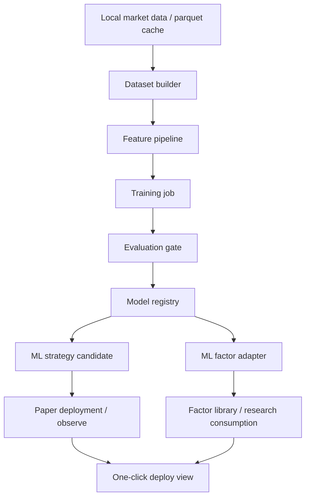

# Paper Agent Long-Run And ML One-Click Execution Plan

更新时间: 2026-04-13

适用仓库: `E:\9_Crypto\crypto_trading_system`

## 1. 文档定位

这份文档用于回答并落地两件事:

1. 先把当前系统改造成可以长期稳定运行的虚拟盘 AI 自治代理系统, 用于持续学习、复盘和风控验证。
2. 在 Phase 1 稳定后, 再补齐 ML 模型的一键训练、评估、注册、部署, 并把模型输出纳入策略和因子体系。

这不是讨论稿, 而是团队执行稿。后续如果要开 Sprint、拆卡、排依赖、做 Go/No-Go 评审, 均以此文档为主。

## 2. 当前基线事实

基于 2026-04-13 的仓库与运行状态, 当前系统事实如下:

1. Web 服务已在本机 `paper` 模式健康运行。
2. AI 自治代理当前为 `stopped`。
3. AI 自治代理当前配置仍然偏“已武装”:
   - `mode=execute`
   - `allow_live=true`
   - `symbol_mode=auto`
   - `auto_start=false`
4. 启动脚本和状态接口已经具备:
   - `.\web.bat`
   - `.\web.bat start -StartAutonomousAgent`
   - `.\web.bat status`
   - `/api/ai/autonomous-agent/*`
5. 自治代理具备长期循环、日志、journal、learning memory、run-once、scorecard、risk-status 等基础能力。
6. 当前“学习”主要是近期结果驱动的自适应风控学习, 不是在线重训模型。
7. AI research 的 one-click 已经是后台任务 + 二段部署模型, 但 research 与 autonomous agent 仍是边界分离。
8. 因子系统已经存在:
   - 时间序列因子注册表
   - 扩展因子
   - 因子库 API
   - 因子研究脚本
   - 因子策略
9. ML 策略壳已经存在, 但当前环境不具备开箱即用条件:
   - `xgboost` 未安装
   - `sklearn` 已安装
   - 仓库下尚无 `models/ml_signal_xgb.json`
   - `MLXGBoostStrategy` 当前不可回测
10. 工作区当前存在未提交改动, 本计划执行时必须避免误覆盖无关修改。

## 3. 总目标

### 3.1 Phase 1 总目标

把当前系统收口为“安全、可长跑、可观察、可复盘、可恢复”的虚拟盘 AI 自治代理系统。

一句话概括:

先让系统可以安全地连续跑, 再谈它能否稳定学到东西。

### 3.2 Phase 2 总目标

把当前零散的 ML 训练脚本、ML 策略壳、研究与部署能力串成一条真正可操作的流水线:

`数据 -> 特征 -> 训练 -> 评估 -> 模型注册 -> 策略部署 -> 因子化 -> 一键触发`

一句话概括:

先让模型能被规范训练和治理, 再让模型成为正式策略和因子资产。

## 4. 成功定义

### 4.1 Phase 1 成功定义

必须同时满足:

1. 系统可在 `paper` 模式下连续运行至少 7 天, 无人工频繁干预。
2. 自治代理启动、停止、重启、状态查看、异常恢复路径全部清晰可验证。
3. 长跑期间任何情况下都不能误触发 live 执行。
4. 每日都能产出可读的运行摘要, 包括:
   - 决策数
   - 提交数
   - 风控拦截数
   - PnL 口径
   - 连亏/异常/缺行情次数
5. 模型服务异常、行情缺失、进程崩溃、配置错误时, 行为是“收缩和报警”, 不是继续无保护运行。
6. 有完整 runbook, 任何非作者成员可以按文档拉起、检查、停机、定位问题。

### 4.2 Phase 2 成功定义

必须同时满足:

1. 可以通过统一入口触发 ML 训练任务, 并查看训练进度与评估结果。
2. 训练产物具备版本、元数据、评估门槛、回滚信息。
3. 通过门槛的模型可被注册为 ML 策略, 并能进入 paper 观察。
4. 模型输出可被包装成可治理的因子或因子适配器, 可在研究/因子库中消费。
5. ML 一键流程必须保留人工或治理门禁, 不允许“训练完自动实盘”。
6. 训练失败、评估不达标、模型文件缺失、依赖缺失时, 错误信息必须直达用户, 而不是静默失败。

## 5. 范围边界

### 5.1 本轮明确要做

1. Phase 1 的 paper 长跑闭环。
2. Phase 2 的 ML 一键化设计与落地准备。
3. 模型注册、因子适配、部署治理的骨架。

### 5.2 本轮明确不做

1. 直接推进 live 自治交易。
2. 把 research 结果自动接到 autonomous agent 执行主链。
3. 一次性扩展大量新模型供应商。
4. 一次性扩展超大 symbol universe。
5. 追求“模型更聪明”而忽视运维、观测和治理。

### 5.3 硬边界

1. Phase 1 中所有默认配置必须以 `paper` 安全为第一原则。
2. 在 Phase 1 验收前, 不允许因为“调试方便”放开 `allow_live`。
3. 在 Phase 2 验收前, 不允许把 ML 训练结果默认视为可部署正式候选。
4. 任何自动化流程都必须保留日志、产物、状态和回滚入口。

## 6. 实施原则

1. 先做收口, 再做扩展。
2. 先做可观察, 再做自动化。
3. 先做配置安全, 再做一键体验。
4. 先做 paper 验证, 再做 live 候选。
5. 先做模型治理, 再做模型部署。

## 7. 总体分期

建议按 6 个阶段推进:

1. `Phase 1A`: 冻结长跑 paper 边界与默认安全配置
2. `Phase 1B`: 补齐自愈、状态、观测、日报与 runbook
3. `Phase 1C`: 完成 7 天 burn-in 验收
4. `Phase 2A`: 打通 ML 环境、数据集、训练作业与模型产物管理
5. `Phase 2B`: 打通评估门禁、模型注册、策略部署
6. `Phase 2C`: 打通模型因子化与 one-click 入口

其中:

1. `Phase 1A-1C` 是严格优先级, 必须先完成。
2. `Phase 2A` 的设计可以提前并行准备, 但代码主线合入优先级低于 Phase 1。
3. `Phase 2B-2C` 必须在 Phase 1 验收通过后进入主执行节奏。

## 8. Phase 1 详细计划: Paper Agent 长期稳定运行

### 8.1 目标

把当前 AI 自治代理从“可以跑”升级到“能长期稳定跑、出问题知道、知道后能收缩、收缩后可恢复”。

### 8.2 交付物

1. `paper-longrun` 运行配置预设或等效安全配置方案。
2. 启动与状态增强:
   - paper 长跑启动入口
   - 长跑健康状态
   - 异常/停摆检测
3. 运行摘要:
   - journal 汇总
   - learning memory 摘要
   - scorecard 日报
4. 风控收口:
   - paper 长跑默认 `allow_live=false`
   - 暴露限制、连亏保护、模型异常保护、缺行情保护
5. 恢复手册:
   - 启动
   - 停止
   - 重启
   - 故障排查
   - 日志路径
6. QA 验证矩阵与 burn-in 记录。

### 8.3 Workstream 划分

#### Workstream P1-A: 配置安全与运行模式收口

目标:

1. 让默认长跑配置天然安全。
2. 防止 paper 长跑与 live 可执行配置混用。

主要任务:

1. 定义 paper 长跑专用 runtime profile。
2. 启动时对以下组合进行收口或拒绝:
   - `paper + allow_live=true`
   - `paper + mode=execute + 无明确长跑安全确认`
3. 给 `web.bat status` 增加更明确的“长跑安全状态”字段。
4. 在 UI/API 中区分:
   - 当前运行模式
   - 当前代理模式
   - 是否 live-capable
   - 是否符合 paper-longrun profile

建议涉及模块:

1. `core/ai/autonomous_agent.py`
2. `web/api/ai_agent.py`
3. `web/api/ai_research.py`
4. `scripts/web.ps1`
5. `STARTUP.md`

完成定义:

1. paper 长跑启动后默认 `allow_live=false`。
2. 状态接口能明确显示“safe for paper long-run”或“不安全原因”。
3. 任何成员都不能误把当前配置当成安全 paper profile。

#### Workstream P1-B: 进程保活、自愈与心跳

目标:

1. 让 agent 不是“运行一次看结果”, 而是“崩了会被看见, 挂了会被拉起或显式失败”。

主要任务:

1. 增强 autonomous agent 的心跳与 stale 检测。
2. 明确 agent 主循环的“活跃、卡住、失败、已停止”状态。
3. 结合 supervisor 或外层脚本补齐重启策略。
4. 输出最近一次成功 tick、最近一次失败、最近一次 manual run、下一次计划运行时间。
5. 补充一键 smoke 检查:
   - 进程在
   - API reachable
   - status 可读
   - run-once 可返回

建议涉及模块:

1. `core/ai/autonomous_agent.py`
2. `core/runtime/supervisor.py`
3. `scripts/start_web_ps.ps1`
4. `scripts/web.ps1`
5. `scripts/` 下新增自检脚本

完成定义:

1. agent 状态能区分 stopped、running、stale、failed。
2. 有清晰的重启策略或最小化恢复步骤。
3. smoke 检查可在 1 分钟内确认系统是否具备继续长跑资格。

#### Workstream P1-C: 风控、执行与成本口径收口

目标:

1. 把长期运行中最容易扩大的损失路径先堵住。

主要任务:

1. 明确 fresh entry、add position、reduce-only 的边界。
2. 强化连亏保护、同向暴露限制、缺行情防守、模型异常防守。
3. 补齐 paper 长跑期间的成本与执行质量摘要。
4. 统一日报中使用的 PnL 字段口径。
5. 区分“没交易机会”和“被风控拦截”。

建议涉及模块:

1. `core/ai/autonomous_agent.py`
2. `core/ai/autonomous_learning.py`
3. `core/risk/*`
4. `core/trading/execution_engine.py`
5. `core/accounting/*`

完成定义:

1. 连亏、异常、缺行情导致的收缩动作可以追溯。
2. 报表能分清:
   - 决策失败
   - 风控拒绝
   - 成本过高不做
   - 数据质量不够
3. paper 长跑 7 天期间不会出现不受控放大仓位。

#### Workstream P1-D: 可观测性、日报与复盘

目标:

1. 让团队每天知道系统有没有学到东西, 以及为什么没学到。

主要任务:

1. 产出每日摘要 JSON/Markdown。
2. 汇总以下指标:
   - tick 数
   - 决策数
   - 提交数
   - 拒绝数
   - 亏损笔数
   - 连亏状态
   - 模型异常率
   - 行情缺失次数
   - 主要阻塞 reason
3. 输出 watchlist / symbol ranking 变化摘要。
4. 将 journal、scorecard、learning memory 的关键信息做统一摘要。

建议涉及模块:

1. `core/ai/autonomous_agent.py`
2. `web/api/ai_agent.py`
3. `scripts/` 下新增日报脚本
4. `docs/` 下新增值班手册或日报模板

完成定义:

1. 每日摘要无需人工拼日志。
2. 团队能从摘要判断是“策略不行”还是“系统没跑稳”。

#### Workstream P1-E: QA、Ops 与 burn-in

目标:

1. 在真实长跑前完成系统级验收。

主要任务:

1. 增加以下测试或场景验证:
   - 配置安全测试
   - status 字段测试
   - run-once / start / stop 测试
   - 模型异常保护测试
   - 缺行情保护测试
   - 连亏学习收缩测试
2. 制定 7 天 burn-in 计划。
3. 制定值班规则:
   - 每日检查时间
   - 异常升级路径
   - stop/restart 门槛
4. 完成 `paper-longrun` runbook。

建议涉及模块:

1. `tests/test_ai_autonomous_agent.py`
2. `tests/test_ai_autonomous_learning.py`
3. `tests/test_ai_research_autonomous_agent_api.py`
4. `STARTUP.md`
5. `docs/` 新增 runbook/burn-in 记录

完成定义:

1. burn-in 前测试矩阵完整。
2. burn-in 期间每次异常都有记录和闭环。
3. burn-in 结束后有 Go/No-Go 结论。

### 8.4 Phase 1 里程碑

#### Milestone P1-M0: 冻结边界

时间建议: 2-3 天

必须完成:

1. 冻结 paper-longrun 目标配置。
2. 冻结 Phase 1 验收口径。
3. 冻结日报字段。

#### Milestone P1-M1: 安全可启动

时间建议: 4-5 天

必须完成:

1. 安全 profile 生效。
2. 启动与状态增强可用。
3. 基本 smoke 检查通过。

#### Milestone P1-M2: 可观察可恢复

时间建议: 1 周

必须完成:

1. 心跳、stale 检测、摘要、runbook 可用。
2. 常见故障可恢复。

#### Milestone P1-M3: 7 天 burn-in

时间建议: 1 周

必须完成:

1. 连续 7 天运行。
2. 无 live 风险。
3. 每日有摘要。
4. 有最终 Go/No-Go。

### 8.5 Phase 1 验收门槛

1. 任意时点 `web.bat status` 可清晰说明系统是否安全长跑中。
2. 代理挂掉后, 团队在 15 分钟内能确认原因和恢复动作。
3. 7 天内没有配置误判导致的 live-capable 运行。
4. 7 天内日报完整率 100%。
5. 7 天内所有异常均有 reason、处理人、结论。

## 9. Phase 2 详细计划: ML 一键训练、部署并进入策略/因子体系

### 9.1 目标

把当前的离线训练脚本与 ML 策略壳升级成正式流水线, 同时把模型输出纳入“策略资产”和“因子资产”两条治理链。

### 9.2 目标架构

目标流程如下:

### 9.3 交付物

1. ML 环境依赖与模型产物目录。
2. 统一 dataset builder。
3. 统一训练作业接口。
4. 模型评估门禁与模型注册表。
5. ML 策略部署入口。
6. ML 因子适配器。
7. one-click ML 流程入口与任务状态。

### 9.4 Workstream 划分

#### Workstream P2-A: 环境与模型产物治理

目标:

1. 让 ML 不是“脚本能跑就行”, 而是正式系统资产。

主要任务:

1. 补齐 `xgboost` 依赖。
2. 新建模型产物目录和 manifest 约定。
3. 定义模型元数据:
   - model_id
   - feature_set_version
   - training_window
   - symbol/timeframe
   - metrics
   - created_at
   - source_commit
4. 增加“当前环境是否支持 ML 回测/训练”的显式诊断接口。

建议涉及模块:

1. `requirements.txt`
2. `config/strategy_registry.py`
3. `scripts/train_ml_signal.py`
4. `web/api/*` 新增诊断接口

完成定义:

1. 环境缺依赖时有明确错误。
2. 模型文件不再是裸文件, 而是带元数据的受控产物。

#### Workstream P2-B: 数据集与特征流水线

目标:

1. 把训练脚本里的临时数据准备逻辑升级成可复用组件。

主要任务:

1. 抽出 dataset builder:
   - 从本地 parquet 读取
   - 统一窗口
   - 统一标签生成
   - 统一 train/valid/test 切分
2. 抽出 feature builder:
   - 训练使用
   - 推理使用
   - 元数据中记录 feature_set_version
3. 支持多 symbol、多 timeframe、多 horizon 的实验定义。

建议涉及模块:

1. `core/ai/ml_signal.py`
2. `scripts/train_ml_signal.py`
3. `core/research/*` 或 `core/ml/*` 新增模块

完成定义:

1. 训练和推理不再各写一套特征逻辑。
2. 数据切分方式固定且可追溯。

#### Workstream P2-C: 训练作业与评估门禁

目标:

1. 让“训练成功”不等于“允许部署”。

主要任务:

1. 把训练入口做成 job:
   - queued
   - running
   - evaluating
   - completed
   - failed
2. 评估输出至少包含:
   - AUC
   - precision/recall/F1
   - 阈值表现
   - 时间切片表现
   - 成本敏感性
   - 样本量
3. 定义最小门槛:
   - 样本量下限
   - 指标下限
   - 稳定性下限
4. 未通过门槛的模型只能归档, 不能部署。

建议涉及模块:

1. `scripts/train_ml_signal.py`
2. `web/api/ai_research.py` 或新增 `web/api/ml.py`
3. `tests/` 新增训练/评估接口测试

完成定义:

1. 训练完成后一定有评估结果。
2. 评估结果一定能判断是否可进入下一步。

#### Workstream P2-D: 模型注册与策略部署

目标:

1. 把合格模型变成正式的 ML 策略候选和运行资产。

主要任务:

1. 建立模型注册表。
2. 模型注册后自动生成策略默认参数:
   - model_path
   - threshold
   - symbol
   - timeframe
3. 把模型资产映射到 `MLXGBoostStrategy` 或后续 ML strategy family。
4. 增加 paper 部署与撤销入口。
5. 记录模型到策略实例的 lineage。

建议涉及模块:

1. `strategies/ai/ml_xgboost_strategy.py`
2. `config/strategy_registry.py`
3. `core/deployment/*`
4. `web/api/ai_research.py`
5. `web/api/strategies.py`

完成定义:

1. 一个合格模型可以被正式部署到 paper。
2. 部署后能追溯是哪个模型版本。

#### Workstream P2-E: 模型因子化

目标:

1. 让模型不只是一个黑盒策略, 还可以作为研究可消费的因子来源。

建议首批因子形式:

1. `ml_score`
2. `ml_score_delta`
3. `ml_long_prob`
4. `ml_regime_score`

主要任务:

1. 为模型输出定义 factor adapter。
2. 将 adapter 纳入因子注册表。
3. 允许在 factor study、factor library、research overview 中消费。
4. 区分:
   - 原始模型概率
   - 离散信号
   - 变化率因子

建议涉及模块:

1. `core/factors_ts/*`
2. `core/data/factor_library.py`
3. `web/api/data.py`
4. `scripts/research/factor_study.py`

完成定义:

1. 模型输出能被当作因子研究。
2. 因子系统中可以识别并展示 ML factor。

#### Workstream P2-F: One-click ML 入口

目标:

1. 把前面的能力收束为真正可操作的一键工作流。

建议流程:

1. 选择 symbol/timeframe/horizon
2. 一键训练
3. 查看评估结果
4. 若达标:
   - 注册模型
   - 生成策略候选
   - 可选生成因子适配器
5. 二段部署到 paper

主要任务:

1. 提供后台 job API。
2. 提供 job 轮询与阶段反馈。
3. 明确失败提示:
   - 缺数据
   - 缺依赖
   - 模型未达标
   - 模型文件缺失
4. 提供模型详情和回滚入口。

建议涉及模块:

1. `web/api/ai_research.py` 或新增 `web/api/ml.py`
2. `web/static/js/*`
3. `web/templates/*`
4. `tests/` 新增 API/UI 资产测试

完成定义:

1. 用户能在 30 秒内拿到 job 受理结果。
2. 训练过程有状态反馈。
3. 合格模型可继续进入部署, 不合格模型可读失败原因。

### 9.5 Phase 2 验收门槛

1. 从 UI 或 API 能触发训练任务。
2. 训练产物带 manifest。
3. 模型评估不达标时不会进入部署。
4. 合格模型能注册为 ML 策略并运行于 paper。
5. 至少 1 个模型输出可作为 ML factor 被 research/factor library 消费。

## 10. 团队组织方案

推荐 7 人编制。若人员不足, 可压缩为 5 人, 但角色边界不能消失。

### 10.1 角色设置

1. `Architecture Owner`
   - 负责边界冻结、阶段验收、跨域依赖与最终 Go/No-Go
2. `Runtime Agent Owner`
   - 负责 autonomous agent、learning memory、heartbeats、paper-longrun profile
3. `Execution & Risk Owner`
   - 负责 execution、risk、PnL 口径、保护逻辑
4. `Platform/API Owner`
   - 负责 API 契约、状态接口、job 管理、控制面入口
5. `Data & ML Owner`
   - 负责 dataset、feature pipeline、training job、model registry
6. `Research & Factor Owner`
   - 负责 ML 与 research/deployment/factor library 的接入
7. `QA/Ops Owner`
   - 负责测试矩阵、burn-in、runbook、值班与升级流程

### 10.2 角色责任矩阵

#### Architecture Owner

负责:

1. 冻结 Phase 1 安全边界。
2. 冻结 Phase 2 模型治理边界。
3. 主持每周 Go/No-Go。

不负责:

1. 包办所有实现。

#### Runtime Agent Owner

负责:

1. `core/ai/autonomous_agent.py`
2. `core/ai/autonomous_learning.py`
3. 心跳、状态、长跑 profile

#### Execution & Risk Owner

负责:

1. `core/trading/*`
2. `core/risk/*`
3. PnL 口径与保护逻辑

#### Platform/API Owner

负责:

1. `web/api/ai_agent.py`
2. `web/api/ai_research.py`
3. job/status/control 接口

#### Data & ML Owner

负责:

1. `scripts/train_ml_signal.py`
2. `core/ai/ml_signal.py`
3. 模型产物、manifest、训练诊断

#### Research & Factor Owner

负责:

1. `core/research/*`
2. `core/deployment/*`
3. `core/factors_ts/*`
4. `core/data/factor_library.py`

#### QA/Ops Owner

负责:

1. `tests/*`
2. `STARTUP.md`
3. `docs/*` 运行手册
4. burn-in 与日报检查

## 11. 并行与串行依赖

### 11.1 Phase 1 串行关键路径

必须串行:

1. 冻结 paper-longrun 安全边界
2. 完成配置收口
3. 完成状态/心跳/恢复能力
4. 完成日报与 runbook
5. 进入 7 天 burn-in

### 11.2 Phase 1 可并行项

可并行:

1. QA 先写测试矩阵
2. Ops 先写 runbook 草稿
3. API/UI 先补状态展示和摘要入口

### 11.3 Phase 2 串行关键路径

必须串行:

1. 补齐 ML 依赖与模型产物规范
2. 抽出 dataset/feature pipeline
3. 完成训练 job
4. 完成评估门禁
5. 完成模型注册
6. 完成 paper 部署
7. 完成因子适配
8. 最后再做 one-click 汇总入口

### 11.4 Phase 2 可并行项

可并行:

1. UI 先设计 job 状态页
2. QA 先写失败场景用例
3. Research & Factor Owner 可提前设计 ML factor contract

## 12. 看板结构

建议统一看板列:

1. `Ready`
2. `In Progress`
3. `Blocked`
4. `In Review`
5. `In QA`
6. `Burn-In`
7. `Done`

每张任务卡必须包含:

1. `owner`
2. `phase`
3. `workstream`
4. `related files`
5. `dependency`
6. `acceptance`
7. `risk`

## 13. Sprint 节奏

建议使用 5 个 Sprint:

1. `Sprint 0`: 冻结边界与拆卡
2. `Sprint 1`: Phase 1 配置安全、状态、自愈
3. `Sprint 2`: Phase 1 报表、runbook、burn-in 准备
4. `Sprint 3`: 7 天 burn-in 与收尾
5. `Sprint 4`: Phase 2A-2B 起步

节奏建议:

1. 每日 15 分钟 standup
2. 每周一次 demo
3. 每周一次 Go/No-Go
4. burn-in 期间每天一次值班复盘

## 14. 首批任务卡建议

### 14.1 Sprint 0

1. 冻结 `paper-longrun profile` 字段与状态口径
2. 冻结日报字段与输出路径
3. 冻结 burn-in 成功标准

### 14.2 Sprint 1

1. 新增长跑安全 profile 与状态诊断
2. 补齐 agent stale/heartbeat/status
3. 补齐 smoke/selfcheck 脚本
4. 补齐 paper 长跑保护逻辑摘要

### 14.3 Sprint 2

1. 输出日报脚本与日报模板
2. 输出 runbook
3. 补齐测试矩阵
4. 完成 burn-in 前预演

### 14.4 Sprint 3

1. 连续 7 天 burn-in
2. 记录异常
3. 输出 Go/No-Go 报告

### 14.5 Sprint 4

1. 补齐 ML 依赖与模型目录规范
2. 抽 dataset/feature pipeline
3. 建训练 job 与评估门禁
4. 建模型注册表

## 15. 风险清单

### 15.1 Phase 1 风险

1. 纸面上是 paper, 实际配置仍保留 live-capable 能力。
2. 进程没死但主循环卡住, 团队误以为系统仍在运行。
3. 学习记忆被当成“策略有效性证明”, 但其实只是防守层。
4. 日报只展示结果, 不展示阻塞原因, 导致错误判断。

### 15.2 Phase 2 风险

1. 把训练脚本 API 化后, 依然没有模型治理。
2. 训练指标好看, 但成本后表现差。
3. 模型输出直接变成策略, 缺少评估门禁和人工确认。
4. 模型因子化后与已有因子命名、口径、时间对齐不一致。

## 16. Go/No-Go 标准

### 16.1 Phase 1 Go

只有满足以下全部条件才允许进入 Phase 2 主执行:

1. 7 天 burn-in 完成。
2. 无 live 风险。
3. 日报完整。
4. 异常闭环完整。
5. 团队能按 runbook 独立完成恢复。

### 16.2 Phase 2 Go

只有满足以下全部条件才允许推广 ML one-click:

1. 训练 job 稳定。
2. 评估门禁可用。
3. 模型注册可追溯。
4. paper 部署与撤回可用。
5. 至少 1 个 ML factor 被研究链路成功消费。

## 17. 建议的开工顺序

明天就可以开工的顺序如下:

1. `Architecture Owner` 主持 30 分钟边界冻结会。
2. `Runtime Agent Owner` 与 `Execution & Risk Owner` 联合确认 paper-longrun profile。
3. `Platform/API Owner` 输出状态字段草案。
4. `QA/Ops Owner` 输出 burn-in 检查单。
5. 只有以上四项冻结后, 才开始 Sprint 1 代码开发。

## 18. 本计划的最终落点

最终我们要得到的不是一个“偶尔跑起来的 agent”, 也不是一个“能训练但没人敢部署的模型脚本”, 而是两层能力:

1. 一个安全、长期、可复盘的 paper 自治运行底座。
2. 一个可治理、可追溯、可部署、可因子化的 ML 资产流水线。

顺序不能反:

先把底座跑稳, 再把模型接上去。
