# Binance 暴涨币因子：严格历史验证与前瞻监控基线

## 技术摘要

- **价格因子有提前筛选价值，但不等于可交易收益。** 历史 walk-forward 共 7 折，AUC 0.763，top-2% 精度 9.40%，lift 8.94x；7 日块 bootstrap 95% 区间 7.04x–10.52x。
- **OI 排名资格：`False`。** 未通过预注册门槛时，OI 只能作 `supportive/neutral/crowded/missing` 注释，不能提高排名。
- **严格平仓结论：`watchlist_only`。** 52 种止盈规则只能使用 2026-03-24 以前已经平仓的交易完成校准；冻结规则在后四折期望 4.50%、利润因子 1.30，但只有 2/4 折利润因子大于 1，周块与币种 bootstrap 下界均小于 0。逐折自适应版本为 `adaptive_promising_but_unconfirmed`，仍不满足不确定性门槛。
- **新的8小时入场效用门首次达到纸面候选标准。** 校准期选择 P0 后8小时、模型分数前30%；后四折65笔组合交易期望16.50%、利润因子2.50，时间折、市场状态、成本、聚类bootstrap与最大贡献币剔除门槛均通过。它的分类是 `paper_candidate_pending_true_oos`，仍不自动交易。
- **它没有解决直接识别剩余三倍空间。** 入选信号从实际买价再涨200%的精度为11.36%，高于7.83%基准但仍很低；直接续涨模型未通过排名门槛。因此“纸面入场候选”和“暴涨币识别因子”必须分开表述。
- **真正 OOS 已建立采集链路但有效样本仍为0。** 历史折统一标为 historical walk-forward；冻结8小时模型未来 30/60/90 日结果才是真正未见样本。

## 价格模型的历史证据

逐折 top-2% lift：F0 14.41x, F1 8.12x, F2 8.10x, F3 6.55x, F4 11.23x, F5 10.84x, F6 0.85x。模型固定使用 8 个价格因子，没有按测试折重新选因子。独立事件捕获率为 39.4%，事件 bootstrap 95% 区间为 30.3%–49.5%，避免把同一次上涨的连续标签日重复当成多个事件。

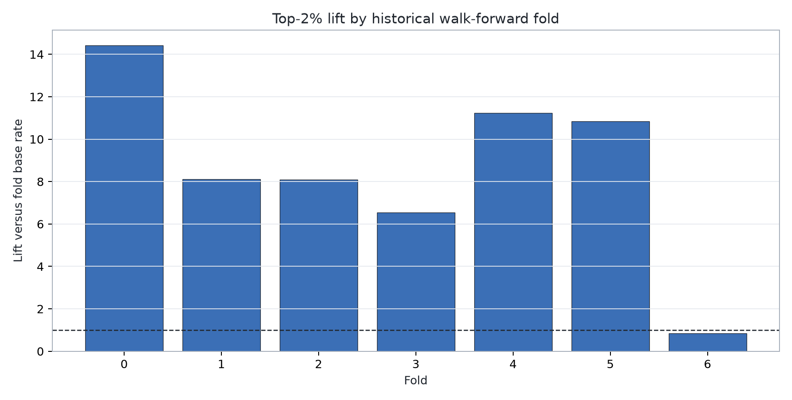

## 阈值与周期敏感性

+200% / 14 日是主问题；+50%、+100%、+150%、+300%、+500%、+900% 与 3/7/14/30 日只使用同一冻结评分做敏感性矩阵，并进行 BH 多重检验控制。+900% 仅探索十倍币，不用于调参。

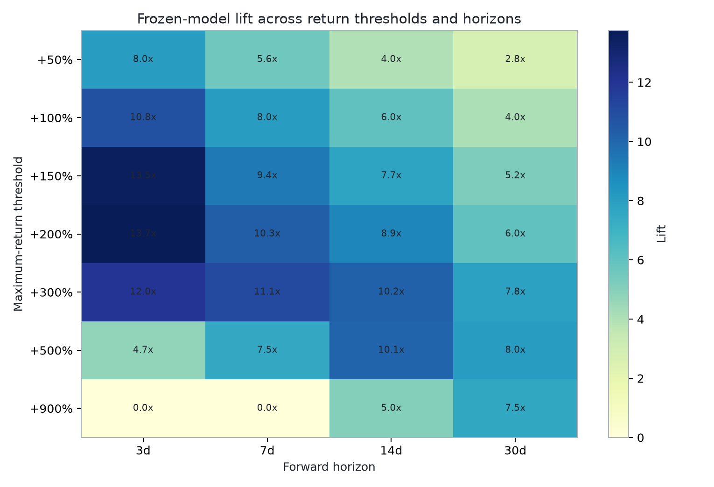

## 小市值与 OI 的独立增量

长窗 OI 源覆盖 107 个币、34181 行。价格-only、OI-only、价格+OI 和四个因子组消融都在完全相同的交集行、相同 walk-forward 折上比较；历史市值滞后 24 小时，价格倒推当前供应量的近似值不进入主结论。

- 小市值: 多数折同时改善 AP 与 lift 的比例 20%；中位 AP 增量 -0.0163，中位 lift 增量 -1.36x。
- 绝对 OI: 多数折同时改善 AP 与 lift 的比例 20%；中位 AP 增量 -0.0155，中位 lift 增量 -1.55x。
- OI/市值: 多数折同时改善 AP 与 lift 的比例 20%；中位 AP 增量 -0.0158，中位 lift 增量 -3.64x。
- OI 增长: 多数折同时改善 AP 与 lift 的比例 20%；中位 AP 增量 0.0080，中位 lift 增量 0.00x。

上述四项均只属于方向性证据；完整 OI 组合只有在多数折同时改善 AP 与 top-2% lift，且两项增量置信区间下界均大于 0 时才取得排序资格。期货/现货成交比在现有长窗缓存中不可恢复，明确列为缺失的预注册特征。

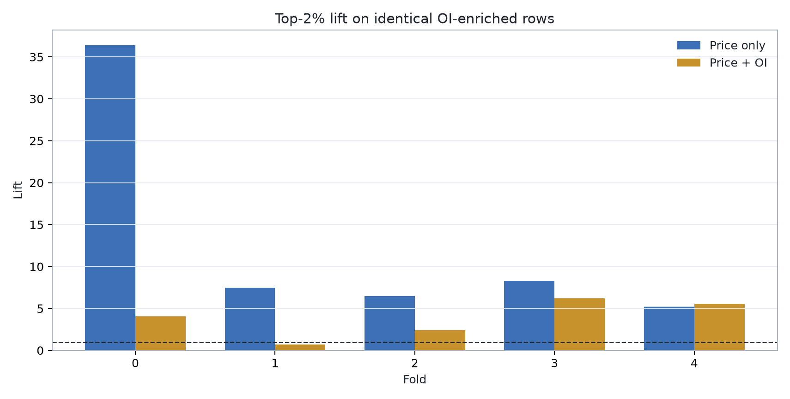

## 1x 永续纸面可行性

模拟采用首次进入每日横截面前 2%、每天最多 3 个新信号、单币一笔、退出后冷却 14 天；08:20 Asia/Shanghai 计算后在下一根 4h 开盘（UTC 04:00）进场，同 K 线止损优先，计入资金费率、每边 5bps 手续费和 5/15/30bps 滑点。组合约束为 100,000 USDT、单笔风险 0.5%、最多 10 个仓位、总名义敞口 50%。纸面候选还必须通过多数时间折、BTC 趋势/波动与山寨宽度市场状态、最大盈利事件剔除和利润集中度门槛。

原四政策比较在完整历史上挑出了 `stop20_half_at100_trail25_time30`，因此只能视为探索性结果。下面的专门平仓研究加入了固定止盈阶梯、两段止盈与不同追踪距离，并将政策选择与确认期按时间隔离；它的严格结论取代原来的 `paper_trade_candidate` 表述。

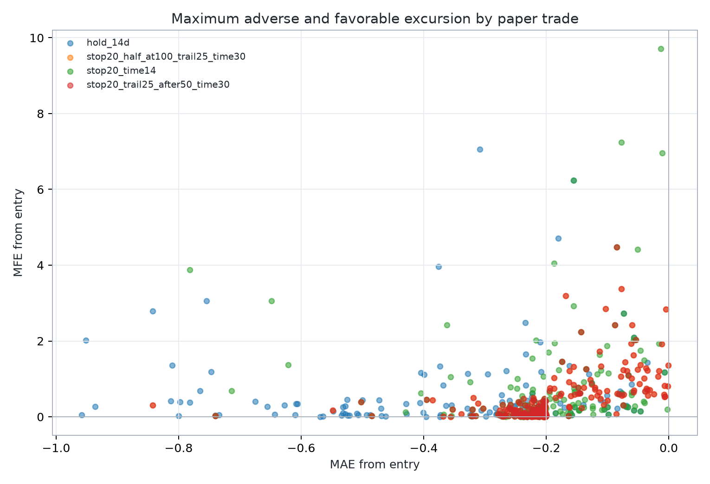

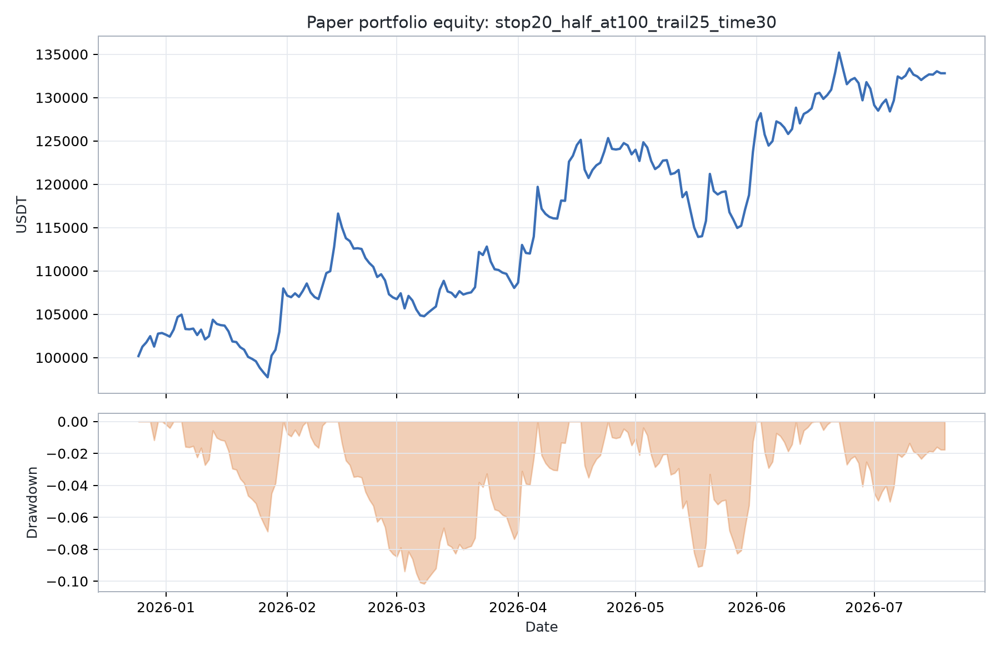

## 过早止盈会破坏极端收益的右尾

止盈目录共 52 个政策，入场规则和 -20% 止损保持不变。固定止盈测试 +25%、+50%、+75%、+100%、+150%、+200% 和 +300%，分别配 14/30 天最长持有；同时比较 50% 分批止盈、15/20/25/30% 追踪止盈和两段固定止盈。全目录只在默认成本下横向比较，15/30bps 压力成本只应用到校准后冻结的政策，避免成本网格参与选参。

确认期固定止盈结果表明：+25% 和 14 天 +50% 止盈的期望为负；14 天 +300% 止盈的描述性期望最高，为 8.85%，利润因子 1.64。高阈值表现更好说明该信号的收益依赖少数大行情，不能用常规小止盈把右尾截掉。但 +300% 是查看确认期后才知道的赢家，不能据此直接冻结为策略。

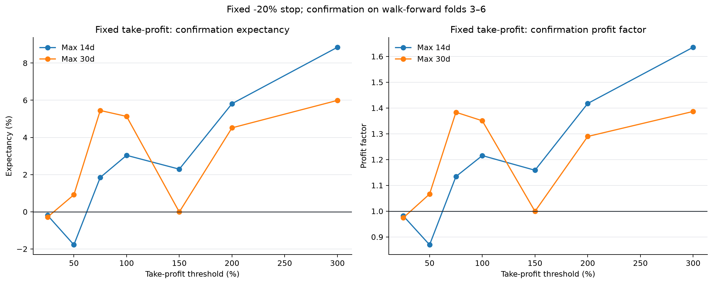

## 校准选出的规则在确认期仍不够稳定

政策选择的信息截止到 2026-03-24；只允许使用该时点之前已经完成平仓的交易。校准期选出 `stop20_half100_trail25_time30`：亏损 -20% 全平，盈利 +100% 时卖出一半，同时为剩余仓位启用 25% 追踪止盈，最长持有 30 天。同一根 4h K 线同时触及止损与止盈时，按止损先成交；本 K 线新激活的追踪止损只能从下一根 K 线开始生效。

冻结后在 folds 3–6 共接受 121 笔交易：期望 4.50%，利润因子 1.30，组合最大回撤 -6.21%，中位持有 4 天；每边 30bps 滑点下期望仍为 4.13%、利润因子 1.27。问题在于结果只有 folds 3 和 5 盈利，folds 4 和 6 的利润因子分别约为 0.75 和 0.46；周块 bootstrap 的期望 95% 区间为 -5.80%–16.40%，币种聚类区间为 -4.79%–14.98%。因此成本不是主要障碍，时间状态和少数极端赢家的不确定性才是。

资金费率历史只覆盖约 33.9% 的确认期交易；缺失部分按 0 处理。这会使成本估计偏乐观或偏悲观，方向取决于缺失时段资金费率，因此是阻止实盘结论的额外数据缺口。

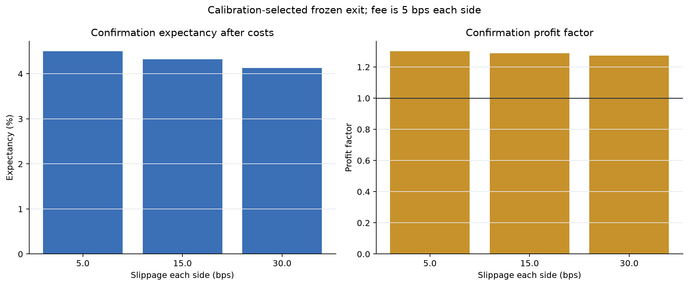

逐折自适应版本每折只读取此前已经平仓的结果，fold 2 选择 14 天 +150% 固定止盈，folds 3–6 均选择上述“+100% 减半后 25% 追踪”规则。它在 folds 2–6 的期望为 6.35%、利润因子 1.44、最大回撤 -7.71%，4/5 折利润因子大于 1；但周块和币种 bootstrap 的期望下界仍分别为 -1.57% 和 -1.48%，所以只能归类为 `adaptive_promising_but_unconfirmed`，不能升级为可交易策略。

## 当前只读观察名单

| Symbol | Score percentile | OI annotation | 7d return |
|---|---:|---|---:|
| — | — | — | — |

`price_watch` 只表示进入冻结价格模型前 2%；`reject_chase` 和 `cooldown_after_200pct_runup` 的风险优先级更高。名单不构成下单建议。

## 数据质量与覆盖缺口

- 当前 30 日回归：收盘确认 17 个、插针 2 个；AKE/BTW 回归通过：True。
- 当前主面板仍有幸存者偏差；历史下架合约未能安全恢复进主宇宙，不能宣称覆盖完整。
- Binance 官方 OI 历史约一个月；长窗 OI 依赖已有缓存，覆盖不足会降低结论等级。
- 市值和 OI 是预测性关联研究，不建立因果关系。
- 4h OHLC 无法恢复真实 K 线内路径；尽管歧义 K 线按止损优先，暴涨币在真实止损和追踪单上的跳空、深度与冲击成本仍可能显著差于模拟。
- 冻结平仓确认期只有约 33.9% 的交易匹配到历史资金费率；其余交易按 0 计费，收益与利润因子不能视为完整成本结果。

## 结论分级

- **已验证：** 固定价格因子在 historical walk-forward 中显著提高 +200% 暴涨标签浓度，bootstrap lift 区间下界高于 1；当前 17+2 事件与 AKE/BTW 回归通过。
- **方向性证据：** 小市值、绝对 OI、OI/市值与 OI 增长的同行消融；以及逐折自适应平仓规则的正点估计。两者都没有通过预注册不确定性门槛。
- **尚未验证：** 固定或自适应平仓规则的真正未来 OOS 收益、每日冻结模型未来 30/60/90 日表现、历史下架合约的完整覆盖和长窗期货/现货成交比。

## 下一步

保持只读监控，不接 `altcoin_radar`、策略管理器或订单执行；90 天内不改入场模型、评分阈值或平仓规则。纸面记录同时保存“+100% 减半后 25% 追踪”的冻结路径和逐折自适应路径，但只有真正 OOS 的 bootstrap 下界大于 0、多数时间折利润因子大于 1 后，才重新讨论纸面候选资格。

<!-- MULTISOURCE_BEGIN -->
## 多源策略挖掘：新闻、链上与交易所数据

### 结论先行

**还没有通过门槛的自动交易策略。** 新数据澄清了真正的问题：价格因子能提高暴涨币浓度，催化新闻还能进一步缩小观察名单，但“找到可能会涨的币”与“现在就能买”不是同一件事。把催化门槛接到冻结的 4 小时退出路径后，默认成本下 16 笔交易的期望为 -1.75%、利润因子 0.88，75% 触发 -20% 止损；周块 bootstrap 的期望下界为 -20.18%。因此它仍是观察名单，不是纸面可交易候选。

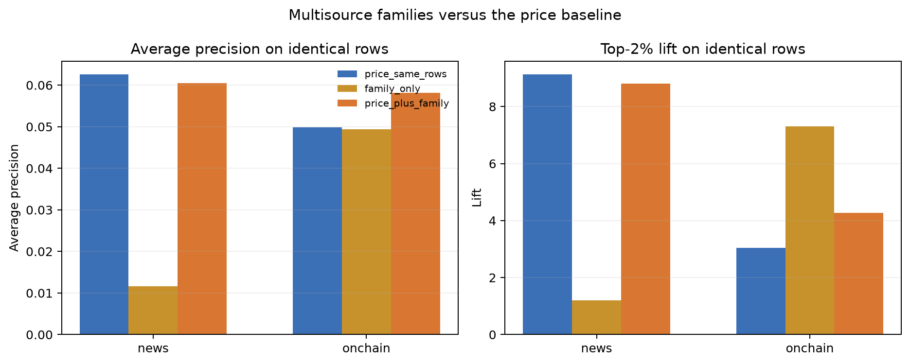

### 已验证

- 冻结价格模型仍是最可靠的提前筛选器。新闻连续模型在同样 37,643 行上的 AP 从 0.0626 降到 0.0605，top-2% lift 从 9.14x 降到 8.81x；3 折中没有一折同时改善 AP 与 lift，增量 bootstrap 下界均小于零。
- “绝对 OI 大”不是正向因子。长窗 OI 已被严格验证否决；近 17 天全市场样本中，绝对 OI 高十分位命中率仅 0.22%，低于 1.01% 的基准。
- 立即交易催化信号不可行。合并行级样本中，“价格前 10% + 7 日明确催化”命中率为 17.58%、lift 15.36x，但这些命中集中在 LAB、CLO、BTW 等少数独立事件；去重并执行组合约束后收益转负，只有 33% 的折利润因子大于 1，删除最大赢家后的期望为 -9.16%。

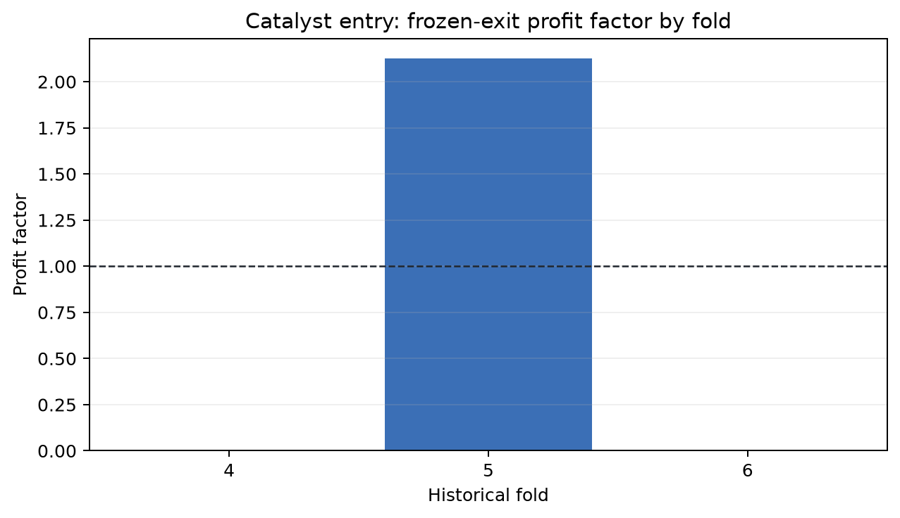

### 方向性证据

- 链上 TVL 只在 53 个币形成可用历史交集。价格+链上在 4,330 行、69 个正例中，AP 从 0.0499 升至 0.0582，lift 从 3.05x 升至 4.26x；但仅一半折同时改善，AP 增量 95% 下界为 -0.0104，尚不能入排序。
- 近 17 天中，OI/市值高十分位命中率为 2.03%，OI 3 日增长高十分位为 2.31%。这与“小市值 + 相对 OI/增量 OI”方向一致，但时间太短，只能当支持性标签。
- BTW 是催化型案例：6 月 4 日合约上线公告当天就触发研究信号，未来 14 日达到 +200%，冻结退出取得约 +109%。AKE 则是供给/交易所流向型案例，暴涨前出现的是庄家向 Binance 转币并伴随下跌的风险新闻。两类机制方向相反，不能用一个新闻总分混合。

### 怎样才可能成为可行策略

下一版不能再把“催化出现”直接当买点，而应拆成三阶段：

1. **脆弱性观察池**：继续使用冻结价格分位，不让 OI 或新闻抬高排名。
2. **事件分型**：把上市/集成/主网等需求催化，与解锁、交易所流入、庄家转币后的供给冲击分开；前者等买方确认，后者只观察恐慌出清后的反转，绝不混成一个线性分数。
3. **入场触发**：当前没有通过门槛的确认条件。统一记录下一根 4h 开盘作为观察基准价，但这不代表下单；主动买入、盘口深度、突破回踩和链上交易所净流入只进入前瞻快照作注释，真正 OOS 验证通过前不得提高排名或触发加仓。

升级门槛保持不变：同排同折增量置信区间下界大于零；冻结退出成本后多数折利润因子大于 1；最大回撤不超过 30%；周块和币种 bootstrap 期望下界均大于零；删除最大盈利币后仍为正。任何一条没过，就只做观察名单。

### 数据覆盖与限制

- 新闻：221,383 条原始记录，严格映射 9,284 条、377 个币；档案始于 2026-02-22，只有 3 个可用后期折。
- 链上：524 个合约中 289 个 CoinGecko 唯一身份，83 个 DefiLlama 映射，最终 53 个币形成连续 TVL 历史；当前身份映射存在幸存者偏差。
- 交易所：丰富的资金费率、多空比、清算和主动买卖缓存是“被关注币”样本，不能作为全市场主回测；全市场官方 OI 历史窗口又只有约一个月。
- 当前 19 个事件中，暴涨参考点前 7 天只有 2 个出现严格新闻匹配，说明公开新闻不是多数暴涨的必要条件。
<!-- MULTISOURCE_END -->

<!-- ENTRY_EXIT_TIMING_BEGIN -->
## 入场与退出时机：新增严格历史研究

### 结论先行

- **目前仍没有通过交易门槛的买入策略；但 24 小时序列启动已成为识别挑战者。** 单根 4h 确认仍无效，新增二阶段规则详见后文。
- **基础入场基线仍是下一根 4h 开盘；新增挑战者需等待完整 24 小时。** 只有 `MFE≥20% 且收盘≥5%` 才进入启动观察，但现阶段仍不得自动追入。
- **基础退出基线仍未通过交易门槛；新增挑战者为 -25% 风险等额止损、+30% 后保本、+100% 减半和 25% 追踪。** 它提高历史 PF，但稳定性与置信下界仍不合格。

### 等待确认没有提高暴涨币浓度

11 个入场规则在 2026-03-24 前完成校准。等待一根 4h 在校准期合格，但确认期漏掉 1 个实际 +200% 信号，命中率低于立即入场；等待数天的回踩与突破规则则要么没有提高精确率，要么把正例保留率压得过低。

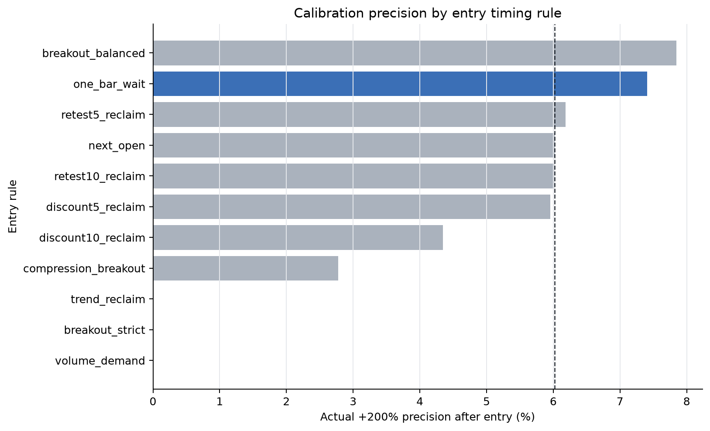

单根 4h 模型进一步使用成交量、主动买入占比、短线涨幅、区间和 EMA 位置。它在四个确认折中没有一折提高筛选精确率：价格基线 AP 为 0.0919，价格加 4h 微观结构 AP 降至 0.0781；选择后的命中率仅 6.06%，低于全体一根等待样本的 8.83%。

### 98.5% 只能作为优先标签，不能缩小主观察池

校准期选出的 98.5% 阈值，在确认期把汇总命中率从 9.19% 提到 10.12%，并保留相同的 26 个实际正例；但只在 50% 的折中改善，而且交易期望从 4.50% 降至 3.44%。因此 98%–98.5% 仍需保留为主观察层，≥98.5% 只标记为高优先级。

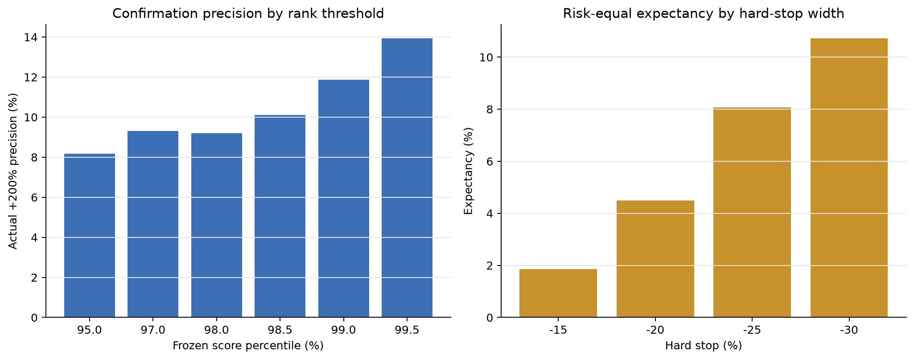

### 真正赢家通常在两到三天内启动，但仍有先跌后涨路径

26 个实际 +200% 信号的中位 MFE 在第 1 天已达 30.9%、第 3 天达 122.7%；中位数约 44 小时达到 +50%、64 小时达到 +100%。这说明“3 天仍未达到 +10%”是有意义的风险标签，但不能直接平仓：仍有 7.7% 的最终赢家符合这个慢启动条件。

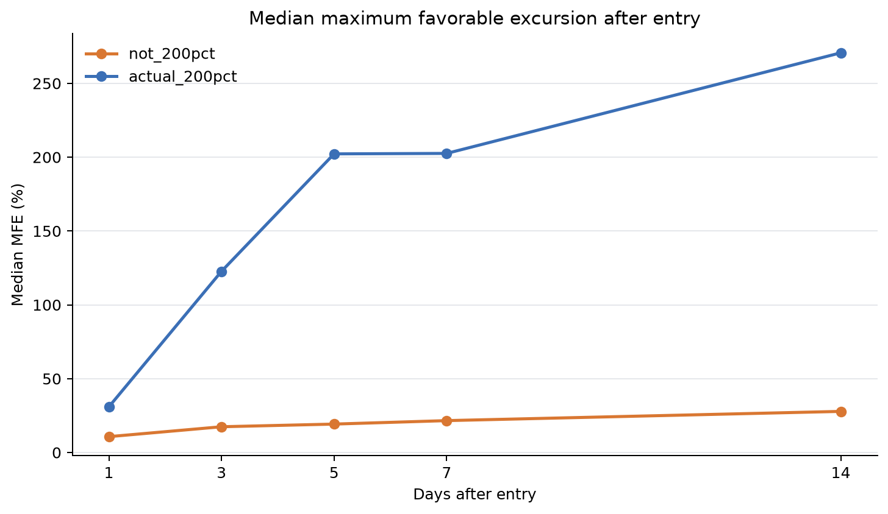

同时，74.7% 的非赢家会在 14 天内触及 -20%，但也有 11.5% 的最终 +200% 路径先触及 -20% 再达到 +50%。在每笔风险固定为权益 0.5% 后，校准仍选择 -20%；确认期利润因子 1.30，但只有 50% 的折盈利，周块与币种 bootstrap 期望下界分别为 -5.62% 和 -4.75%。

### 当前可执行的研究协议

1. **观察池：** 保留冻结价格分位 ≥98%；≥98.5% 标记 `priority_watch`，但不删除 98%–98.5% 候选。
2. **入场时钟：** 记录信号后下一根 4h 开盘作为统一参考价；4h 成交量、主动买入或回踩确认只作注释，不能提高排名或触发加仓。
3. **追高拒绝：** 继续拒绝单日涨幅 ≥20%、日内振幅 ≥35%、上影 ≥15% 或已经完成 +200% 的候选。
4. **退出观察：** 纸面路径使用 -20% 止损、+100% 卖一半、剩余 25% 追踪、最长 30 天；3 天 MFE <10% 标记 `failure_to_launch`，但现阶段不自动平仓。
5. **升级条件：** 真正未来 OOS 必须同时出现精确率增量、超过一半时间折盈利、成本后利润因子 >1、周块/币种 bootstrap 期望下界 >0，且删掉最大赢家后仍为正。当前未满足。

### 已验证、方向性与尚未验证

- **已验证：** 多日形态确认和单根 4h 微观模型没有提高识别；风险等额后 -20% 仍是校准选择；没有规则通过纸面交易门槛。
- **方向性证据：** 98.5% 分位可作为优先标签；真正赢家通常在 44–64 小时内跨过 +50%/+100%；3 天未启动可作为风险标记。
- **尚未验证：** 逐档试仓、盘口深度恢复、链上净流入与独立买方确认。现有历史数据不足以对这些字段做无偏全市场回测，必须由前瞻快照积累。
<!-- ENTRY_EXIT_TIMING_END -->

<!-- SEQUENTIAL_STRATEGY_BEGIN -->
## 24 小时序列启动：识别能力明显提高，但交易稳定性仍未通过

### 最重要的新发现

- **暴涨币识别出现了可操作的二阶段方案。** 在冻结价格模型前 2% 观察池中，先记录下一根 4h 开盘价，然后观察完整 24 小时；若期间最高价至少达到参考价的 **+20%**，且第 24 小时结束时仍至少上涨 **+5%**，则标记为 `launch_confirmed`。历史确认期的逐行命中率由 9.25% 提高到 25.42%，保留 15/26 个正例。
- **事件去重后仍成立。** 155 个信号簇中有 17 个独立正事件；启动规则选择 42 个簇、命中 12 个，事件精度 28.57%，保留率 70.59%。
- **这不是简单的单币偶然。** 置换检验的 AP 增量单侧 p 值为 0.0006，精度增量 p 值为 0.0054；逐一删除 114 个币时，AP 和精度增量仍全部为正。
- **但它仍是二次历史研究。** 规则族是在前一轮路径研究之后形成，不能把第 3–6 折重新称为真正未见 OOS。因此它只能冻结为前瞻挑战者，不能直接替换主排名或触发交易。

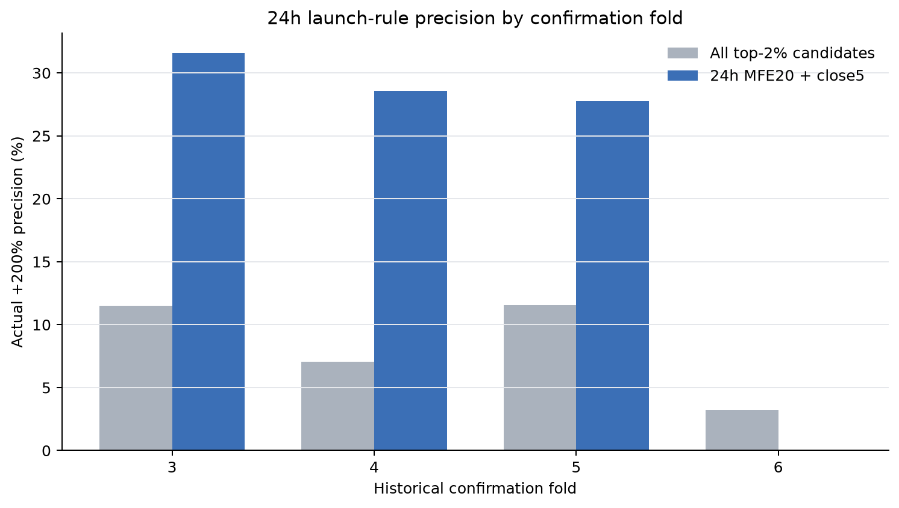

### 黑盒序列模型提供了独立佐证

24 小时浅层树在确认期把 AP 从 0.0797 提高到 0.2080，选择后命中率 14.84%，四折中 75% 同时改善 AP 与精度。路径-only 消融的 AP 为 0.2152，说明增量主要来自启动后的真实路径，而不是再次包装原价格分数。不过早期模型校准只有一个可用验证折，故排名门槛仍判定失败。

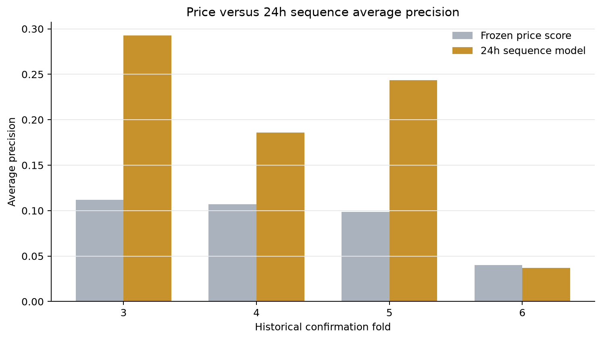

### “何时买”：当前冻结的前瞻挑战者

1. 日线结束后只保留冻结价格分位 ≥98% 的观察池；原有 `reject_chase` 和 `cooldown_after_200pct_runup` 继续拥有否决权。
2. 下一根 4h 开盘只作为 `P0` 参考价，不因单根成交量或主动买入立即追价。
3. 在 `P0` 后观察六根完整 4h K 线。若 `MFE24h ≥20%` 且第六根收盘相对 `P0 ≥5%`，在 24 小时边界记录 `launch_confirmed`；否则记录 `launch_rejected`。
4. 校准期选择的是确认后再入场，而不是提前满仓或事后挑选的半仓模式。但确认后仍有 3 倍空间的命中率只有 13.56%，所以目前只能模拟，不能据此追涨。

### “何时卖”：当前最强但尚未过门槛的退出挑战者

校准最终选择：风险等额的 **-25% 硬止损**；盈利曾达到 **+30%** 后，从下一根 4h 起把保护位移到成本；达到 **+100%** 卖出一半，余仓使用 **25% 追踪止损**，最长持有 30 天。确认期 44 笔的期望为 10.12%、利润因子 1.84、最大回撤 -3.38%；30bps 单边滑点压力下期望仍为 9.78%。

但只有 50% 的折利润因子大于 1，周块和币种 bootstrap 的期望下界分别为 -4.41%、-2.37%。因此退出策略仍是 `watchlist_only`。较早的“确认后一天未继续上涨就退出”没有取代 +30% 后保本规则。

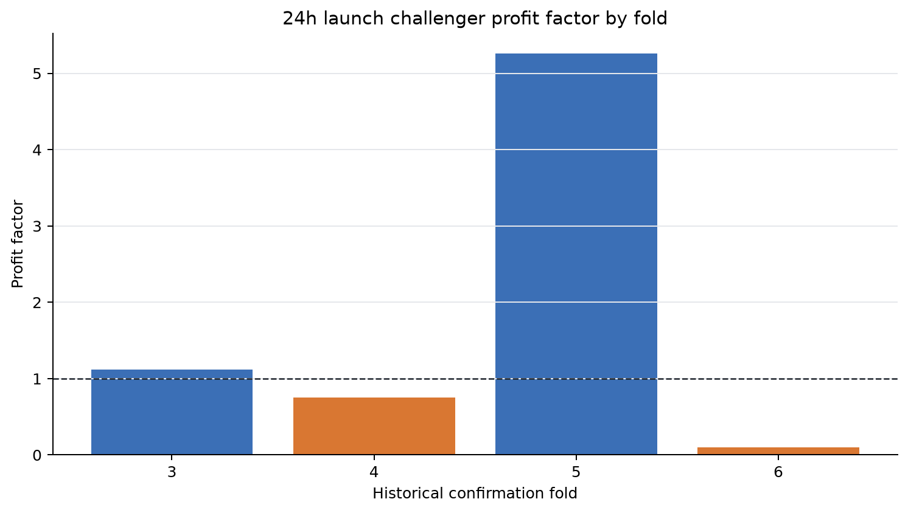

### 第一批真正前瞻的 24 小时记录

现有不可覆盖快照已经产生 3 条成熟观察，其中 2 条触发启动规则、0 条同时通过原始阶段否决。ESPORTS 和 AKE 虽触发启动，但原始状态均为暴涨后冷却；HOME 未触发且原始状态为追高拒绝。因此当前没有新的纸面入场候选。这 3 条只用于开始积累真正 OOS，样本量不足以评价规则。

### 当前结论

- **识别层：** 24 小时 `MFE≥20% + 收盘≥5%` 是迄今最有意义的二阶段识别规则，历史信号精度约为原观察池的 2.75 倍。
- **入场层：** 确认后追入仍会遇到大量回撤；只允许纸面记录，不自动交易。半仓试探、确认后补仓的历史 PF 更高，但它不是校准选择，必须留给未来 OOS 比较。
- **退出层：** -25% 风险等额、+30% 后保本、+100% 减半、25% 追踪是当前最强挑战者，但时间稳定性和置信下界未通过。
- **升级条件：** 真正未来样本中多数月份/时间折 PF>1，周块与币种期望下界均>0，删除最大赢家后仍为正，且原始阶段否决不得被绕过。
<!-- SEQUENTIAL_STRATEGY_END -->

<!-- POSTLAUNCH_ENTRY_BEGIN -->
## 启动确认后的买点研究：等待回踩没有提高胜算

在 24 小时启动规则之后，研究又按时间隔离比较了 9 个可执行买点：确认边界立即记录、再等 4 小时、回踩 5%/10%、回踩后收复、受控回踩、六根 K 线突破和突破启动前高点。所有非即时规则都只读取已经收完的 4h K 线，并在下一根开盘成交；未来 +200% 标签按实际成交价重新计算。

校准期选中了 `discount5_reclaim`（相对启动确认价回踩至少 5%，随后阳线收复，再下一根 4h 开盘）。但它在确认期失效：候选从 59 个降至 49 个，实际 +200% 精度从 **13.56% 降至 6.12%**，只保留 **3/8** 个仍有三倍空间的路径。中位买价虽然低了 1.82%，但代价是漏掉多数真正赢家。

交易结果同样恶化：冻结相同的 -25% / +30% 后保本 / +100% 减半 / 25% 追踪退出后，利润因子从 **1.84** 降至 **1.09**，期望从 **10.12%** 降至 **1.25%**；删掉最大赢家后期望为 **-1.93%**。因此回踩收复规则被否决，不能取代启动确认后的下一根 4h 开盘基线。

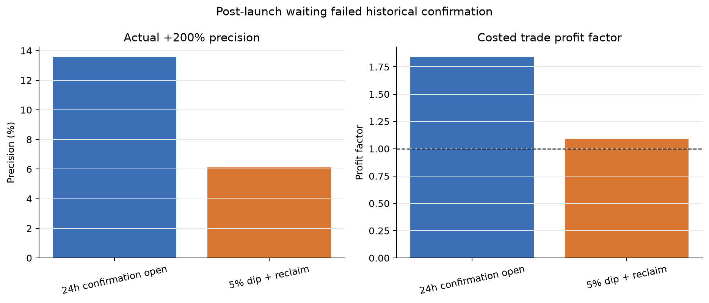

市场状态也不能补救这个问题：BTC 趋势和山寨宽度在校准期与确认期的方向发生反转，所以只作为失效诊断，不允许成为事后过滤器。当前可执行结论是：**先用 24 小时启动路径提高识别浓度；若做纸面跟踪，就在启动确认后的下一根 4h 开盘建立统一参考价，不等待回踩，也不自动交易。**
<!-- POSTLAUNCH_ENTRY_END -->

<!-- STRATEGY_FRONTIER_BEGIN -->
## 继续寻找更好的买卖点：三项看似合理的方案均未取代当前基线

### 分阶段建仓没有解决“太晚买”

研究按校准期比较了在最初 `P0` 提前买入 0%/10%/25%/50%/75%/100%，并在 24 小时启动确认后补足剩余仓位。校准最终选择 **0% 提前试仓、确认后 100% 再进入**。确认期提前试仓会把大量未启动信号带入组合：确认后入场的单笔期望为 10.12%，而各提前试仓方案只剩约 1.7%–2.2%。因此“先买一点再说”被否决。

### 收盘止损不能证明硬止损是主要问题

8 个确认后仍有 +200% 空间的赢家中，在达到 +50% 前只有 1/8 曾在先前完整 K 线盘中跌破 -25%，而 4h 收盘跌破 -20% 的比例为 0%。比较 -35%/-40%/-50% 灾难止损与 -15%/-20%/-25% 收盘确认止损后，校准仍选择 **-25% 盘中硬止损**。这说明部分插针确实存在，但不足以解释策略不稳定。

### 新上市合约更容易暴涨，但上市年龄不能加入排序

上市年龄单独使用的 top-2% lift 为 4.23 倍，七折中年龄系数全部为负，确认了“越新越容易出现极端波动”的方向。但它与现有价格脆弱度高度重叠：加入价格模型后，top-2% 命中率从 **9.40% 降至 8.28%**，独立事件覆盖从 **39/99 降至 29/99**，AP 增量 bootstrap 上界仍为负。因此上市年龄只作风险/新币注释，不提高排名。

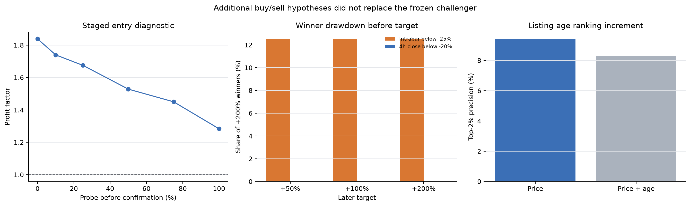

这组三项反证进一步收敛了规则：**识别仍依赖冻结价格前 2% 加 24 小时 `MFE≥20% / 收盘≥5%`；买点仍是启动确认后的下一根 4h 开盘；退出仍是 -25% 硬止损、+30% 后保本、+100% 减半、余仓 25% 追踪、最长 30 天。** 历史收益仍未通过稳定性与置信下界门槛，继续保持 `watchlist_only`。
<!-- STRATEGY_FRONTIER_END -->
<!-- FORWARD_MICROSTRUCTURE_BEGIN -->
## 真正前瞻的启动结构验证：不允许事后补数据

历史盘口、全市场长窗 OI、多空账户和主动买卖数据不足以无偏重建，继续在历史样本上筛选这些条件会产生严重的幸存者偏差。因此研究已转为**确认时点冻结采集**：每天 12:05（Asia/Shanghai）先完成 24 小时启动观察，再只对 `launch_confirmed` 信号保存当刻的 500 档盘口、50/100bp 深度与 2,000/10,000 USDT 冲击成本、标记/指数价差、资金费率、OI 美元值与 1/4/24 小时变化、全市场与大户多空比、1/4/24 小时主动买入占比。

采集窗口严格限制为启动确认边界后 15 分钟。盘口、标记价格和当前 OI 必须足够新鲜；历史序列必须止于确认时点，任何未来记录都会被剔除。迟到、数据缺失或时间戳过期时只写失败审计，不生成可用于分析的快照，也不允许日后回填。该结构在验证门槛通过前只作注释，不能改变冻结价格排名、阶段否决或纸面资格。

首轮试运行正确识别出 ESPORTS 与 AKE 已迟到约 8.9 小时，生成有效启动结构快照 **0** 个；这两币不会被用当前盘口冒充启动盘口。现有 3 条 24 小时前瞻记录中，2 条启动确认但均被原阶段冷却否决，1 条启动拒绝，因此当前仍没有纸面候选。

每个启动确认信号满 30 天后，系统单独追加不可覆盖结果：14/30 天 MFE、MAE、收盘收益、达到 +50%/+100%/+200% 的首次时间、实际资金费率，以及两条预注册退出路径。主路径保持 **-25% 硬止损、+30% 后保本、+100% 减半、余仓 25% 追踪、最长 30 天**；`-40% 灾难止损 + 单根 4h 收盘跌破 -25% 后下一开盘退出` 仅为未来反事实，不因历史后验结果替换主规则。

当前这个模块解决的是“如何公平验证盘口/OI 是否有增量”，还没有产生足够未来样本来回答“哪些启动结构有效”。只有积累到足够独立事件，并且在时间折中同时提高平均精确率和 top-2% lift、增量置信区间下界大于 0，才允许升级为筛选因子；在此之前总体结论仍为 `watchlist_only`。
<!-- FORWARD_MICROSTRUCTURE_END -->

<!-- CONTINUATION_UTILITY_BEGIN -->
## 何时买的新结论：8小时入场效用门通过历史纸面门槛

此前24小时规则回答的是“行情是否已经启动”，却没有直接优化确认后买入是否赚钱。新研究把目标拆成两个互不混淆的问题：第一，实际检查点开盘后14天内是否仍能上涨200%；第二，在冻结风险管理下，从这个检查点买入的14天净收益是否为正。

研究只使用 P0 后已经收完的4h K线，在 **4/8/12/16/20/24小时** 六个检查点比较同一个强正则逻辑模型，并比较训练分数的前40%/30%/20%/10%四档阈值。模型读取原价格分数，以及早期收盘收益、MFE/MAE、路径回撤与效率、区间扩张、成交量加速和主动买入变化。三个校准窗口全部在2026-03-24前到期；后四个 walk-forward 折仅作历史确认。

### 直接预测“买后再涨200%”仍然失败

校准排序最高的是20小时、前10%，但它没有达到校准资格。确认期281个信号中有22个从实际检查点仍上涨200%；模型选择31个、命中3个，精度 **9.68%**、保留率 **13.64%**，相对7.83%基准只小幅提高。事件去重后选择24个事件、命中6个，精度25%，但周块和币种bootstrap的AP与精度增量下界都小于0。因此它不能加入暴涨币排名。

### 预测“这个时点入场能否赚钱”出现可复核增量

校准期选择 **P0后8小时、模型分数前30%**。训练标签是相同止损/保本/减半/追踪框架下的14天净收益是否为正，并使用14天到期隔离；最终确认仍恢复最长30天退出。确认期标签层从281个信号选择88个：14天期望从5.49%提高到 **14.02%**，利润因子从1.46提高到 **2.29**。

施加每天最多3个新信号、同币单仓、退出后14天冷却、单笔风险0.5%、最多10仓和50%总名义敞口后，确认期剩65笔：

- 期望 **16.50%**，利润因子 **2.50**，最大回撤 **-4.28%**；
- 5/15/30bps单边滑点下期望分别为16.50%/15.96%/16.09%，利润因子均不低于2.39；
- 四折PF为4.26/0.93/3.71/2.41，3/4折大于1；六种市场状态中5种PF大于1；
- 周块bootstrap期望95%下界 **+1.98%**，币种bootstrap下界 **+2.60%**；
- 删除最大单笔后期望13.65%；最大贡献币LAB占正利润23.02%，删除LAB后期望仍为10.69%。

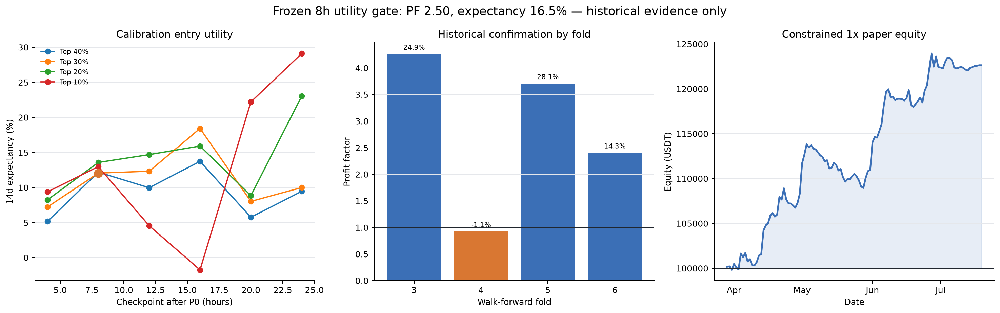

### 冻结纸面规则

1. 08:20生成冻结价格前2%中的每日最多3个观察信号，原 `reject_chase` 和 `cooldown_after_200pct_runup` 始终有否决权。
2. 下一根4h开盘为P0；只观察其后两根完整4h K线，在P0后8小时边界计算效用分数。
3. 冻结模型版本 `continuation-utility-8h-v1-frozen-2026-07-19`，阈值0.5664177568；达到阈值且原阶段为 `price_watch` 才记录二级纸面入场，实际规则不下单。
4. 退出保持：-25%硬止损；曾盈利+30%后下一根4h起保本；+100%减半；余仓25%追踪；最长30天。
5. 每天20:05只读运行，超过8小时边界15分钟即fail-closed。满30天单独追加不可覆盖结果；30/60/90天复盘前不重训、不改阈值。

最终分级是：**直接暴涨识别仍为 `watchlist_only`；8小时买点升级为 `paper_candidate_pending_true_oos`。** 资金费率历史覆盖只有30.77%，且所有历史确认结果都已被研究者看过，所以真正资格仍取决于未来OOS；不允许自动交易或杠杆。
<!-- CONTINUATION_UTILITY_END -->

<!-- INTENSITY_EXIT_FRONTIER_BEGIN -->
## 继续提高识别与退出：多阈值强度有效但未过门槛，右尾退出只作前瞻反事实

### 多阈值目标比单一 +200% 标签更有效，但不确定性仍不足

直接 +200% 标签过于稀疏，因此预注册了两类丰富目标：固定权重的 +50%/+100%/+150%/+200% 序数模型，以及对未来14日 MFE 做对数回归的连续强度模型。48 个候选只在三个校准窗口选择，校准选中 **20小时序数模型、训练分数前20%**。

确认期 AP 从价格分数的 **0.0777** 和旧二元模型的 **0.0977** 提高到 **0.1137**；62 个入选信号命中7个，精度 **11.29%**，保留 7/22 个仍有 +200% 空间的标签。事件去重后选择 44 个、命中 9 个，精度 **20.45%**、正事件保留率 **64.29%**。但只有 50% 的确认折同时改善 AP 与精度，按周和按币 bootstrap 的 AP/精度增量下界仍小于0，因此仍是 `watchlist_only`，不能加入排名。

### “没有迅速启动就退出”被否决

在冻结8小时效用入场后，比较了 P0+24/48/72小时的 MFE 失败退出。校准仍选择 **不使用失败启动退出**；所有四个提前退出版本在逐信号配对后平均增量都为负。原来的 -25%硬止损、+30%后保本、+100%减半、25%追踪、最长30天保持不变。

### 更晚减半、放宽追踪有正点估计，但尚不能替换主退出

校准选择 **+150%卖出一半、余仓30%追踪**。确认期组合从基线 65 笔、期望 16.50%、PF 2.50、收益 22.64%，变为 63 笔、期望 **19.28%**、PF **2.81**、收益 **25.31%**；最大回撤从 -4.28% 扩大到 -5.45%。逐信号平均增量为 1.49%，但按周95%区间下界 -4.49%、按币下界 -5.90%，仍无法排除偶然性。

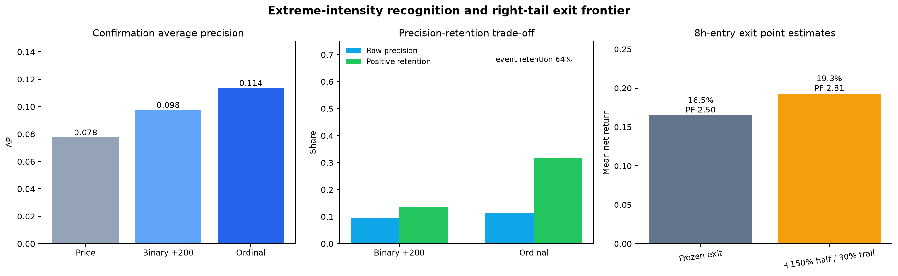

因此主策略不变；`hard25_be30_half150_trail30` 已加入未来30日标签，作为不改变排名、不触发交易的冻结反事实。真正未来样本若能让配对增量下界大于0，才讨论替换主退出。
<!-- INTENSITY_EXIT_FRONTIER_END -->

<!-- UTILITY_INTENSITY_ROUTER_BEGIN -->
## 8小时入场后再用20小时强度决定去留：明确失败

为了避免固定 MFE 规则过于粗糙，本轮把两个已经校准选出的模型串联：P0+8小时效用模型先决定纸面进入，P0+20小时序数强度模型再决定是否继续持有。没有重新选择模型、检查点或阈值；低强度信号只读取截至20小时已经收完的K线，并在该边界开盘退出。

识别层的总体点估计从 **11.36%** 提高到 **15.79%**，但只保留 3/10 个正标签；四折中只有两折命中，高强度组在 folds 3 和 6 的命中均为0。事件去重后选择 17 个、命中 3 个，精度 17.65%。按周和按币的精度/AP增量下界仍小于0，识别门槛失败。

交易层出现更强反证：确认期从基线 65 笔、期望 **16.50%**、PF **2.50**，变为 67 笔、期望 **-1.06%**、PF **0.84**。逐信号平均增量为 **-12.04%**；按周增量95%区间上界只有 -2.38%，按币上界 -2.64%，即使最乐观区间也仍为负。

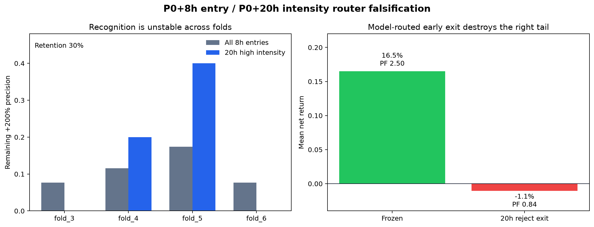

结论不是“样本不足”，而是**20小时低强度不能作为卖出理由**。暴涨币的收益依赖慢启动和少数长右尾；8小时入场后继续使用冻结退出，不新增20小时强制离场。
<!-- UTILITY_INTENSITY_ROUTER_END -->

<!-- UTILITY_EXHAUSTION_EXIT_BEGIN -->
## 盈利后的放量长上影：目前最有希望的卖点挑战者

此前的失败启动和20小时低强度退出都会误杀慢启动赢家。本轮反过来只在盈利已经形成后寻找衰竭：校准比较主退出、+150%减半后的30%/35%追踪，以及放量长上影和买盘衰退两类4小时信号。所有衰竭信号必须等当前K线收完，下一根4小时开盘才允许退出。

校准选择 `half150_trail35_wick`：**盈利达到+150%卖出一半，余仓35%追踪；价格至少翻倍后，如果当前4小时K线的上影占振幅≥35%、收盘位于振幅下35%、成交量≥过去均值1.5倍，则下一根开盘退出。** 买盘衰退版本没有胜出。

确认期共有 65 笔，其中10笔由放量长上影退出。相对主退出：

- 单笔期望从 16.50% 提高到 **17.88%**；
- 利润因子从 2.50 提高到 **2.63**；
- 组合收益从 22.64% 提高到 **25.01%**；
- 最大回撤从 -4.28% 变为 -4.34%；
- 四个确认折的PF分别为 4.32/1.08/3.25/3.54，全部大于1；
- 周/币聚类的策略绝对期望下界均大于0，删除最大赢家后期望仍为 14.83%。

但相对主退出的逐信号平均增量只有 **2.14%**；按周增量95%下界 -1.19%，按币下界 -1.36%，仍略低于0。因此它是当前最强卖点挑战者，但尚不能替换主退出。

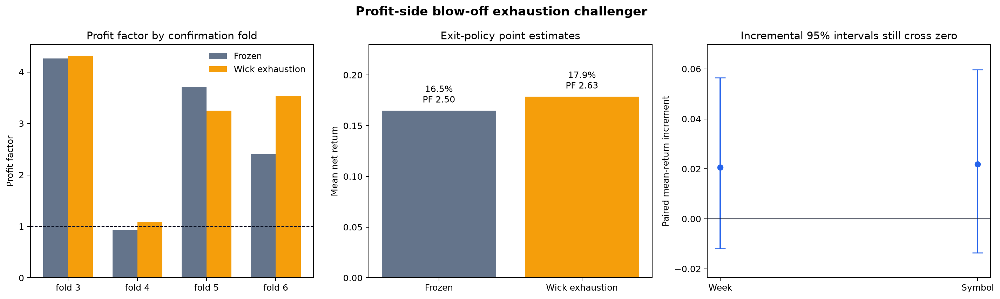

该规则已作为 `hard25_be30_half150_trail35_wick` 加入未来30日只读标签。主退出继续冻结；只有真正OOS的配对增量下界大于0，才允许升级。
<!-- UTILITY_EXHAUSTION_EXIT_END -->

<!-- UTILITY_EXHAUSTION_ATTRIBUTION_BEGIN -->
## 卖点析因：长上影有方向，35%追踪本身明确拖累

这次没有再选参数，而是把已经测试过的退出规则放在同一批 8 小时入场、同一组确认折、同一成本下逐笔配对。88 条信号进一步按“同一币 14 天只保留首次信号”压缩为 67 个独立事件，避免 ARIA 等同一轮行情被重复计算。

结论可以拆成三层：

- **把追踪距离从 30% 放宽到 35% 是负贡献。** 只改变 12 条路径，12 条全部变差，逐行平均增量 -1.33%；周块与币种 bootstrap 的 95% 上界都低于 0。若未来使用 +150% 减半的右尾方案，30% 追踪优于 35%。
- **放量长上影择时有正向点估计，但尚未独立识别。** 在相同 35% 静态尾部上加入长上影退出，改变 13 条路径，9 条改善、4 条恶化；逐行平均 +1.99%，事件去重后 +1.26%。但逐行和事件口径下，按周及按币的 95% 下界全部小于 0。
- **此前组合改善主要来自长上影，不是 35% 追踪。** `half150_trail35_wick` 相对冻结退出的逐行增量 2.14% 中，92.7% 由长上影择时贡献；事件去重后的组合增量仅 0.79%。

基于这个析因结果，新增一个只允许真正前瞻验证的事后假设：**盈利 +150% 卖一半，余仓使用 30% 追踪；价格至少翻倍后，如完成的 4 小时 K 线上影占振幅≥35%、收盘位于振幅下 35%、成交量≥过去 18 根均值的 1.5 倍，则下一根 4 小时开盘退出。**

该 `half150_trail30_wick_posthoc` 在历史确认中的点估计为：65 笔、期望 18.50%、PF 2.68、组合收益 25.94%，四个确认折 PF 均大于 1。相对现有 35% 长上影版本，6 条被改变的路径全部改善，逐行与事件聚类下界均大于 0；但它是看完确认结果后才组合出来的，**不能把这些数字当作新确认集表现**。相对冻结主退出，它的逐行增量 2.71%、独立事件增量 1.19%，区间仍跨 0，而且它也不全面支配单纯 30% 追踪方案。

因此主退出不变；未来标签同时保留冻结退出、单纯 30% 尾部、35% 长上影和新 30% 长上影四条路径。新规则只有在真正 OOS 中相对冻结退出和单纯 30% 尾部的事件级增量下界都大于 0，才有升级资格。

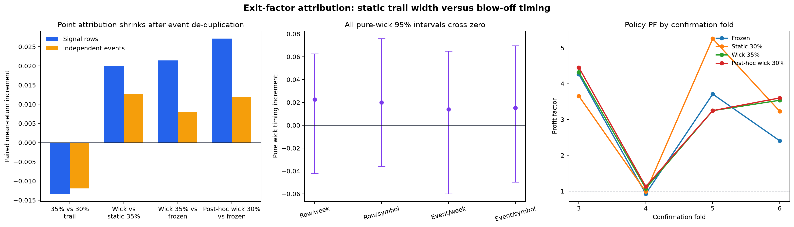
<!-- UTILITY_EXHAUSTION_ATTRIBUTION_END -->

<!-- UTILITY_ENTRY_TIMING_BEGIN -->
## 8小时评分后的买点：5%回撤再收盘回升，只能作为前瞻过滤器

这轮把“8小时分数达到 q70 后立即在决策开盘买入”与九种时间安全的执行方式分开比较。所有非立即规则最多观察后续24小时；凡依赖回撤、收盘、突破或回升的条件，都等触发 K 线完整收盘后，在下一根4小时开盘成交。规则只在三段校准窗口选择，确认折仍为第3–6折。

校准唯一合格的是 `discount5_reclaim`：从8小时决策开盘价至少回撤5%，随后出现阳线且收盘高于前一根收盘，再在下一根4小时开盘买入。确认期结果：

- 88条原始8小时信号中触发54条，触发率 61.36%，中位等待 12 小时，中位买价比8小时开盘低 2.14%；
- 逐行 +200% 命中从 10/88=11.36% 提高到 8/54=14.81%，保留 80% 的正行；
- 合并同币14天重复信号后，从 5/67=7.46% 提高到 5/45=11.11%，5个正事件全部保留；
- 事件口径按周/按币的精度增量95%下界分别为 0.87%/1.24%，均大于0；但逐行下界为 -0.76%/-0.71%，仍略低于0。

54个已触发信号与其8小时立即入场版本逐一配对后，未来 +200% 标签完全相同。这说明命中率提高来自“回撤后能够重新收回”的过滤作用，不是便宜约2%的买价人为制造了更多 +200% 标签。

交易层没有通过替换门槛：过滤后的44笔组合期望 14.97%、PF 2.28，优于相同54条信号立即入场的 12.11%/PF 1.92；配对单笔增量为 1.91%。但按周/按币的配对下界仍为 -5.58%/-2.34%，绝对期望下界也小于0，第4折 PF 只有 0.84。而全部信号立即入场的历史点估计仍更高：期望 16.50%、PF 2.50。

因此主买点继续冻结为 **P0+8h 分数通过后的决策开盘**。`discount5_reclaim_24h_next_open` 已加入未来30日只读标签，只作为“如果等回撤确认会怎样”的前瞻对照，不改变排名、原阶段否决或自动交易权限。只有真正 OOS 同时通过逐行、独立事件和交易配对下界，才允许升级。

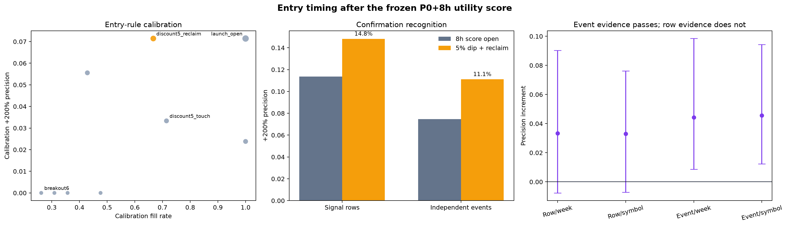
<!-- UTILITY_ENTRY_TIMING_END -->

<!-- UTILITY_ENTRY_FRONTIER_BEGIN -->
## 突破能确认暴涨倾向，但等突破再买已经太晚

为了确认5%回撤规则究竟是不是唯一有信息的路径，这轮把事先固定的九种入场规则在确认期全部展开，并对八个非基准候选同时做 BH 多重检验。该步骤只用于假设生成：校准期没有选中的规则，即使确认期表现突出，也不允许回写成历史通过。

最显眼的是 `breakout6`：完成的4小时K线收盘突破此前六根最高价、当根涨幅0–10%、相对8小时开盘追价不超过25%，下一根开盘进入。它在确认期触发 21 条，6 条达到 +200%，逐行精度 **28.57%**；18 个独立事件中命中 5 个，事件精度 **27.78%**，四折均高于立即入场。

但它不能升级为识别规则：校准期正例为0；八规则 BH 校正后的逐行/事件 p 值为 0.061/0.207；逐行按周/按币增量下界虽为正，但事件下界仍为 -0.66%/-2.90%。样本只有5个正事件，期间反转风险很高。

更重要的是，它回答了“何时买”的方向：**突破适合确认，不适合等待后再追入。** 17笔受组合约束的突破后交易表面期望 25.00%、PF 3.99，但与同一批信号在8小时开盘买入逐笔配对后，平均少赚 **17.80%**；按周和按币的配对95%上界分别为 -3.93%/-4.67%，都低于0。`prelaunch_high_break` 也在四折提高识别精度，但等待后的配对收益少 19.13%，两套上界同样为负（-8.64%/-6.42%）。

因此不新增突破后买入规则。主买点仍是8小时评分通过后的决策开盘；5%回撤回升继续作为已登记的前瞻过滤器。突破结构只保留为“入场后持仓强度/是否给赢家更多空间”的研究线索，下一步只能研究如何管理已持有仓位，不能用它追涨。

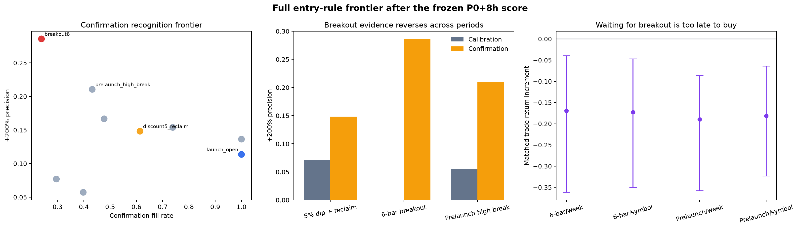
<!-- UTILITY_ENTRY_FRONTIER_END -->

<!-- UTILITY_BREAKOUT_HOLD_ROUTER_BEGIN -->
## 突破不是追买点，但可以决定是否给已持有赢家更多空间

完整买点前沿已经证明：等 `breakout6` 确认后再买，同一批信号平均少赚17.80%。本轮因此不改变冻结的8小时买点，而是把突破改成持仓管理信号。只有在8小时入场后的24小时内，某根完整4小时K线收盘突破此前六根最高价、当根涨幅不超过10%、相对入场开盘涨幅不超过25%时，才允许在下一根4小时开盘切换盈利侧退出；-25%硬止损和+30%后的保本规则不变。

确认期88条信号中有21条出现突破，包含6条 +200% 行；合并同币14天重复信号后为18个事件、命中5个，事件精度从全部信号的5/67=7.46%提高到5/18=27.78%。21条都在完成K线后的下一根开盘完成政策切换，切换前没有任何一条已经减半或启动追踪，排除了用同一根K线回看改规则。

单纯切换为“+150%减半、余仓30%追踪”的点估计最高：期望 **21.92%**、PF **3.04**；但独立事件按周/按币的增量下界仍为 -0.42%/-0.59%，不能排除重复行情影响。

更稳健的前瞻版本是：**突破确认后把减半目标延后到+150%，余仓30%追踪；价格至少翻倍后，若完成的4小时K线上影占振幅≥35%、收盘位于振幅下35%、成交量≥过去18根均值1.5倍，则下一根开盘退出。** 与冻结退出相比：

- 65笔组合期望从 16.50% 提高到 **19.65%**，PF从 2.50 提高到 **2.79**，组合收益从 22.64% 提高到 **27.40%**；
- 最大回撤为 -4.55%，四折PF均大于1，六种市场状态中五种PF大于1；30bps单边滑点压力下期望仍为 19.23%、PF 2.67；
- 逐信号配对增量为 **3.00%**，独立事件增量为 **2.31%**；逐行按周/币95%下界为 0.64%/0.54%，事件口径为 0.40%/0.33%，四个下界均大于0；
- 实际只改变8条路径，7条改善、1条恶化；最大赢家占正利润 11.89%，删除最大赢家后期望仍为 16.63%。

这是目前最有意义的新发现，但证据等级仍是**方向性前瞻假设**：`breakout6` 是查看确认期后才选出的持仓路由，不能把同一批历史数据重新称为确认集。它已登记为 `breakout6_half150_trail30_wick_24h_next_open` 的30日只读反事实，不改变排名、主买点、主退出或自动交易权限。真正OOS样本目前仍为0；只有未来独立事件持续保持正增量，才允许升级纸面退出。

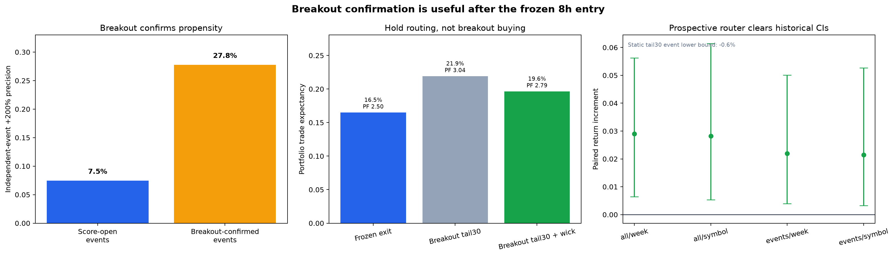
<!-- UTILITY_BREAKOUT_HOLD_ROUTER_END -->

<!-- UTILITY_BREAKOUT_ADD_BEGIN -->
## 突破可以管理赢家，但不值得为它预留加仓资金

突破确认组的收益明显高于未突破组，因此本轮检验了一个自然延伸：总计划风险保持不变，在8小时买点只投入50%/75%/90%，把剩余部分留到24小时内 `breakout6` 确认后的下一根4小时开盘再加；如果没有触发，预留部分保持现金。每个子仓独立计入手续费、资金费率、止损与盈利退出，组合仍使用最多10仓、总名义敞口50%的保守约束，不增加杠杆。

更早的42条校准信号包含11次突破机会。校准没有选择任何预留比例：10%/25%/50%加仓方案的逐信号增量分别为 **-0.86%/-2.15%/-4.30%**，三个校准窗口的平均增量全部为负；50%预留在删除最大赢家后期望转为负值。因此校准结论是 **8小时买点投入100%，突破加仓0%**。

后续88条确认信号给出相同方向：

- 全仓在8小时买入：65笔、期望 **19.65%**、PF **2.79**、组合收益 **27.40%**、最大回撤 -4.55%；
- 预留10%：期望 18.38%、PF 2.83、组合收益 25.55%，配对增量 **-0.95%**；
- 预留25%：期望 16.47%、PF 2.90、配对增量 **-2.38%**；
- 预留50%：期望 13.29%、PF 3.08、配对增量 **-4.77%**。

加仓子仓本身平均仍赚 29.61%，但它买得更晚；对已突破信号，预留10%再加也使总体收益少 2.24%。对未突破信号，长期保留10%现金又少 0.55%。所以PF从2.79逐步提高到3.08、回撤从-4.55%收窄到-2.39%，本质是**降低平均资金投入**，不是产生新的超额收益。

结论进一步收敛了买点：当8小时效用分数通过且阶段仍为 `price_watch` 时，不应为了等待突破而少买，也不应在突破后追加入场；计划纸面仓位在8小时决策开盘一次完成。突破只保留为后续盈利侧退出路由。该加仓方案未加入前瞻标签，不改变主买点、主退出、排名或交易权限。

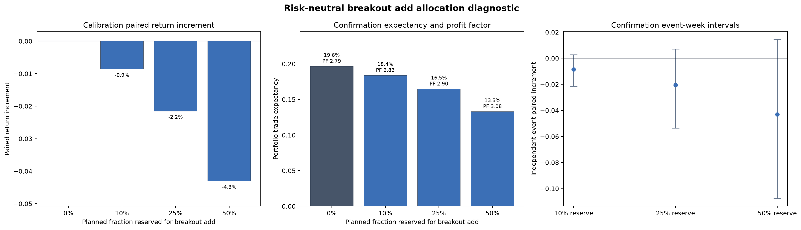
<!-- UTILITY_BREAKOUT_ADD_END -->

<!-- UTILITY_TAKER_FLOW_BEGIN -->
## 8小时主动买入占比：无需等待的识别增强项，但尚不能成为买入门

在8小时效用模型已经入选的信号中，继续等待回撤或突破都会损失时机。本轮因此只检查决策时已经可得的路径字段，并冻结一个语义明确、无需拟合的条件：前两根完整4小时K线合计的主动买入成交额占比至少 **50%**。它不改变入场时钟，仍在P0后8小时决策开盘判断。

更早的42条校准信号中，该条件保留21条并保留全部3个 +200% 正例，精度从 7.14% 提高到 14.29%，三个校准窗口的精度增量均为正。但筛选后的14天效用期望从 12.06% 降到 8.13%，说明“更像暴涨币”与“当时买入更赚钱”在早期样本中并不一致。

后四折确认的识别点估计更强：

- 88条8小时信号中保留48条，+200% 正例保留 **9/10**；
- 逐行精度从 **11.36%** 提高到 **18.75%**，周块/币种增量95%下界分别为 0.34%/0.37%；
- 合并同币14天重复信号后，精度从 7.46% 提高到 12.12%，保留4/5个正事件，但事件周块/币种下界为 -1.85%/-1.54%，仍低于0。

交易点估计也改善，但稳定性不够：冻结退出下35笔交易的期望为 **18.68%**、PF **2.75**，高于全部信号的 16.50%/PF 2.50；与突破持仓路由合并后为 **22.13%**、PF **3.07**。然而第6折筛选后5笔的期望为 -14.74%、PF 0.03；冻结退出按币种bootstrap期望下界 -4.27%，组合路由下界 -3.16%，均未过零。

因此它是目前最值得前瞻验证的**识别注释**，不是新的排名或买入否决条件。未来8小时只读快照已经追加 `taker_flow_supportive`，30日标签会原样携带；该字段不提高排名、不覆盖 `reject_chase`/暴涨后冷却、不改变现有纸面资格。主买点、主退出和自动交易禁令均不变。

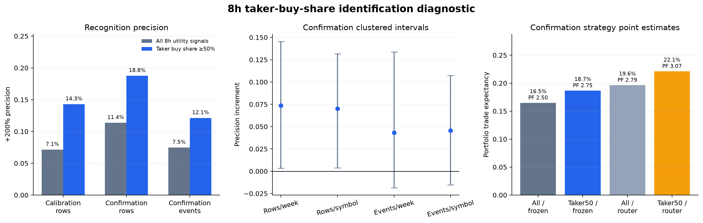
<!-- UTILITY_TAKER_FLOW_END -->

<!-- UTILITY_STRATEGY_ITERATION_BEGIN -->
## 主动买盘的独立性与“整仓跑”退出审计

主动买盘占比的方向性不是由单一阈值造成：48%–51% 四个邻近阈值在校准期和确认期都提高了 +200% 浓度。固定 50% 条件将校准精度从 7.14% 提至 14.29%，确认精度从 11.36% 提至 18.75%。但这还不能证明它是独立因子：只匹配早期涨幅时随机检验 p=0.045；同时匹配涨幅和路径效率后 p=0.069，没有越过 5% 门槛。结合校准期筛选后 14 天效用反而降至 8.13%，结论仍是“值得前瞻记录的识别注释”，不是买入开关。

卖出端测试了六个“突破确认后不卖一半、整仓追踪”的固定方案。当前规则在 14 天校准期的组合交易期望为 **4.77%**、PF **1.60**；六个整仓候选的期望仅为 2.95%–2.97%，相对当前规则的配对增量全部为负（-2.89% 至 -1.62%），没有任何候选通过校准门槛。可用的两个早期 30 天窗仅 18 笔，所有候选绝对期望都为负；其中最好的配对增量 0.58% 不足以改变结论。

确认期里，`breakout6_full_runner_a150_t30_wick` 的点估计达到 21.03%/PF 2.92，高于当前路由；但这正是未被校准期支持、查看后段样本才显得漂亮的规则。它被保留为过拟合反例，不进入前瞻监控。当前执行假设仍是：原 8 小时买点；突破只管理已有仓位；+150% 卖出一半，余仓 30% 追踪并保留量能长上影退出；不加仓、不自动交易。

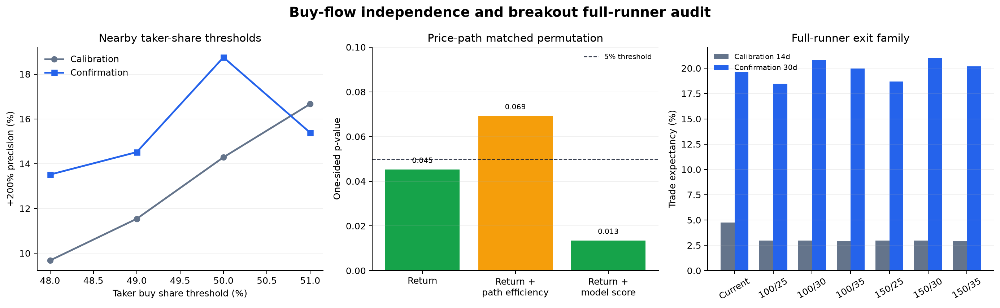

分批比例也不是稳定参数。只改变 +150% 时卖出的比例，校准期选择 75%：相对卖 50% 增加 0.97%，三个校准窗为“两正一零”。但确认期方向反转：卖 25% 的期望为 20.34%，卖 50% 为 19.65%，卖 75% 为 18.96%；校准选中的 75% 相对 50% 变为 -0.47%。这说明最优兑现比例依赖市场状态，当前保留较中性的 50%，不做自适应切换。

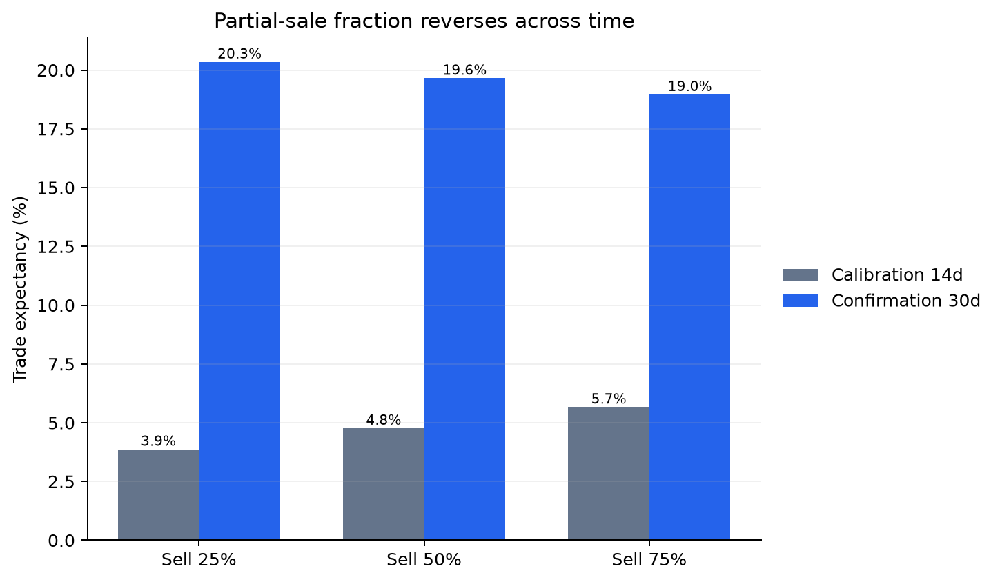

### 市场状态能否决定卖出比例

答案是否定的，至少现有样本还不能。卖出比例真正改变交易结果的信号，校准期只有 **3 笔**、确认期只有 **6 笔**。语义上看似合理的“高波动卖 25%、低波动卖 75%”在校准期相对固定卖 50% 减少 -0.97%，确认期却增加 0.68%；而校准期偏好的“高波动卖 75%”在确认期反向失效。按市场状态学习的规则因每个状态少于 5 笔有效支持，全部回退到 50%。因此，状态只保留为失效诊断，不进入卖出路由。

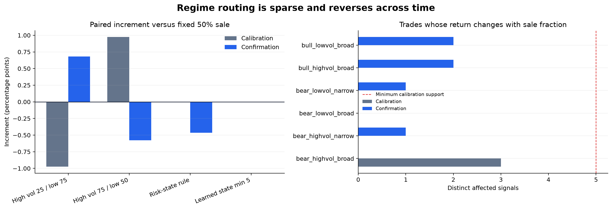

### 前瞻监控的运营审计

不可覆盖主快照目前只有 2026-07-18, 2026-07-19，缺失 2026-07-20, 2026-07-21；其中真正按 08:20 时钟准时落盘的只有 2026-07-19。7 月 21 日事后实时公开数据 dry-run 的 527/527 个合约通过覆盖和时效审计，但运行晚于冻结决策时钟，没有写入快照，也不计入真正 OOS。当前成熟的 8 小时效用标签和启动微结构标签仍均为 **0**，所以历史上的纸面候选不能升级为可执行策略。

<!-- UTILITY_STRATEGY_ITERATION_END -->
